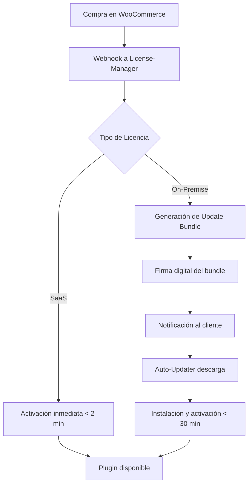

# Documento de Especificación y Diseño (DED)
# Sistema de Gestión Académico-Administrativa "Lazarus"

**Versión:** 2.1  
**Fecha:** 28 de mayo de 2025  
**Arquitecto/Autor:** Alonso Arias  
**Equipo de Desarrollo:** Alonso Arias, Yulian Moreno, Andersson Muñoz  
**Cliente:** Instituciones Educativas Colombianas  

---

## Índice

1. [Introducción](#1-introducción)
   1. [Propósito del documento](#11-propósito-del-documento)
   2. [Alcance del sistema](#12-alcance-del-sistema)
   3. [Definiciones, acrónimos y abreviaturas](#13-definiciones-acrónimos-y-abreviaturas)
   4. [Referencias](#14-referencias)
   5. [Visión general del documento](#15-visión-general-del-documento)

2. [Descripción general](#2-descripción-general)
   1. [Perspectiva del producto](#21-perspectiva-del-producto)
   2. [Funciones del producto](#22-funciones-del-producto)
   3. [Características de los usuarios](#23-características-de-los-usuarios)
   4. [Restricciones](#24-restricciones)
   5. [Suposiciones y dependencias](#25-suposiciones-y-dependencias)

3. [Contexto y Alcance](#3-contexto-y-alcance)
   1. [Nombre clave y branding](#31-nombre-clave-y-branding)
   2. [Modelo de licenciamiento](#32-modelo-de-licenciamiento)
      1. [Tipos de suscripción y costos (COP)](#321-tipos-de-suscripción-y-costos-cop)
   3. [Segmento de clientes objetivo](#33-segmento-de-clientes-objetivo)
   4. [Stack tecnológico](#34-stack-tecnológico)
   5. [Proceso de instalación](#35-proceso-de-instalación)
   6. [Modelo de desarrollo](#36-modelo-de-desarrollo)
   7. [Arquitectura general](#37-arquitectura-general)

4. [Modelo de MVP por Plugins](#4-modelo-de-mvp-por-plugins)
   1. [Estrategia de releases](#41-estrategia-de-releases)
   2. [Detalle de plugins por release](#42-detalle-de-plugins-por-release)
   3. [Roadmap visual](#43-roadmap-visual)

5. [Roles y Permisos](#5-roles-y-permisos)
   1. [Modelo de roles](#51-modelo-de-roles)
   2. [Permisos por rol](#52-permisos-por-rol)
   3. [Matriz CRUD×Rol](#53-matriz-crudrol)
   4. [Gestión y exportación de roles](#54-gestión-y-exportación-de-roles)

6. [Plugins y Requisitos Funcionales](#6-plugins-y-requisitos-funcionales)
   1. [Core](#61-core)
   2. [Installer](#62-installer)
   3. [RBAC-Extended](#63-rbac-extended)
   4. [Académico-Basic](#64-académico-basic)
   5. [Boletines](#65-boletines)
   6. [License-Manager](#66-license-manager)
   7. [Payments](#67-payments)
   8. [Analytics](#68-analytics)
   9. [Certificaciones](#69-certificaciones)
   10. [Migrator](#610-migrator)
   11. [LMS-Bridge](#611-lms-bridge)
   12. [Observador](#612-observador)
   13. [Meal-Service](#613-meal-service)
   14. [Scheduling](#614-scheduling)
   15. [HR-Management](#615-hr-management)
   16. [Accounting](#616-accounting)
   17. [Resource-Management](#617-resource-management)
   18. [Admissions](#618-admissions)

7. [Requisitos No Funcionales](#7-requisitos-no-funcionales)
   1. [Rendimiento](#71-rendimiento)
   2. [Seguridad](#72-seguridad)
   3. [Disponibilidad](#73-disponibilidad)
   4. [Escalabilidad](#74-escalabilidad)
   5. [Usabilidad](#75-usabilidad)
   6. [Mantenibilidad](#76-mantenibilidad)
   7. [Portabilidad](#77-portabilidad)
   8. [Compatibilidad](#78-compatibilidad)

8. [Normativa y Cumplimiento](#8-normativa-y-cumplimiento)
   1. [Marco legal colombiano](#81-marco-legal-colombiano)
   2. [Protección de datos personales](#82-protección-de-datos-personales)
   3. [Integraciones oficiales](#83-integraciones-oficiales)
   4. [Estándares técnicos obligatorios](#84-estándares-técnicos-obligatorios)
   5. [Documentación Swagger](#85-documentación-swagger)

9. [Diseño Técnico](#9-diseño-técnico)
   1. [Arquitectura del sistema](#91-arquitectura-del-sistema)
   2. [Diseño de base de datos](#92-diseño-de-base-de-datos)
   3. [Diseño de APIs REST/SOAP](#93-diseño-de-apis-restsoap)
   4. [Diseño de seguridad](#94-diseño-de-seguridad)
   5. [Diseño de escalabilidad](#95-diseño-de-escalabilidad)
   6. [Diagramas UML](#96-diagramas-uml)
   7. [DevOps y CI/CD](#97-devops-y-cicd)
   8. [Observabilidad](#98-observabilidad)

10. [Historias de Usuario](#10-historias-de-usuario)
    1. [Historias de Core](#101-historias-de-core)
    2. [Historias por plugin](#102-historias-por-plugin)

11. [Plan de Pruebas](#11-plan-de-pruebas)
    1. [Estrategia de pruebas](#111-estrategia-de-pruebas)
    2. [Tipos de pruebas](#112-tipos-de-pruebas)
    3. [Matriz de pruebas por plugin](#113-matriz-de-pruebas-por-plugin)

12. [Estrategia de Migración](#12-estrategia-de-migración)
    1. [Proceso de migración](#121-proceso-de-migración)
    2. [Herramientas de migración](#122-herramientas-de-migración)
    3. [Validación de datos migrados](#123-validación-de-datos-migrados)

13. [Plan de Capacitación](#13-plan-de-capacitación)
    1. [Usuarios administradores](#131-usuarios-administradores)
    2. [Usuarios finales](#132-usuarios-finales)
    3. [Recursos de autoservicio](#133-recursos-de-autoservicio)

14. [Cronograma de Desarrollo](#14-cronograma-de-desarrollo)
    1. [Resumen de sprints](#141-resumen-de-sprints)
    2. [Cronograma detallado de 36 meses](#142-cronograma-detallado-de-36-meses)
    3. [Hitos principales](#143-hitos-principales)
    4. [Matriz RACI del proyecto](#144-matriz-raci-del-proyecto)

15. [Anexos Técnicos](#15-anexos-técnicos)
    1. [Ejemplo de archivo .env](#151-ejemplo-de-archivo-env)
    2. [Plantilla my.cnf optimizada](#152-plantilla-mycnf-optimizada)
    3. [Estructura archivo .lzm](#153-estructura-archivo-lzm)
    4. [Configuración webhook WooCommerce](#154-configuración-webhook-woocommerce)
    5. [Plantilla de roles JSON](#155-plantilla-de-roles-json)
    6. [Esquema manifest.json para plugins](#156-esquema-manifestjson-para-plugins)
    7. [Especificación OpenAPI](#157-especificación-openapi)

---

## 1. Introducción

### 1.1 Propósito del documento

Este Documento de Especificación y Diseño (DED) versión 2.1 define de manera exhaustiva y autocontenida los requisitos, arquitectura, diseño técnico y plan de implementación del sistema de gestión académico-administrativa "Lazarus" para instituciones educativas colombianas. El documento incorpora mejoras significativas en el modelo de licenciamiento, procesos DevOps, observabilidad del sistema y nuevas funcionalidades como el módulo de admisiones. Servirá como guía principal para el desarrollo del sistema, proporcionando una visión clara de todos los componentes, restricciones y expectativas, facilitando así la implementación incremental por el equipo de desarrollo compuesto por tres desarrolladores.

### 1.2 Alcance del sistema

Lazarus es un sistema modular de gestión académico-administrativa integral diseñado específicamente para colegios colombianos de naturaleza pública, privada o mixta. El sistema contempla:

**Gestión Académica:**
- Administración de calificaciones, boletines, certificados
- Gestión de horarios académicos
- Integración con sistemas de aprendizaje (LMS)
- Observador del estudiante
- **Sistema completo de admisiones** (nuevo en v2.1)

**Gestión Administrativa:**
- Administración de roles y permisos extensible
- Sistema contable integrado
- Gestión del personal (nómina, contratos, evaluaciones)
- Administración de recursos físicos e inventarios
- **Gestión avanzada de licencias con activación automática** (mejorado en v2.1)

**Gestión de Servicios:**
- Sistema de alimentación escolar (PAE - Programa de Alimentación Escolar)
- Control de transporte escolar
- Gestión de biblioteca y recursos educativos

**Infraestructura Técnica:**
- Arquitectura basada en plugins con núcleo mínimo
- Servicios REST/SOAP para todas las funcionalidades
- **Documentación Swagger/OpenAPI autogenerada** (nuevo en v2.1)
- Compatibilidad multi-sede y multi-institución
- **Sistema de activación automática de plugins** (nuevo en v2.1)
- Integración con sistemas oficiales colombianos
- Modelo de licenciamiento flexible (SaaS y On-Premise)
- **Progressive Web App (PWA) responsiva** para acceso móvil

El sistema está destinado a instituciones de educación básica y media, contemplando diferentes calendarios académicos (A, B y flexibles) y modalidades (presencial, virtual, a distancia, alternancia).

El proyecto contempla un periodo de desarrollo de 36 meses con un buffer del 25% adicional (45 meses totales) por un equipo de tres desarrolladores con dedicación parcial (2 horas diarias cada uno), con entregas incrementales de funcionalidad a través de plugins que permitan un uso temprano del sistema mientras se continúa el desarrollo de funcionalidades avanzadas.

#### Dentro del alcance:

**Núcleo del sistema:**
- Sistema core multi-tenancy con aislamiento de datos por institución
- Arquitectura de servicios REST/SOAP para todas las funcionalidades
- Proceso de instalación simplificado con validación de licencia previa
- **Sistema de auto-actualización y activación de plugins**

**Gestión académica completa:**
- **Proceso completo de admisiones y matrículas**
- Gestión académica básica (años académicos, periodos, cursos, asignaturas)
- Sistema de calificaciones flexible y adaptable a diferentes modelos evaluativos
- Generación de horarios académicos con optimización automática
- Generación de boletines y certificados oficiales
- Observador del estudiante y seguimiento disciplinario

**Gestión administrativa integral:**
- Sistema contable completo (PUC educativo colombiano)
- Gestión de nómina y personal docente/administrativo
- Administración de recursos físicos e inventarios
- Control de mantenimiento preventivo y correctivo
- **Gestión avanzada de licencias con facturación medida**

**Servicios institucionales:**
- Sistema de alimentación escolar (PAE) con control nutricional
- Gestión de transporte escolar
- Administración de biblioteca y recursos educativos
- Control de enfermería y salud escolar

**Cumplimiento normativo:**
- Conformidad con normativa educativa colombiana
- Integración con sistemas oficiales (SIMAT, ICFES, MEN)
- Adaptación a diferencias entre instituciones públicas, privadas y mixtas
- Cumplimiento de requisitos específicos según tipo de institución

**Infraestructura tecnológica:**
- **Sistema DevOps completo con CI/CD**
- **Observabilidad con ELK + Prometheus + Grafana**
- Gestión de licencias y pagos por documentos
- Análisis estadístico y sistema de alertas
- Herramientas de migración de datos
- Integración con sistemas de aprendizaje (Moodle)
- **Blockchain interno para auditoría inmutable**

#### Fuera del alcance:

- Aplicaciones móviles nativas (se usará PWA responsiva)
- Desarrollo de contenido educativo o curricular
- Sistema de videoconferencia propio (se integrará con existentes)
- Sistema de e-learning propio (se integra con LMS existentes)
- GraphQL (removido en v2.1, solo REST/SOAP)

### 1.3 Definiciones, acrónimos y abreviaturas

- **DED**: Documento de Especificación y Diseño
- **MVP**: Producto Mínimo Viable
- **SaaS**: Software como Servicio
- **On-Premise**: Implementación local en servidores del cliente
- **JWT**: JSON Web Token
- **RBAC**: Control de Acceso Basado en Roles
- **LMS**: Sistema de Gestión de Aprendizaje
- **CRUD**: Crear, Leer, Actualizar, Eliminar
- **MFA/2FA**: Autenticación de Múltiples Factores/Dos Factores
- **API**: Interfaz de Programación de Aplicaciones
- **REST**: Representational State Transfer
- **SOAP**: Simple Object Access Protocol
- **SA**: Super-Administrador
- **AC**: Admin-Cliente
- **AI**: Admin-Institución
- **AS**: Admin-Sede
- **PAE**: Programa de Alimentación Escolar
- **PUC**: Plan Único de Cuentas
- **DANE**: Departamento Administrativo Nacional de Estadística
- **SIMAT**: Sistema Integrado de Matrícula
- **MEN**: Ministerio de Educación Nacional
- **PWA**: Progressive Web App
- **CI/CD**: Integración Continua/Despliegue Continuo
- **SAST**: Static Application Security Testing
- **DAST**: Dynamic Application Security Testing
- **ELK**: Elasticsearch, Logstash, Kibana
- **RACI**: Responsible, Accountable, Consulted, Informed
- **OpenAPI**: Especificación para describir APIs REST

### 1.4 Referencias

**Normativa Educativa:**
- Ley General de Educación (Ley 115 de 1994)
- Decreto 1860 de 1994
- Decreto 1290 de 2009
- Decreto 1075 de 2015
- Decreto 1965 de 2013 (Convivencia escolar)
- Resolución 6404 de 2009 (Libro de registro de diplomas)
- Ley 715 de 2001 (Sistema General de Participaciones)

**Normativa de Alimentación Escolar:**
- Resolución 29452 de 2017 (Lineamientos PAE)
- Decreto 1852 de 2015 (PAE)
- Resolución 16432 de 2015 (Lineamientos técnicos PAE)

**Normativa Laboral y Contable:**
- Código Sustantivo del Trabajo
- Decreto 2649 de 1993 (PUC)
- Resolución 355 de 2007 (PUC sector público)
- Decreto 1567 de 1998 (Capacitación empleados públicos)

**Protección de Datos:**
- Ley 1581 de 2012 y Decreto 1377 de 2013
- Ley 594 de 2000 (Ley General de Archivos)
- Ley 87 de 1993 (Control Interno)
- ISO/IEC 27001 (Seguridad de la Información)
- WCAG 2.1 AA (Accesibilidad Web)

**Estándares Técnicos:**
- OpenAPI Specification 3.0.3
- OAuth 2.0 (RFC 6749)
- JSON Web Token (RFC 7519)

### 1.5 Visión general del documento

Este documento está estructurado en 15 secciones que abarcan desde la introducción y contexto hasta los anexos técnicos. La versión 2.1 incluye mejoras significativas en:
- Modelo de licenciamiento con facturación medida y activación automática de plugins
- Nuevo módulo de admisiones
- Documentación Swagger/OpenAPI obligatoria
- Procesos DevOps y CI/CD detallados
- Sistema de observabilidad completo
- Blockchain interno para auditoría
- Matriz RACI y buffer de tiempo del 25%

## 2. Descripción general

### 2.1 Perspectiva del producto

Lazarus es un sistema integral e independiente pero interoperable con otros sistemas educativos colombianos. Está diseñado como una solución completa que puede funcionar de forma autónoma o complementando otras herramientas mediante integraciones. Su arquitectura modular basada en plugins, con un núcleo mínimo que expone servicios REST/SOAP, permite a las instituciones activar solo las funcionalidades necesarias según sus necesidades específicas y naturaleza jurídica (pública, privada o mixta).

El sistema incluye capacidades avanzadas de auto-actualización y activación automática de plugins tras la compra, garantizando que las instituciones siempre tengan acceso inmediato a las funcionalidades que adquieren. La interfaz será una Progressive Web App (PWA) completamente responsiva, eliminando la necesidad de desarrollar aplicaciones móviles nativas.

### 2.2 Funciones del producto

El sistema Lazarus ofrece las siguientes funciones principales:

**Núcleo del Sistema:**
- Arquitectura de servicios REST/SOAP extensible por plugins
- Multi-tenancy con aislamiento completo de datos
- Sistema avanzado de roles y permisos (RBAC)
- Auditoría y logs inmutables con blockchain interno
- **Gestión de plugins activables/desactivables por tenant**
- **Sistema de auto-actualización para instalaciones On-Premise**
- **Documentación Swagger/OpenAPI autogenerada**

**Gestión Académica Completa:**
- **Proceso completo de admisiones y selección**
- Registro y administración de calificaciones
- Generación de horarios con optimización automática
- Generación de boletines, certificados y diplomas
- Observador del estudiante según Decreto 1965/2013
- Integración con sistemas de gestión de aprendizaje

**Gestión Administrativa Integral:**
- Sistema contable completo adaptado al PUC educativo
- Gestión de nómina y personal según normativa laboral colombiana
- Administración de inventarios y recursos físicos
- Control de mantenimiento de infraestructura
- **Gestión avanzada de licencias con facturación medida**

**Gestión de Servicios Institucionales:**
- Sistema PAE con control nutricional y trazabilidad
- Gestión de transporte escolar con rutas y control
- Administración de biblioteca y recursos educativos
- Control de servicios de salud y enfermería

**Cumplimiento Normativo:**
- Adaptación automática según tipo de institución (pública/privada/mixta)
- Integración con sistemas oficiales (SIMAT, ICFES, MEN)
- Generación de reportes oficiales requeridos
- Gestión documental según Ley General de Archivos

**Analítica y Reportes:**
- Indicadores de rendimiento académico y alertas tempranas
- Análisis financiero y presupuestal
- Estadísticas de servicios institucionales
- Reportes para entes de control
- **Métricas de uso para facturación medida**

### 2.3 Características de los usuarios

Lazarus está diseñado para ser utilizado por diversos actores del ecosistema educativo, incluyendo nuevos roles para el proceso de admisiones:

**Usuarios Administrativos:**
- **Administradores de sistema**: Usuarios técnicos que gestionan la plataforma a nivel general
- **Directivos institucionales**: Rectores, coordinadores y directivos según estructura organizacional
- **Personal administrativo**: Secretarias, personal financiero, recursos humanos
- **Contadores**: Profesionales contables para instituciones que lo requieran
- **Coordinador de Admisiones**: Supervisa todo el proceso de admisión (nuevo en v2.1)
- **Asesor de Admisiones**: Atiende a familias interesadas (nuevo en v2.1)

**Usuarios Académicos:**
- **Docentes**: Profesores de planta, provisionales o por horas cátedra
- **Coordinadores académicos**: Supervisión de procesos académicos
- **Psicorientadores**: Personal de apoyo psicológico y orientación

**Usuarios de Servicios:**
- **Personal de alimentación**: Gestión del servicio PAE
- **Personal de transporte**: Conductores y monitores de ruta
- **Bibliotecarios**: Gestión de recursos bibliográficos
- **Personal de enfermería**: Atención en salud escolar

**Usuarios Beneficiarios:**
- **Estudiantes**: Usuarios que consultan información académica
- **Acudientes**: Padres o tutores con acceso según edad del estudiante
- **Aspirantes**: Familias en proceso de admisión
- **Invitados**: Usuarios con acceso limitado a información pública

### 2.4 Restricciones

El desarrollo e implementación de Lazarus está sujeto a las siguientes restricciones:

**Recursos de desarrollo:**
- Equipo de tres desarrolladores (Alonso Arias, Yulian Moreno, Andersson Muñoz)
- Disponibilidad de 2 horas diarias por desarrollador (6 horas diarias totales)
- Trabajo remoto coordinado

**Plazo de desarrollo:**
- 36 meses para el desarrollo completo del sistema
- Buffer adicional del 25% (9 meses) para contingencias
- Entregas incrementales cada 3-4 semanas

**Restricciones técnicas:**
- Stack tecnológico predefinido (Laravel 10 LTS, MariaDB, etc.)
- Arquitectura de servicios REST/SOAP obligatoria (sin GraphQL)
- Núcleo mínimo con funcionalidades vía plugins
- Documentación Swagger/OpenAPI obligatoria para todas las APIs REST

**Restricciones normativas:**
- Cumplimiento obligatorio de leyes y decretos educativos colombianos
- Adaptación a diferencias entre instituciones públicas, privadas y mixtas
- Requisitos estrictos de seguridad y privacidad de información sensible

**Restricciones operativas:**
- Debe funcionar en entornos con conectividad limitada o intermitente
- Compatible con infraestructura típica de instituciones educativas colombianas
- Tiempo máximo de activación de plugins: SaaS < 2 min, On-Premise < 30 min

### 2.5 Suposiciones y dependencias

El diseño de Lazarus se basa en las siguientes suposiciones y dependencias:

**Suposiciones técnicas:**
- Las instituciones educativas tienen acceso a servidores que cumplen con requisitos mínimos
- Los usuarios administradores tienen conocimientos técnicos básicos
- Existe compatibilidad entre las versiones del stack tecnológico seleccionado
- Disponibilidad de conexión a internet para actualizaciones y sincronización
- El repositorio de plugins tendrá disponibilidad del 99.9%

**Suposiciones normativas:**
- Los sistemas oficiales mantienen sus interfaces de integración actuales
- El marco normativo colombiano no sufre cambios drásticos durante el desarrollo
- Las diferencias entre tipos de instituciones se mantienen estables

**Dependencias externas:**
- Disponibilidad de servicios de terceros (pasarelas de pago, SMS, correo)
- Continuidad de frameworks y librerías open source utilizadas
- Acceso a documentación oficial de sistemas gubernamentales
- Servicio de firma digital para update bundles

## 3. Contexto y Alcance

### 3.1 Nombre clave y branding

**Nombre clave**: Lazarus

El nombre "Lazarus" evoca el concepto de revitalización y nueva vida, simbolizando la modernización de los procesos educativos tradicionales y la transformación digital de las instituciones educativas colombianas. Este nombre será utilizado tanto internamente en el desarrollo como en la comercialización del producto.

Elementos de branding a desarrollar:
- Logo principal y variantes según tipo de institución
- Paleta de colores institucional adaptable
- Tipografía del sistema
- Iconografía consistente en interfaz
- Guías de marca para personalización institucional

### 3.2 Modelo de licenciamiento

El sistema Lazarus implementa un modelo de licenciamiento dual mejorado con capacidades de activación automática y facturación medida:

**Modelo SaaS (Software como Servicio):**
- Ideal para instituciones con recursos limitados de TI
- Autenticación mediante clave JWT
- Facturación recurrente (mensual/anual) con opción de medición
- Almacenamiento en la nube gestionada por el proveedor
- Actualizaciones automáticas
- **Activación de plugins en menos de 2 minutos tras la compra**
- Soporte técnico incluido según nivel de suscripción
- Tarifas diferenciadas para instituciones públicas

**Modelo On-Premise (Local):**
- Preferido por instituciones con infraestructura propia
- **Validación de licencia antes de crear tablas en la instalación**
- Licencia validada mediante archivo `.lzl`
- Pago único con mantenimiento anual opcional
- Instalación en servidores propios de la institución
- **Sistema de auto-actualización con Update Bundles firmados**
- **Activación de plugins en menos de 30 minutos tras la compra**
- Soporte técnico según contrato de mantenimiento
- Control total sobre datos y configuraciones

**Sistema de Gestión de Licencias 2.0:**
- API completa en `/api/rest/v1/licensing/`
- Eventos del sistema: `plan.changed`, `addon.purchased`, `plugin.activated`, `plugin.deactivated`
- Integración con WooCommerce solo para venta (webhook delega a License-Manager)
- Facturación medida opcional por estudiante/empleado activo
- Validación de licencia en tiempo real

**Consideraciones por tipo de institución:**
- **Públicas**: Descuentos especiales, facturación adaptada a presupuesto público
- **Privadas**: Planes premium con funcionalidades avanzadas
- **Mixtas**: Modelos híbridos según necesidades específicas

**Migración bidireccional:**
- Transición SaaS → On-Premise y viceversa
- Proceso operado exclusivamente por el proveedor
- Preservación de integridad de datos
- Tiempo de migración garantizado ≤ 48 horas
- Verificación de consistencia post-migración

### 3.2.1 Tipos de suscripción y costos (COP)

#### Planes SaaS

| Plan | Costo Mensual | Costo Anual | Estudiantes | Empleados | Plugins Incluidos | Soporte |
|------|---------------|-------------|-------------|-----------|-------------------|---------|
| **Starter** | $499,000 | $4,990,000 | Hasta 500 | Hasta 50 | Core, Academic, HR, Boletines | Email |
| **Professional** | $999,000 | $9,990,000 | Hasta 2,000 | Hasta 200 | Starter + PAE, Accounting, Analytics | Email + Chat |
| **Enterprise** | $1,999,000 | $19,990,000 | Ilimitado | Ilimitado | Todos los plugins | 24/7 Dedicado |

#### Planes On-Premise

| Plan | Costo Único | Mantenimiento Anual | Estudiantes | Empleados | Plugins Incluidos |
|------|-------------|-------------------|-------------|-----------|-------------------|
| **Standard** | $14,990,000 | $2,998,000 | Hasta 5,000 | Hasta 500 | Core + 5 plugins a elección |
| **Premium** | $29,990,000 | $5,998,000 | Ilimitado | Ilimitado | Todos los plugins actuales y futuros |

#### Plugins Adicionales (Add-ons)

| Plugin | Costo SaaS/mes | Costo On-Premise |
|--------|----------------|------------------|
| Admissions | $199,000 | $2,990,000 |
| Transport | $149,000 | $1,990,000 |
| Library | $99,000 | $1,490,000 |
| Certificates | $149,000 | $1,990,000 |
| Resource-Management | $199,000 | $2,990,000 |

#### Facturación Medida (Metered Billing)

Para instituciones que superan los límites de su plan:

| Concepto | Costo por unidad/mes |
|----------|---------------------|
| Estudiante adicional | $1,000 |
| Empleado adicional | $5,000 |
| Sede adicional | $99,000 |
| Almacenamiento adicional (GB) | $10,000 |

#### Descuentos Especiales

- Instituciones públicas: 50% en todos los planes
- Instituciones rurales: 30% adicional
- Redes educativas (5+ sedes): 20% adicional
- Pago anual anticipado: 2 meses gratis

#### Flujo de Validación de Licencia



### 3.3 Segmento de clientes objetivo

El sistema está diseñado para atender a los siguientes segmentos de instituciones educativas colombianas:

**Por naturaleza jurídica:**
- **Colegios públicos (oficiales)**: Con requisitos específicos de contratación estatal
- **Colegios privados**: Con necesidades de gestión empresarial
- **Colegios de administración mixta**: Concesiones, alianzas público-privadas

**Por estructura organizacional:**
- Instituciones unisede urbanas y rurales
- Instituciones multi-sede (megacolegios)
- Redes/grupos educativos
- Instituciones con sedes en diferentes municipios

**Por calendario académico:**
- Calendario A (febrero-noviembre)
- Calendario B (agosto-junio)
- Calendarios flexibles o especiales
- Modelos de alternancia educativa

**Por modalidad educativa:**
- Educación presencial tradicional
- Educación virtual
- Educación a distancia
- Modelos híbridos
- Educación por ciclos (adultos)

**Por niveles educativos:**
- Preescolar (pre-jardín, jardín, transición)
- Básica primaria (1° a 5°)
- Básica secundaria (6° a 9°)
- Media académica (10° y 11°)
- Media técnica con articulación SENA
- Programas de educación para adultos

### 3.4 Stack tecnológico

El desarrollo de Lazarus se basará en las siguientes tecnologías:

**Backend - Núcleo y Servicios:**
- Laravel 10 LTS (framework PHP)
- Arquitectura de microservicios con servicios REST/SOAP
- MariaDB ≥ 10.6 (base de datos relacional)
- Redis (caché y colas)
- stancl/tenancy (multi-tenancy - database-per-tenant)
- nWidart/modules (arquitectura modular para plugins)
- Laravel API Resources (REST)
- PHP SOAP Server (servicios SOAP)
- **L5-Swagger para documentación OpenAPI automática**

**Frontend:**
- Livewire 3.x / Inertia.js (interfaces reactivas)
- TailwindCSS (framework CSS)
- Alpine.js (interactividad frontend mínima)
- HTMX (mejoras progresivas)
- Chart.js (visualización de datos)
- **Workbox para capacidades PWA offline**

**Infraestructura:**
- Docker (contenedores para desarrollo y despliegue)
- Nginx (servidor web)
- Let's Encrypt (certificados SSL automáticos)
- Laravel Horizon (gestión de colas)
- Laravel Telescope (debugging - solo desarrollo)
- Supervisor (gestión de procesos)
- **GitHub Actions para CI/CD**
- **Terraform para IaC**

**Herramientas de desarrollo:**
- PHPStan (análisis estático - SAST)
- Laravel Pint (formateador de código)
- PHPUnit (pruebas unitarias)
- Laravel Dusk (pruebas end-to-end)
- **OWASP ZAP para DAST**
- Postman/Insomnia (documentación API)
- **SonarQube para análisis de calidad**

**Observabilidad:**
- **Elasticsearch + Logstash + Kibana (ELK)**
- **Prometheus + Grafana para métricas**
- **OpenTelemetry para trazas distribuidas**
- **Sentry para manejo de errores**

**Blockchain para auditoría:**
- **Hyperledger Fabric (privado y permisionado)**
- **Smart contracts para logs inmutables**

### 3.5 Proceso de instalación

El sistema Lazarus ofrece dos métodos principales de instalación mejorados con validación de licencia:

**Instalación "One-Click" (wizard web):**
1. Subida de archivos a servidor vía FTP/SFTP
2. Acceso a URL de instalación
3. **Solicitud y validación de licencia antes de continuar**
4. Verificación automática de requisitos del servidor
5. Formulario web para configuración:
   - Tipo de institución (pública/privada/mixta)
   - Datos de conexión a base de datos
   - Información de la institución
   - Configuración de correo electrónico
   - Ajustes de seguridad básicos
   - Zona horaria y configuración regional
6. **Descarga automática de plugins según licencia**
7. Creación automática de bases de datos y archivos de configuración
8. Carga de catálogos específicos según tipo de institución
9. Generación automática del archivo `.env`
10. Creación de usuario Super-Administrador
11. **Configuración del Auto-Updater (opt-in)**
12. Selección de plugins iniciales a activar
13. Redirección al dashboard inicial

**Instalación mediante CLI:**
1. Clonación/descarga de repositorio
2. Ejecución de script de instalación
   ```bash
   php artisan lazarus:install --license-key=XXXX-XXXX-XXXX --type={public|private|mixed}
   ```
3. **Validación de licencia con servidor central**
4. **Descarga de plugins permitidos según licencia**
5. Configuración mediante prompts interactivos o archivo de configuración
6. Verificación automática de dependencias
7. Migración y semilla de base de datos
8. Generación de claves de aplicación
9. Configuración de tareas programadas (cron)
10. Configuración de servicios REST/SOAP
11. **Setup del Auto-Updater**

Ambos métodos incluyen:
- Validación de licencia antes de crear estructuras
- Descarga solo de plugins con licencia activa
- Detección automática del tipo de institución
- Carga de configuraciones predeterminadas según naturaleza jurídica
- Verificación de compatibilidad de versiones
- Comprobación de extensiones PHP requeridas
- Validación de permisos de archivos y directorios
- Creación automática de archivos de configuración

### 3.6 Modelo de desarrollo

El desarrollo de Lazarus seguirá estas directrices actualizadas con consideración del buffer adicional:

**Recursos humanos:**
- Equipo de tres desarrolladores:
  - Alonso Arias (Arquitecto/Líder técnico)
  - Yulian Moreno (Desarrollador)
  - Andersson Muñoz (Desarrollador)
- Dedicación de 2 horas diarias por persona
- Total: 30 horas semanales de desarrollo
- Periodo de desarrollo: 36 meses + 25% buffer = 45 meses totales

**Metodología:**
- Desarrollo incremental basado en plugins
- Sprints de 3 semanas
- Reuniones diarias de sincronización (15 min)
- Pruebas continuas (TDD cuando sea aplicable)
- Releases cada 2-3 sprints
- Retrospectivas quincenales
- **Documentación Swagger actualizada en cada sprint**

**Distribución de trabajo:**
- Desarrollo en paralelo de diferentes plugins
- Rotación de responsabilidades para conocimiento compartido
- Pair programming para componentes críticos
- Code reviews obligatorios entre el equipo
- **SAST/DAST en cada PR**

**Gestión del código:**
- Control de versiones con Git (GitHub)
- Estrategia Git Flow adaptada
- Ramas feature/hotfix/release
- Convención de commits semánticos
- Documentación inline del código (PHPDoc)
- **Pipeline CI/CD con GitHub Actions**
- **Análisis de código con SonarQube**

**Comunicación del equipo:**
- Canal de Slack/Discord para comunicación diaria
- Tablero Kanban compartido (Trello/Jira)
- Documentación en wiki del proyecto
- Sesiones de diseño colaborativo
- **Revisiones de seguridad mensuales**

**Priorización:**
- Enfoque en MVP funcional por cada plugin
- Desarrollo del núcleo REST/SOAP primero
- Implementación incremental de servicios
- Pruebas de usuarios clave al final de cada release
- **Generación automática de documentación OpenAPI**

### 3.7 Arquitectura general

El sistema Lazarus se construirá sobre una arquitectura modular orientada a servicios con las siguientes características:

**Arquitectura por capas:**
- **Capa de servicios**: APIs REST/SOAP expuestas por el núcleo
- **Capa de presentación**: PWA responsiva con capacidades offline
- **Capa de aplicación**: Controladores, servicios de negocio
- **Capa de dominio**: Modelos, lógica de negocio, reglas
- **Capa de infraestructura**: Base de datos, servicios externos

**Núcleo mínimo:**
- Gestión de autenticación y autorización
- Servicios base REST/SOAP
- Sistema de plugins
- Multi-tenancy
- Auditoría y logs con blockchain
- Gestión de configuración
- **Service Orchestrator para coordinación de plugins**
- **Auto-Updater para actualizaciones**

**Modelo de plugins:**
- Cada funcionalidad como plugin independiente
- **Plugins activables/desactivables por tenant vía UI y API**
- Plugins extienden servicios REST/SOAP del núcleo
- Activación/desactivación sin afectar el sistema
- Versionado independiente
- APIs bien definidas entre plugins
- **Metadatos `activable_por_tenant: true` en manifest**

**Servicios REST/SOAP:**
```
/api/rest/v1/[plugin]/[recurso]    # Servicios REST
/api/soap/v1/[plugin]              # Servicios SOAP
/api/rest/v1/licensing/            # Gestión de licencias
```

Ejemplos:
- REST: `/api/rest/v1/academic/courses`
- REST: `/api/rest/v1/licensing/plugins/activate`
- SOAP: `/api/soap/v1/academic?wsdl`

**Multi-tenancy:**
- Aislamiento a nivel de base de datos (database-per-tenant)
- Separación lógica de datos por cliente/institución/sede
- Configuraciones específicas por tipo de institución
- Dominios/subdominios configurables por tenant
- **Gestión de plugins activos por tenant**

**Consideraciones por tipo de institución:**
- **Públicas**: Módulos de contratación estatal, reportes CHIP
- **Privadas**: Módulos de gestión empresarial, marketing
- **Mixtas**: Combinación configurable de características

**Escalabilidad:**
- Diseño para crecimiento horizontal y vertical
- Servicios stateless para fácil replicación
- Cache distribuido con Redis
- Preparación para arquitectura de microservicios futura
- **Auto-scaling basado en métricas de Prometheus**

## 4. Modelo de MVP por Plugins

### 4.1 Estrategia de releases

El desarrollo de Lazarus seguirá una estrategia de releases incrementales con mayor frecuencia, aprovechando el equipo ampliado y considerando el buffer del 25%. Cada versión entrega un conjunto coherente de funcionalidades empaquetadas como plugins. Esta estrategia permite:

1. Obtener feedback temprano y continuo de usuarios reales
2. Distribuir la carga de desarrollo entre los tres miembros del equipo
3. Priorizar funcionalidades según necesidades urgentes de instituciones
4. Mantener un ritmo sostenible con entregas cada 6-8 semanas
5. Adaptarse rápidamente a cambios normativos
6. Validar la arquitectura de servicios REST/SOAP desde el inicio
7. **Permitir activación automática de nuevas funcionalidades tras la compra**

Cada release está planificado para ofrecer un MVP (Producto Mínimo Viable) con funcionalidad completa en su alcance, permitiendo uso en producción desde las primeras versiones.

### 4.2 Detalle de plugins por release

#### Release 0.1 - Núcleo y Fundamentos (Mes 1-2)
**Plugins**: core, installer, rbac-extended
**Objetivo**: Establecer la infraestructura base con servicios REST/SOAP
**Funcionalidades clave**:
- Arquitectura de servicios REST/SOAP funcional
- Estructura multi-tenant con aislamiento de datos
- **Wizard de instalación con validación de licencia**
- Sistema extensible de roles y permisos
- Panel de administración base
- Gestión de usuarios y perfiles
- Diferenciación por tipo de institución
- **Sistema base de plugins con metadatos de activación**

#### Release 0.2 - Gestión Académica Básica (Mes 3-4)
**Plugins**: academico-basic, boletines
**Objetivo**: Implementar gestión académica fundamental
**Funcionalidades clave**:
- Servicios REST/SOAP para gestión académica
- Configuración de períodos académicos
- Definición de asignaturas y áreas
- Registro de calificaciones
- Generación de boletines con plantillas
- Configuración de escala de evaluación
- Adaptación según calendario académico

#### Release 0.2.1 - Sistema de Admisiones (Mes 5)
**Plugins**: admissions
**Objetivo**: Proceso completo de admisiones
**Funcionalidades clave**:
- Portal de inscripciones online
- Gestión de documentos de aspirantes
- Programación de entrevistas y pruebas
- Evaluación y selección de candidatos
- Comunicación automatizada con familias
- Reportes de proceso de admisión
- Integración con matrícula académica

#### Release 0.3 - Horarios y Asignación (Mes 6-7)
**Plugins**: scheduling
**Objetivo**: Gestión completa de horarios académicos
**Funcionalidades clave**:
- Motor de generación de horarios
- Gestión de aulas y espacios
- Asignación de docentes a horarios
- Restricciones y preferencias
- Optimización automática
- Gestión de conflictos

#### Release 0.4 - Sistema de Alimentación (Mes 8-9)
**Plugins**: meal-service
**Objetivo**: Implementar gestión PAE completa
**Funcionalidades clave**:
- Gestión de menús y minutas
- Control nutricional
- Registro de beneficiarios PAE
- Control de asistencia alimentaria
- Inventario de alimentos
- Reportes para MEN y entes de control
- Diferenciación urbano/rural

#### Release 0.5 - Gestión de Personal (Mes 10-12)
**Plugins**: hr-management
**Objetivo**: Administración integral de recursos humanos
**Funcionalidades clave**:
- Gestión de personal docente y administrativo
- Control de contratos y vinculación
- Cálculo de nómina según normativa
- Evaluación de desempeño
- Control de novedades
- Generación de certificados laborales
- Diferencias entre empleados públicos/privados

#### Release 0.6 - Sistema Contable (Mes 13-15)
**Plugins**: accounting
**Objetivo**: Contabilidad adaptada al sector educativo
**Funcionalidades clave**:
- PUC educativo colombiano
- Gestión de presupuesto
- Facturación y cartera
- Conciliaciones bancarias
- Reportes fiscales
- Integración con CHIP (públicas)
- Manejo de fondos de servicios educativos

#### Release 0.7.1 - Sistema de Licencias Avanzado (Mes 16-17)
**Plugins**: license-manager 2.0
**Objetivo**: Gestión completa de licencias
**Funcionalidades clave**:
- API REST completa `/api/rest/v1/licensing/`
- Gestión de planes y addons
- Sistema de eventos de licenciamiento
- Facturación medida (metered billing)
- Activación/desactivación de plugins por tenant
- Dashboard de uso y costos
- Integración con WooCommerce mejorada

#### Release 0.7.2 - Sistema de Pagos (Mes 18)
**Plugins**: payments
**Objetivo**: Gestión de pagos institucionales
**Funcionalidades clave**:
- Integración con pasarelas de pago
- Gestión de pagos de servicios
- Facturación electrónica
- Control de cartera estudiantil

#### Release 0.8 - Analítica Educativa (Mes 19-21)
**Plugins**: analytics
**Objetivo**: Inteligencia de negocio educativa
**Funcionalidades clave**:
- Dashboard ejecutivo por tipo de institución
- Indicadores de deserción y rendimiento
- Análisis financiero
- Estadísticas PAE
- Alertas automáticas
- Reportes para entes de control
- **Métricas de uso para facturación medida**

#### Release 0.9 - Gestión Documental (Mes 22-23)
**Plugins**: certificaciones
**Objetivo**: Emisión de documentos oficiales
**Funcionalidades clave**:
- Generación de diplomas y actas
- Certificados académicos y laborales
- Constancias personalizadas
- Firma digital y códigos QR
- Libro de registro digital
- Cumplimiento Ley de Archivos

#### Release 0.10 - Recursos Físicos (Mes 24-25)
**Plugins**: resource-management
**Objetivo**: Control de infraestructura y recursos
**Funcionalidades clave**:
- Inventario de activos fijos
- Gestión de espacios físicos
- Mantenimiento preventivo/correctivo
- Control de préstamos
- Gestión de laboratorios
- Plan de compras institucional

#### Release 0.11 - Observador Estudiantil (Mes 26-27)
**Plugins**: observador
**Objetivo**: Seguimiento integral del estudiante
**Funcionalidades clave**:
- Registro disciplinario según Decreto 1965
- Seguimiento académico
- Acompañamiento psicosocial
- Gestión de comités de convivencia
- Alertas tempranas
- Reportes para acudientes

#### Release 0.12 - Migración y Conectividad (Mes 28-29)
**Plugins**: migrator, lms-bridge
**Objetivo**: Herramientas de integración
**Funcionalidades clave**:
- Migración desde otros sistemas
- Integración con Moodle
- Sincronización de datos
- Importación masiva
- APIs para terceros
- Conectores estándar

#### Release 1.0 - Sistema Completo (Mes 30-45)
**Objetivo**: Refinamiento, optimización y estabilización
**Actividades**:
- Optimización de rendimiento
- Mejoras de UX/UI
- **Sistema completo de DevOps/CI-CD**
- **Observabilidad completa (ELK + Prometheus)**
- **Blockchain de auditoría en producción**
- Documentación completa
- Capacitación de usuarios
- Corrección de bugs
- Nuevas características menores
- **Auto-Updater completo para On-Premise**

### 4.3 Roadmap visual

```
2025                    2026                    2027                    2028         2029
|------|------|------|------|------|------|------|------|------|------|------|------|
May    Jul    Sep    Nov    Ene    Mar    May    Jul    Sep    Nov    Ene    Mar    May
|      |      |      |      |      |      |      |      |      |      |      |      |
[0.1]--[0.2]-[0.2.1][0.3]--[0.4]--[0.5]----[0.6]----[0.7.1][0.7.2][0.8]--[0.9]-[0.10][0.11][0.12]--[1.0]--------
 |      |      |      |      |      |         |        |      |     |      |     |     |     |       |
Core   Acad. Admis. Sched. Meals  HR        Account. Lic2.0 Pay  Anal.  Cert. Res. Obs.  Migr.  Final+Buffer
       Basic         (NEW)  (PAE)   Mgmt      ing                        Mgmt       LMS

Equipo de desarrollo (3 personas × 2 horas/día = 30 horas/semana):
- Desarrollo paralelo de componentes
- Integración continua con CI/CD
- Releases frecuentes con auto-activación
- Buffer del 25% para contingencias (9 meses adicionales)
```

## 5. Roles y Permisos

### 5.1 Modelo de roles

El sistema Lazarus implementa un modelo RBAC extensible y adaptable según el tipo de institución, con roles específicos para cada contexto incluyendo los nuevos roles de admisiones:

#### Jerarquía de roles predefinidos

**Roles Administrativos del Sistema:**

1. **Super-Administrador (SA)**
   - Nivel: Sistema
   - Control total sobre todas las funcionalidades
   - Gestión de licencias y configuración global
   - **Gestión de plugins por tenant**

2. **Admin-Cliente (AC)**
   - Nivel: Cliente (grupo de instituciones)
   - Administra múltiples instituciones
   - Reportes consolidados
   - **Gestión de licencias del grupo**

3. **Admin-Institución (AI)**
   - Nivel: Institución
   - Administra institución completa
   - Configuraciones institucionales
   - **Activación/desactivación de plugins**

4. **Admin-Sede (AS)**
   - Nivel: Sede
   - Administra sede específica
   - Configuraciones locales

**Roles Directivos:**

5. **Rector**
   - Máxima autoridad institucional
   - Aprobación de procesos críticos
   - Firma digital de documentos

6. **Coordinador Académico**
   - Supervisión académica
   - Aprobación de calificaciones
   - Gestión de horarios

7. **Coordinador de Convivencia**
   - Gestión disciplinaria
   - Comités de convivencia
   - Seguimiento de casos

8. **Coordinador de Admisiones** (nuevo en v2.1)
   - Supervisión del proceso de admisión
   - Definición de criterios de selección
   - Aprobación de admitidos
   - Reportes de admisiones

**Roles Académicos:**

9. **Docente**
   - Registro de calificaciones
   - Observaciones de estudiantes
   - Gestión de sus cursos

10. **Director de Grupo**
    - Funciones de docente
    - Seguimiento especial de su grupo
    - Reportes de grupo

11. **Psicorientador**
    - Acompañamiento estudiantil
    - Reportes confidenciales
    - Gestión de casos especiales

12. **Asesor de Admisiones** (nuevo en v2.1)
    - Atención a familias interesadas
    - Registro de información de aspirantes
    - Programación de entrevistas
    - Seguimiento de proceso individual

**Roles Administrativos Institucionales:**

13. **Secretaria Académica**
    - Gestión documental
    - Matrículas y certificados
    - Atención a usuarios

14. **Auxiliar Administrativo**
    - Soporte a secretaría
    - Tareas administrativas básicas
    - Archivo documental

15. **Pagador/Tesorero**
    - Gestión de pagos
    - Control de cartera
    - Reportes financieros

16. **Contador**
    - Gestión contable completa
    - Reportes fiscales
    - Auditoría financiera

17. **Almacenista**
    - Control de inventarios
    - Gestión de compras
    - Distribución de recursos

**Roles de Servicios:**

18. **Coordinador PAE**
    - Gestión programa alimentación
    - Control nutricional
    - Reportes MEN

19. **Manipulador de Alimentos**
    - Registro de minutas servidas
    - Control de asistencia PAE
    - Inventario diario

20. **Bibliotecario**
    - Gestión de recursos bibliográficos
    - Préstamos y devoluciones
    - Estadísticas de uso

21. **Enfermero/a**
    - Atención en salud
    - Registro médico
    - Alertas de salud

22. **Coordinador de Transporte**
    - Gestión de rutas
    - Control de vehículos
    - Seguimiento de estudiantes

**Roles de Recursos Humanos:**

23. **Jefe de Personal**
    - Gestión de contratos
    - Evaluaciones de desempeño
    - Procesos de selección

24. **Auxiliar de Nómina**
    - Procesamiento de nómina
    - Novedades de personal
    - Reportes de seguridad social

**Roles de Mantenimiento:**

25. **Jefe de Mantenimiento**
    - Programación de mantenimientos
    - Gestión de personal técnico
    - Control de infraestructura

26. **Personal de Mantenimiento**
    - Registro de actividades
    - Solicitudes de materiales
    - Reportes de estado

**Usuarios Finales:**

27. **Estudiante**
    - Consulta de información personal
    - Acceso a recursos
    - Comunicación académica

28. **Acudiente**
    - Seguimiento de estudiantes asociados
    - Autorización de permisos
    - Comunicación con institución

29. **Aspirante** (actualizado en v2.1)
    - Registro en proceso de admisión
    - Carga de documentos
    - Consulta de estado de admisión

30. **Egresado**
    - Solicitud de certificados
    - Acceso a información histórica
    - Actualización de datos

31. **Invitado**
    - Acceso público limitado
    - Consulta de información general
    - Pre-inscripciones

#### Características del sistema RBAC mejorado

- **Roles por tipo de institución**: Configuraciones predeterminadas según naturaleza jurídica
- **Roles contextuales**: Aplicación en contextos específicos
- **Herencia múltiple**: Un usuario puede tener varios roles simultáneos
- **Restricciones temporales**: Activación por períodos específicos
- **Delegación supervisada**: Asignación temporal de permisos
- **Auditoría completa**: Trazabilidad de todas las acciones con blockchain
- **Permisos dinámicos**: Según plugins activos por tenant

### 5.2 Permisos por rol

Los permisos están organizados por módulos y siguen la nomenclatura `[módulo].[recurso].[acción]`:

#### Categorías de permisos expandidas

1. **Sistema** (`system.*`)
   - Configuración global
   - Gestión de plugins
   - Auditoría general
   - Mantenimiento

2. **Licenciamiento** (`licensing.*`)
   - Ver estado de licencia
   - Gestionar plugins activos
   - Ver métricas de uso
   - Comprar addons

3. **Administración** (`admin.*`)
   - Gestión de usuarios
   - Configuración de roles
   - Parámetros institucionales
   - Calendarios

4. **Académico** (`academic.*`)
   - Planes de estudio
   - Calificaciones
   - Horarios
   - Promoción

5. **Admisiones** (`admissions.*`)
   - Gestión de aspirantes
   - Proceso de selección
   - Entrevistas
   - Comunicaciones

6. **Estudiantes** (`students.*`)
   - Matrículas
   - Información personal
   - Observador
   - Seguimiento

7. **Personal** (`hr.*`)
   - Contratos
   - Nómina
   - Evaluaciones
   - Capacitación

8. **Contabilidad** (`accounting.*`)
   - Asientos contables
   - Presupuesto
   - Facturación
   - Reportes fiscales

9. **Alimentación** (`meals.*`)
   - Menús y minutas
   - Beneficiarios
   - Inventarios
   - Reportes PAE

10. **Recursos** (`resources.*`)
    - Inventarios
    - Mantenimiento
    - Préstamos
    - Compras

11. **Documental** (`documents.*`)
    - Certificados
    - Constancias
    - Archivo
    - Correspondencia

12. **Reportes** (`reports.*`)
    - Académicos
    - Financieros
    - Estadísticos
    - Oficiales

### 5.3 Matriz CRUD×Rol

Matriz actualizada de permisos incluyendo nuevos roles y recursos:

| Recurso | SA | AI | Rector | Coord. Acad | Coord. Admis | Docente | Secret. | Contador | Estudiante | Acudiente |
|---------|----|----|--------|-------------|--------------|---------|---------|----------|------------|-----------|
| **Usuarios** | CRUD | CRU | R | R | R | - | CR | - | - | - |
| **Roles** | CRUD | R | R | - | - | - | - | - | - | - |
| **Licencias** | CRUD | RU | R | - | - | - | - | - | - | - |
| **Plugins** | CRUD | CRU | R | - | - | - | - | - | - | - |
| **Instituciones** | CRUD | R | R | R | R | - | - | - | - | - |
| **Admisiones** | CRUD | R | RU | - | CRUD | - | RU | - | - | - |
| **Aspirantes** | CRUD | R | R | - | CRUD | - | CRU | - | R | R |
| **Calificaciones** | CRUD | R | RU | RU | - | CRU | R | - | R | R |
| **Horarios** | CRUD | CRU | RU | CRUD | - | R | R | - | R | R |
| **Nómina** | CRUD | RU | R | - | - | - | - | CRUD | - | - |
| **Contabilidad** | CRUD | R | R | - | - | - | - | CRUD | - | - |
| **Menús PAE** | CRUD | R | R | - | - | - | - | - | R | R |
| **Inventarios** | CRUD | RU | R | - | - | - | R | R | - | - |
| **Mantenimiento** | CRUD | CRU | RU | - | - | - | CR | - | - | - |
| **Certificados** | CRUD | R | RU | R | - | - | CRUD | - | R | R |
| **Observador** | CRUD | R | RU | CRU | - | CRU | R | - | R | R |

**Leyenda**:
- C: Crear
- R: Leer  
- U: Actualizar
- D: Eliminar
- -: Sin acceso

#### Permisos específicos por tipo de institución

**Instituciones Públicas adicionales:**
- Gestión de contratación estatal
- Reportes CHIP y SIIF
- Control fiscal
- Rendición de cuentas

**Instituciones Privadas adicionales:**
- Gestión de mercadeo
- CRM de familias
- Facturación avanzada
- Gestión de becas

**Instituciones Mixtas:**
- Combinación configurable
- Doble contabilidad
- Reportes diferenciados

### 5.4 Gestión y exportación de roles

El sistema incluye herramientas avanzadas para gestión de roles adaptadas a cada tipo de institución:

#### Plantillas por tipo de institución

1. **Plantilla Institución Pública**
   - Roles según Ley 715
   - Permisos de contratación estatal
   - Reportes oficiales obligatorios
   - Gestión de licencias limitada

2. **Plantilla Institución Privada**
   - Roles empresariales
   - Gestión comercial
   - Flexibilidad organizacional
   - Control total de licencias y plugins

3. **Plantilla Institución Mixta**
   - Roles híbridos
   - Permisos diferenciados
   - Doble estructura
   - Gestión compartida de licencias

#### Funcionalidades de gestión mejoradas

- **Asistente de configuración**: Guía según tipo de institución
- **Validación normativa**: Verificación de cumplimiento legal
- **Simulador de permisos**: Prueba antes de aplicar
- **Versionado de roles**: Control de cambios histórico con blockchain
- **Importación inteligente**: Detección de conflictos
- **Permisos dinámicos**: Ajuste automático según plugins activos

## 6. Plugins y Requisitos Funcionales

### 6.1 Core

El plugin Core constituye el núcleo mínimo del sistema con arquitectura orientada a servicios REST/SOAP.

#### Requisitos Funcionales Actualizados

| ID | Requisito | Descripción | Prioridad |
|----|-----------|-------------|-----------|
| CORE-1 | Multi-tenancy base | Arquitectura multi-tenant con aislamiento por base de datos | Alta |
| CORE-2 | Servicios REST base | APIs REST para todas las operaciones CRUD básicas | Alta |
| CORE-3 | Servicios SOAP base | Endpoints SOAP para integración con sistemas legacy | Alta |
| CORE-4 | Gestión de usuarios | Sistema de usuarios con perfiles diferenciados por institución | Alta |
| CORE-5 | Sistema base de roles | RBAC básico extensible por plugins | Alta |
| CORE-6 | Autenticación JWT/OAuth | Sistema de autenticación para servicios | Alta |
| CORE-7 | Dashboard modular | Panel configurable según tipo de institución | Media |
| CORE-8 | Sistema de notificaciones | Notificaciones multi-canal (email, SMS, push) | Media |
| CORE-9 | Gestión de instituciones | CRUD con campos específicos según naturaleza jurídica | Alta |
| CORE-10 | Logs y auditoría | Sistema inmutable de auditoría con blockchain interno | Alta |
| CORE-11 | API Gateway | Punto único de entrada para todos los servicios | Alta |
| CORE-12 | Plugin loader | Sistema dinámico de carga y gestión de plugins | Alta |
| CORE-13 | Configuración jerárquica | Parámetros por sistema/institución/sede/usuario | Media |
| CORE-14 | Cache distribuido | Sistema de cache para optimización de servicios | Media |
| CORE-15 | Healthcheck endpoints | Monitoreo de salud de servicios | Media |
| CORE-16 | Service Orchestrator | Coordinación entre plugins y servicios | Alta |
| CORE-17 | Plugin activation API | API para activar/desactivar plugins por tenant | Alta |
| CORE-18 | Documentación Swagger | Generación automática de OpenAPI specs | Alta |

### 6.2 Installer

Plugin completamente rediseñado para instalación con validación de licencia.

#### Requisitos Funcionales

| ID | Requisito | Descripción | Prioridad |
|----|-----------|-------------|-----------|
| INS-1 | Validación de licencia | Verificar licencia antes de crear estructuras | Alta |
| INS-2 | Descarga de plugins | Descargar solo plugins con licencia activa | Alta |
| INS-3 | Wizard adaptativo | Instalación guiada según tipo de institución | Alta |
| INS-4 | Detección de entorno | Identificación automática de capacidades del servidor | Alta |
| INS-5 | Carga datos específicos | Catálogos diferenciados (público/privado/mixto) | Alta |
| INS-6 | Configuración servicios | Setup automático de endpoints REST/SOAP | Alta |
| INS-7 | Auto-Updater setup | Configuración del sistema de actualizaciones | Alta |
| INS-8 | Validación normativa | Verificación de requisitos legales mínimos | Media |
| INS-9 | Modo demo | Instalación con datos de prueba | Baja |
| INS-10 | Rollback | Capacidad de revertir instalación fallida | Alta |

### 6.3 RBAC-Extended

Sistema avanzado de roles con adaptación institucional.

#### Requisitos Funcionales

| ID | Requisito | Descripción | Prioridad |
|----|-----------|-------------|-----------|
| RB-1 | Plantillas institucionales | Sets de roles predefinidos por tipo | Alta |
| RB-2 | Validación legal | Verificación de roles mínimos obligatorios | Alta |
| RB-3 | Roles dinámicos | Creación según estructura organizacional | Alta |
| RB-4 | Permisos por servicio | Control granular sobre APIs REST/SOAP | Alta |
| RB-5 | Delegación temporal | Sistema de suplencias y encargos | Media |
| RB-6 | Auditoría de permisos | Trazabilidad completa de cambios con blockchain | Alta |
| RB-7 | Permisos por plugin | Ajuste dinámico según plugins activos | Alta |
| RB-8 | Roles de licenciamiento | Permisos para gestión de licencias | Alta |

### 6.4 Académico-Basic

Gestión académica fundamental con servicios REST/SOAP.

#### Requisitos Funcionales

| ID | Requisito | Descripción | Prioridad |
|----|-----------|-------------|-----------|
| AB-1 | API años académicos | CRUD completo vía REST/SOAP | Alta |
| AB-2 | Calendarios diferenciados | Soporte A, B, flexible, alternancia | Alta |
| AB-3 | Escalas evaluación | Configurables según normativa | Alta |
| AB-4 | Áreas obligatorias | Según Ley 115 y decretos | Alta |
| AB-5 | Asignación académica | Con validación de idoneidad docente | Alta |
| AB-6 | Promoción automática | Según criterios institucionales | Media |
| AB-7 | API calificaciones | Servicios para registro masivo | Alta |
| AB-8 | Planes de estudio | Diferenciados por modalidad | Media |
| AB-9 | Activable por tenant | Metadato para activación dinámica | Alta |

### 6.5 Boletines

Generación de boletines adaptados a normativa.

#### Requisitos Funcionales

| ID | Requisito | Descripción | Prioridad |
|----|-----------|-------------|-----------|
| BO-1 | Plantillas por institución | Formatos diferenciados público/privado | Alta |
| BO-2 | Cumplimiento Decreto 1290 | Estructura según normativa | Alta |
| BO-3 | API generación | Servicios REST para generación masiva | Alta |
| BO-4 | Firmas digitales | Integración con sistema de firmas | Media |
| BO-5 | Marcas de agua | Para versiones preliminares | Alta |
| BO-6 | Multiidioma | Soporte para lenguas nativas | Baja |
| BO-7 | Activable por tenant | Permitir activación independiente | Alta |

### 6.6 License-Manager

Sistema completamente rediseñado para gestión avanzada de licencias.

#### Requisitos Funcionales

| ID | Requisito | Descripción | Prioridad |
|----|-----------|-------------|-----------|
| LM-1 | API REST completa | `/api/rest/v1/licensing/` con todas las operaciones | Alta |
| LM-2 | Gestión de planes | CRUD de planes de suscripción | Alta |
| LM-3 | Gestión de addons | Compra y activación de plugins adicionales | Alta |
| LM-4 | Sistema de eventos | `plan.changed`, `addon.purchased`, etc. | Alta |
| LM-5 | Facturación medida | Metered billing por estudiante/empleado | Alta |
| LM-6 | Activación automática | < 2 min SaaS, < 30 min On-Premise | Alta |
| LM-7 | Dashboard de uso | Métricas y costos en tiempo real | Media |
| LM-8 | Integración WooCommerce | Webhook para procesamiento de ventas | Alta |
| LM-9 | Validación continua | Verificación periódica de licencia | Alta |
| LM-10 | Rollback de activación | Revertir activaciones fallidas | Alta |
| LM-11 | API activación plugins | Endpoints para activar/desactivar por tenant | Alta |
| LM-12 | Notificaciones | Alertas de vencimiento y límites | Media |

### 6.7 Payments

Sistema de pagos adaptado al contexto colombiano.

#### Requisitos Funcionales

| ID | Requisito | Descripción | Prioridad |
|----|-----------|-------------|-----------|
| PM-1 | Integración PSE | Pagos seguros en línea para Colombia | Alta |
| PM-2 | Facturación DIAN | Cumplimiento resolución facturación electrónica | Alta |
| PM-3 | Gestión cartera | Control de pagos estudiantiles | Alta |
| PM-4 | Descuentos y becas | Sistema flexible de beneficios | Media |
| PM-5 | API pagos | Servicios para integración externa | Alta |
| PM-6 | Conciliación bancaria | Automatización de procesos | Media |
| PM-7 | Activable por tenant | Configuración independiente | Alta |

### 6.8 Analytics

Analítica educativa con indicadores diferenciados.

#### Requisitos Funcionales

| ID | Requisito | Descripción | Prioridad |
|----|-----------|-------------|-----------|
| AN-1 | Indicadores MEN | Métricas oficiales requeridas | Alta |
| AN-2 | Deserción escolar | Análisis y alertas tempranas | Alta |
| AN-3 | Eficiencia interna | Tasas de aprobación, repitencia | Alta |
| AN-4 | Dashboard ejecutivo | Vistas por tipo de institución | Alta |
| AN-5 | API analytics | Servicios para consulta de métricas | Media |
| AN-6 | Reportes DANE | Formatos para estadísticas oficiales | Alta |
| AN-7 | Métricas de uso | Para facturación medida | Alta |
| AN-8 | Activable por tenant | Activación independiente | Alta |

### 6.9 Certificaciones

Documentos oficiales según normativa.

#### Requisitos Funcionales

| ID | Requisito | Descripción | Prioridad |
|----|-----------|-------------|-----------|
| CR-1 | Libro de registro | Digital según Resolución 6404/2009 | Alta |
| CR-2 | Diplomas oficiales | Cumplimiento de requisitos legales | Alta |
| CR-3 | Certificados laborales | Para personal docente y administrativo | Alta |
| CR-4 | Constancias | Múltiples tipos configurables | Media |
| CR-5 | API documentos | Generación programática | Media |
| CR-6 | Firma electrónica | Según Decreto 2364/2012 | Alta |
| CR-7 | Activable por tenant | Plugin independiente | Alta |

### 6.10 Migrator

Herramientas de migración mejoradas.

#### Requisitos Funcionales

| ID | Requisito | Descripción | Prioridad |
|----|-----------|-------------|-----------|
| MIG-1 | Conectores específicos | Para sistemas educativos colombianos comunes | Alta |
| MIG-2 | Mapeo inteligente | Detección automática de estructuras | Media |
| MIG-3 | Validación SIMAT | Compatibilidad con formato oficial | Alta |
| MIG-4 | API migración | Servicios para migración remota | Media |
| MIG-5 | Migración incremental | Soporte para migraciones parciales | Media |
| MIG-6 | Activable por tenant | Uso temporal durante migración | Alta |

### 6.11 LMS-Bridge

Integración con plataformas de aprendizaje.

#### Requisitos Funcionales

| ID | Requisito | Descripción | Prioridad |
|----|-----------|-------------|-----------|
| LMS-1 | Conector Moodle | Integración bidireccional completa | Alta |
| LMS-2 | Sincronización usuarios | Propagación automática de cambios | Alta |
| LMS-3 | Calificaciones | Importación desde actividades LMS | Alta |
| LMS-4 | API bridge | Servicios para integración flexible | Media |
| LMS-5 | Mapeo de competencias | Alineación con modelo pedagógico | Media |
| LMS-6 | Activable por tenant | Configuración independiente | Alta |

### 6.12 Observador

Sistema de seguimiento estudiantil integral.

#### Requisitos Funcionales

| ID | Requisito | Descripción | Prioridad |
|----|-----------|-------------|-----------|
| OB-1 | Tipos situaciones | I, II, III según Decreto 1965/2013 | Alta |
| OB-2 | Rutas de atención | Protocolos según Manual de Convivencia | Alta |
| OB-3 | Comités convivencia | Gestión de casos y actas | Alta |
| OB-4 | Seguimiento psicosocial | Registro confidencial | Alta |
| OB-5 | API observador | Consulta y registro vía servicios | Media |
| OB-6 | Alertas automáticas | Notificación de situaciones críticas | Alta |
| OB-7 | Activable por tenant | Plugin independiente | Alta |

### 6.13 Meal-Service

Sistema completo de alimentación escolar (PAE).

#### Requisitos Funcionales

| ID | Requisito | Descripción | Prioridad |
|----|-----------|-------------|-----------|
| MS-1 | Gestión beneficiarios | Registro según criterios MEN | Alta |
| MS-2 | Minutas patrón | Según lineamientos nutricionales oficiales | Alta |
| MS-3 | Control raciones | Registro diario de entregas | Alta |
| MS-4 | Inventario alimentos | Control PEPS | Alta |
| MS-5 | Trazabilidad | Seguimiento lote a lote | Media |
| MS-6 | Reportes MEN | Formatos oficiales PAE | Alta |
| MS-7 | API PAE | Servicios para integración con operadores | Media |
| MS-8 | Control calidad | Registro de condiciones organolépticas | Media |
| MS-9 | Complemento nutricional | Diferenciación jornada mañana/tarde | Alta |
| MS-10 | Alertas sanitarias | Sistema de notificaciones urgentes | Alta |
| MS-11 | Activable por tenant | Activación según necesidad | Alta |

### 6.14 Scheduling

Gestión integral de horarios académicos.

#### Requisitos Funcionales

| ID | Requisito | Descripción | Prioridad |
|----|-----------|-------------|-----------|
| SC-1 | Motor optimización | Algoritmo para generación automática | Alta |
| SC-2 | Restricciones docentes | Disponibilidad y preferencias | Alta |
| SC-3 | Espacios físicos | Gestión de aulas y laboratorios | Alta |
| SC-4 | Intensidad horaria | Cumplimiento de horas por área | Alta |
| SC-5 | Horarios especiales | Media técnica, jornada única | Media |
| SC-6 | API horarios | Consulta y modificación vía servicios | Alta |
| SC-7 | Validación pedagógica | Distribución equilibrada de áreas | Media |
| SC-8 | Horarios rotativos | Soporte para modelos flexibles | Baja |
| SC-9 | Activable por tenant | Plugin independiente | Alta |

### 6.15 HR-Management

Gestión integral de recursos humanos.

#### Requisitos Funcionales

| ID | Requisito | Descripción | Prioridad |
|----|-----------|-------------|-----------|
| HR-1 | Tipos vinculación | Planta, provisional, OPS, hora cátedra | Alta |
| HR-2 | Escalafón docente | Según Decreto 1278 y 2277 | Alta |
| HR-3 | Evaluación desempeño | Formatos oficiales MEN | Alta |
| HR-4 | Nómina diferenciada | Sector público vs privado | Alta |
| HR-5 | Prestaciones sociales | Cálculo automático según ley | Alta |
| HR-6 | Certificados laborales | Generación automática | Media |
| HR-7 | API nómina | Integración con sistemas de pago | Alta |
| HR-8 | Dotación | Control de entrega EPP | Media |
| HR-9 | Capacitación | Plan institucional de formación | Media |
| HR-10 | Bienestar laboral | Gestión de programas | Baja |
| HR-11 | Activable por tenant | Configuración independiente | Alta |

### 6.16 Accounting

Sistema contable educativo completo.

#### Requisitos Funcionales

| ID | Requisito | Descripción | Prioridad |
|----|-----------|-------------|-----------|
| AC-1 | PUC educativo | Plan de cuentas sector educación | Alta |
| AC-2 | Doble contabilidad | Para instituciones mixtas | Alta |
| AC-3 | Presupuesto | Control presupuestal público/privado | Alta |
| AC-4 | Facturación DIAN | Cumplimiento normativa vigente | Alta |
| AC-5 | Fondos servicios | Gestión FSE para públicas | Alta |
| AC-6 | CHIP | Integración reportes Contaduría | Alta |
| AC-7 | API contable | Servicios para integración ERP | Media |
| AC-8 | Conciliación | Bancaria automática | Media |
| AC-9 | Costos educativos | Análisis por programa/estudiante | Media |
| AC-10 | Estados financieros | Generación automática | Alta |
| AC-11 | Activable por tenant | Plugin independiente | Alta |

### 6.17 Resource-Management

Administración de recursos físicos e inventarios.

#### Requisitos Funcionales

| ID | Requisito | Descripción | Prioridad |
|----|-----------|-------------|-----------|
| RM-1 | Inventario general | Control de todos los bienes | Alta |
| RM-2 | Mantenimiento | Preventivo y correctivo programado | Alta |
| RM-3 | Hoja de vida | Por cada activo/equipo | Media |
| RM-4 | Préstamos | Control de recursos prestados | Media |
| RM-5 | Depreciación | Cálculo automático contable | Media |
| RM-6 | Plan compras | Gestión anual de adquisiciones | Alta |
| RM-7 | API inventarios | Consulta y actualización remota | Media |
| RM-8 | Códigos QR/barras | Identificación rápida de bienes | Baja |
| RM-9 | Espacios físicos | Gestión y reserva de espacios | Media |
| RM-10 | Consumibles | Control de materiales gastables | Media |
| RM-11 | Activable por tenant | Plugin independiente | Alta |

### 6.18 Admissions

Sistema completo de gestión de admisiones (nuevo en v2.1).

#### Requisitos Funcionales

| ID | Requisito | Descripción | Prioridad |
|----|-----------|-------------|-----------|
| ADM-1 | Portal inscripciones | Formulario online para aspirantes | Alta |
| ADM-2 | Gestión documentos | Carga y validación de documentos | Alta |
| ADM-3 | Programación entrevistas | Calendario de entrevistas y pruebas | Alta |
| ADM-4 | Evaluación candidatos | Sistema de puntuación configurable | Alta |
| ADM-5 | Comunicación automatizada | Emails y SMS a familias | Media |
| ADM-6 | Criterios de selección | Configurables por institución | Alta |
| ADM-7 | Listas de espera | Gestión automática | Media |
| ADM-8 | Reportes de admisión | Estadísticas del proceso | Media |
| ADM-9 | API admisiones | Servicios REST para integración | Media |
| ADM-10 | Integración matrícula | Conversión aspirante a estudiante | Alta |
| ADM-11 | Activable por tenant | Activación según necesidad | Alta |
| ADM-12 | Múltiples procesos | Soporte para varios períodos simultáneos | Media |

## 7. Requisitos No Funcionales

### 7.1 Rendimiento

| ID | Requisito | Descripción | Criterio de aceptación |
|----|-----------|-------------|------------------------|
| RNF-P1 | Tiempo respuesta REST | APIs REST deben responder rápidamente | < 200ms para operaciones simples, < 1s para complejas |
| RNF-P2 | Tiempo respuesta SOAP | Servicios SOAP optimizados | < 500ms para operaciones simples, < 2s para complejas |
| RNF-P3 | Concurrencia | Soporte para múltiples instituciones simultáneas | 1000+ usuarios concurrentes sin degradación > 20% |
| RNF-P4 | Procesamiento batch | Operaciones masivas eficientes | Carga de 1000 estudiantes < 60s |
| RNF-P5 | Generación reportes | Reportes complejos en tiempo razonable | Reportes institucionales < 30s |
| RNF-P6 | Optimización móvil | Rendimiento en dispositivos móviles | PWA carga inicial < 5s en 3G |
| RNF-P7 | Activación plugins | Tiempo máximo de activación | SaaS < 2 min, On-Premise < 30 min |

### 7.2 Seguridad

| ID | Requisito | Descripción | Criterio de aceptación |
|----|-----------|-------------|------------------------|
| RNF-S1 | Seguridad APIs | Protección de servicios REST/SOAP | OAuth2/JWT obligatorio, rate limiting |
| RNF-S2 | Cumplimiento LGPD | Protección datos personales estudiantes | Cifrado AES-256, consentimientos |
| RNF-S3 | Segregación datos | Aislamiento entre instituciones | Zero data leakage entre tenants |
| RNF-S4 | Auditoría inmutable | Logs que no se pueden alterar | Blockchain interno Hyperledger Fabric |
| RNF-S5 | Autenticación fuerte | MFA para roles administrativos | TOTP/SMS para roles críticos |
| RNF-S6 | Backup seguro | Respaldos cifrados | Cifrado en reposo y tránsito |
| RNF-S7 | Firma digital | Update bundles firmados | Verificación criptográfica obligatoria |
| RNF-S8 | Checksum validation | Integridad de descargas | SHA-256 para todos los archivos |

### 7.3 Disponibilidad

| ID | Requisito | Descripción | Criterio de aceptación |
|----|-----------|-------------|------------------------|
| RNF-D1 | Alta disponibilidad | Sistema siempre accesible | 99.9% uptime (8.76 horas downtime/año) |
| RNF-D2 | Recuperación desastres | Plan DR implementado | RTO < 4 horas, RPO < 1 hora |
| RNF-D3 | Modo offline | Funcionalidad sin internet | PWA con funciones críticas offline |
| RNF-D4 | Sincronización | Reconciliación de datos offline | Merge automático sin pérdida de datos |
| RNF-D5 | Repo disponibilidad | Repositorio de plugins | 99.9% uptime garantizado |

### 7.4 Escalabilidad

| ID | Requisito | Descripción | Criterio de aceptación |
|----|-----------|-------------|------------------------|
| RNF-E1 | Escalamiento horizontal | Agregar servidores según demanda | Arquitectura soporta N servidores |
| RNF-E2 | Multi-institución | Soporte para redes educativas | 100+ instituciones por instancia |
| RNF-E3 | Crecimiento datos | Manejo de datos históricos | Performance estable con 10 años de datos |
| RNF-E4 | Microservicios ready | Preparado para evolución | Servicios desacoplables |
| RNF-E5 | Auto-scaling | Escalamiento automático | Basado en métricas de Prometheus |

### 7.5 Usabilidad

| ID | Requisito | Descripción | Criterio de aceptación |
|----|-----------|-------------|------------------------|
| RNF-U1 | Accesibilidad WCAG | Acceso para todos | Conformidad WCAG 2.1 AA |
| RNF-U2 | Mobile first | Diseño adaptativo | PWA 100% funcional en móviles |
| RNF-U3 | Multicultural | Soporte comunidades indígenas | Interfaz en lenguas nativas |
| RNF-U4 | Contexto rural | Funcional en zonas apartadas | Optimizado para baja conectividad |

### 7.6 Mantenibilidad

| ID | Requisito | Descripción | Criterio de aceptación |
|----|-----------|-------------|------------------------|
| RNF-M1 | Arquitectura plugin | Extensibilidad garantizada | Nuevos módulos sin tocar core |
| RNF-M2 | Documentación APIs | APIs bien documentadas | OpenAPI 3.0 + WSDL completos y actualizados |
| RNF-M3 | Versionado servicios | Evolución sin romper | Soporte 3 versiones simultáneas |
| RNF-M4 | Monitoreo servicios | Observabilidad completa | Logs, métricas, trazas con ELK + Prometheus |
| RNF-M5 | Código limpio | Calidad de código | Score SonarQube > 80% |
| RNF-M6 | Rollback automático | Reversión de cambios | Rollback < 5 minutos |

### 7.7 Portabilidad

| ID | Requisito | Descripción | Criterio de aceptación |
|----|-----------|-------------|------------------------|
| RNF-P1 | Independencia nube | No atado a proveedor | Funcional en AWS, Azure, on-premise |
| RNF-P2 | Exportación estándar | Datos en formatos abiertos | XML, JSON, CSV para todo |
| RNF-P3 | Containers | Despliegue containerizado | Docker + Kubernetes ready |
| RNF-P4 | IaC | Infraestructura como código | Terraform para todos los entornos |

### 7.8 Compatibilidad

| ID | Requisito | Descripción | Criterio de aceptación |
|----|-----------|-------------|------------------------|
| RNF-C1 | Integraciones oficiales | Sistemas gobierno Colombia | SIMAT, CHIP, SECOP compatible |
| RNF-C2 | Navegadores | Soporte amplio | Chrome, Firefox, Safari, Edge últimas 2 versiones |
| RNF-C3 | Estándares educativos | Formatos intercambio | SCORM, xAPI para e-learning |
| RNF-C4 | PWA Standards | Progressive Web App | Service Workers, Web App Manifest |

## 8. Normativa y Cumplimiento

### 8.1 Marco legal colombiano

El sistema debe cumplir con normativa específica según el tipo de institución:

#### Normativa común a todas las instituciones

| Norma | Aplicación en Lazarus |
|-------|----------------------|
| **Ley 115 de 1994** | Estructura del sistema educativo, evaluación |
| **Decreto 1290 de 2009** | Sistema de evaluación y promoción |
| **Decreto 1965 de 2013** | Convivencia escolar, rutas de atención |
| **Ley 1581 de 2012** | Protección de datos personales |
| **Ley 594 de 2000** | Gestión documental y archivo |

#### Normativa específica para instituciones públicas

| Norma | Aplicación en Lazarus |
|-------|----------------------|
| **Ley 715 de 2001** | Sistema General de Participaciones, recursos |
| **Decreto 1075 de 2015** | Decreto único reglamentario educación |
| **Decreto 4791 de 2008** | Fondos de Servicios Educativos |
| **Ley 80 de 1993** | Contratación estatal |
| **Decreto 1082 de 2015** | Contratación pública |
| **Resolución 385 de 2016** | Reporte información contable pública |

#### Normativa específica para instituciones privadas

| Norma | Aplicación en Lazarus |
|-------|----------------------|
| **Decreto 2150 de 1995** | Régimen de establecimientos privados |
| **Decreto 529 de 2006** | Contratación con el Estado |
| **Resolución DIAN** | Facturación electrónica obligatoria |
| **Código de Comercio** | Obligaciones mercantiles |

#### Normativa para el PAE

| Norma | Aplicación en Lazarus |
|-------|----------------------|
| **Resolución 29452 de 2017** | Lineamientos técnicos PAE |
| **Decreto 1852 de 2015** | Operación del PAE |
| **Resolución 16432 de 2015** | Estándares mínimos PAE |

### 8.2 Protección de datos personales

Implementación reforzada considerando datos de menores:

#### Medidas específicas por tipo de dato

**Datos académicos sensibles:**
- Cifrado adicional para calificaciones y observador
- Acceso con doble autenticación para psicorientación
- Logs detallados de acceso a información sensible
- Blockchain para trazabilidad inmutable

**Datos de salud (PAE y enfermería):**
- Cumplimiento adicional Ley 1751 de 2015
- Separación lógica de datos médicos
- Consentimiento explícito para tratamiento

**Datos financieros:**
- Cumplimiento PCI-DSS para pagos
- Segregación de datos de tarjetas
- Auditoría financiera integrada

### 8.3 Integraciones oficiales

Actualización de integraciones considerando tipos de institución:

#### SIMAT (Todas las instituciones)
- Generación diferenciada de anexos según tipo
- Validaciones específicas sector oficial
- Campos adicionales para privadas

#### CHIP (Solo públicas)
- Integración automática con contabilidad
- Generación de formatos CGN
- Validaciones presupuestales

#### SECOP (Públicas y mixtas)
- Publicación de contratos
- Seguimiento de procesos
- Alertas de vencimientos

#### DPS - Familias en Acción
- Reporte de asistencia
- Certificaciones automáticas
- Cruce de beneficiarios

### 8.4 Estándares técnicos obligatorios

Estándares adicionales para cumplimiento:

#### Interoperabilidad gubernamental
- **X-ROAD Colombia**: Preparación para futura implementación
- **Lenguaje común**: Estándar de intercambio GEL-XML
- **Firma digital**: Cumplimiento Decreto 2364 de 2012

#### Accesibilidad inclusiva
- **Decreto 1421 de 2017**: Educación inclusiva
- **NTC 5854**: Accesibilidad web colombiana
- **Soporte multilingüe**: Lenguas nativas reconocidas

### 8.5 Documentación Swagger

El sistema implementará documentación Swagger/OpenAPI obligatoria para todas las APIs REST:

#### Lineamientos de documentación

**Generación automática:**
- Uso de L5-Swagger para Laravel
- Actualización automática en cada build
- Versionado de especificaciones

**Contenido obligatorio:**
- Descripción detallada de cada endpoint
- Parámetros con tipos y validaciones
- Respuestas con ejemplos
- Códigos de error documentados
- Autenticación requerida

**Acceso a documentación:**
- UI Swagger disponible en `/api/documentation`
- Descarga de especificación en `/api/openapi.yaml`
- Separación por versiones de API

**Ejemplo de documentación:**
```yaml
openapi: 3.0.3
info:
  title: Lazarus API
  version: 1.0.0
paths:
  /api/rest/v1/academic/students:
    get:
      summary: Listar estudiantes
      parameters:
        - name: grade
          in: query
          schema:
            type: integer
      responses:
        200:
          description: Lista de estudiantes
```

## 9. Diseño Técnico

### 9.1 Arquitectura del sistema

#### Arquitectura orientada a servicios con núcleo mínimo

```
┌─────────────────────────────────────────────────────────────┐
│                    CAPA DE PRESENTACIÓN                      │
├─────────────────────────────────────────────────────────────┤
│  PWA Responsive  │  Admin Panel  │  Public Portal           │
└────────────────────┬───────────────────────────────────────┘
                     │
┌────────────────────┴───────────────────────────────────────┐
│                      API GATEWAY                            │
├─────────────────────────────────────────────────────────────┤
│  Auth  │  Rate Limiting  │  Routing  │  Cache  │  Swagger  │
└────────────────────┬───────────────────────────────────────┘
                     │
┌────────────────────┴───────────────────────────────────────┐
│                    NÚCLEO MÍNIMO                            │
├─────────────────────────────────────────────────────────────┤
│  ┌─────────────┐  ┌──────────────┐  ┌─────────────────┐   │
│  │ REST APIs   │  │  SOAP APIs   │  │ Service         │   │
│  └─────────────┘  └──────────────┘  │ Orchestrator    │   │
│  ┌─────────────────────────────────────────────────────┐   │
│  │  Multi-Tenancy  │  Plugin Manager  │  Auto-Updater  │   │
│  └─────────────────────────────────────────────────────┘   │
│  ┌─────────────┐  ┌──────────────┐  ┌─────────────────┐   │
│  │    Auth     │  │     RBAC     │  │ License Manager │   │
│  └─────────────┘  └──────────────┘  └─────────────────┘   │
└────────────────────┬───────────────────────────────────────┘
                     │
┌────────────────────┴───────────────────────────────────────┐
│                    CAPA DE PLUGINS                          │
├─────────────────────────────────────────────────────────────┤
│ ┌──────────┐ ┌──────────┐ ┌──────────┐ ┌──────────┐      │
│ │Academic  │ │Admissions│ │    HR    │ │   PAE    │ ...  │
│ │ ┌──────┐ │ │ ┌──────┐ │ │ ┌──────┐ │ │ ┌──────┐ │      │
│ │ │ REST │ │ │ │ REST │ │ │ │ REST │ │ │ │ REST │ │      │
│ │ │ SOAP │ │ │ │ SOAP │ │ │ │ SOAP │ │ │ │ SOAP │ │      │
│ │ └──────┘ │ │ └──────┘ │ │ └──────┘ │ │ └──────┘ │      │
│ └──────────┘ └──────────┘ └──────────┘ └──────────┘      │
└────────────────────┬───────────────────────────────────────┘
                     │
┌────────────────────┴───────────────────────────────────────┐
│                 CAPA DE DATOS                               │
├─────────────────────────────────────────────────────────────┤
│  ┌─────────────┐  ┌──────────────┐  ┌─────────────────┐   │
│  │  MariaDB    │  │    Redis     │  │  File Storage   │   │
│  │  (Tenant)   │  │   (Cache)    │  │  (S3/Local)     │   │
│  └─────────────┘  └──────────────┘  └─────────────────┘   │
│  ┌─────────────────────────────────────────────────────┐   │
│  │           Hyperledger Fabric (Blockchain)            │   │
│  └─────────────────────────────────────────────────────┘   │
└─────────────────────────────────────────────────────────────┘
```

#### Service Orchestrator

El Service Orchestrator coordina la comunicación entre plugins:

```
┌─────────────────────────────────────────────────┐
│            SERVICE ORCHESTRATOR                  │
├─────────────────────────────────────────────────┤
│  ┌─────────────┐  ┌─────────────┐              │
│  │Event Bus    │  │Service      │              │
│  │            │  │Registry     │              │
│  └─────────────┘  └─────────────┘              │
│  ┌─────────────┐  ┌─────────────┐              │
│  │Plugin       │  │Dependency   │              │
│  │Lifecycle    │  │Resolution   │              │
│  └─────────────┘  └─────────────┘              │
└─────────────────────────────────────────────────┘
```

#### Auto-Updater para On-Premise

```
┌─────────────────────────────────────────────────┐
│              AUTO-UPDATER                        │
├─────────────────────────────────────────────────┤
│  ┌─────────────┐  ┌─────────────┐              │
│  │Update       │  │Signature    │              │
│  │Checker      │  │Validator    │              │
│  └─────────────┘  └─────────────┘              │
│  ┌─────────────┐  ┌─────────────┐              │
│  │Bundle       │  │Rollback     │              │
│  │Installer    │  │Manager      │              │
│  └─────────────┘  └─────────────┘              │
└─────────────────────────────────────────────────┘
```

#### Estrategias específicas de escalamiento

**Escalamiento por tipo de carga:**

1. **Carga académica (inicio de año)**
   - Auto-scaling de workers para matrículas
   - Cache precalentado de datos maestros
   - Colas prioritarias para procesos críticos

2. **Carga de calificaciones (fin de período)**
   - Escrituras distribuidas por curso
   - Generación asíncrona de boletines
   - CDN para descarga de documentos

3. **Carga PAE (diaria)**
   - Particionamiento por sede/comedor
   - Sincronización diferida con sistema central
   - Cache local en comedores con conectividad limitada

4. **Carga de admisiones (períodos específicos)**
   - Escalamiento temporal durante inscripciones
   - Colas dedicadas para procesamiento de documentos
   - Rate limiting para evitar sobrecarga

**Optimizaciones para instituciones grandes:**
- Sharding de datos por sede
- Índices parciales por período activo
- Archivado automático de datos históricos
- Compresión de logs antiguos

### 9.2 Diseño de base de datos

#### Estrategia multi-tenant mejorada

**Base de datos central (lazarus_central)**
```sql
-- Información global del sistema
tenants
├── id
├── name
├── institution_type (public|private|mixed)
├── database_name
├── domain
├── status
├── active_plugins (JSON)
└── metadata (JSON)

licenses
├── id
├── tenant_id
├── type (saas|on-premise)
├── plan
├── modules (JSON)
├── valid_until
└── constraints (JSON)

subscriptions
├── id
├── tenant_id
├── plan_id
├── status
├── started_at
├── ends_at
└── billing_details (JSON)

addons
├── id
├── subscription_id
├── plugin_code
├── purchased_at
├── activated_at
└── status

plugin_states
├── id
├── tenant_id
├── plugin_code
├── is_active
├── activated_at
├── deactivated_at
└── activated_by

metered_usage
├── id
├── tenant_id
├── metric_type (students|employees|storage)
├── quantity
├── period
├── billed
└── created_at

system_logs
├── id
├── action
├── user_id
├── tenant_id
├── details (JSON)
├── blockchain_hash
└── created_at
```

**Bases de datos por tenant (lazarus_tenant_xxx)**
```sql
-- Estructura adaptada según tipo de institución y plugins activos
institutions
├── id
├── name
├── type-specific fields...
└── config (JSON)

-- Tablas comunes
users, roles, permissions...

-- Tablas específicas según plugins activos
academic_*, hr_*, accounting_*, meals_*, admissions_*...
```

#### Modelo diferenciado por tipo de institución

**Instituciones Públicas adicionales:**
- Tablas para fondos de servicios educativos
- Integración con SIIF Nación
- Control de SGP (Sistema General de Participaciones)

**Instituciones Privadas adicionales:**
- Tablas de gestión comercial
- CRM de familias
- Control de cartera y cobranza

**Instituciones Mixtas:**
- Esquema híbrido configurable
- Doble contabilidad
- Separación de recursos

### 9.3 Diseño de APIs REST/SOAP

#### Arquitectura de servicios

**Endpoints REST estándar:**
```
# Patrón general
/api/rest/v1/{módulo}/{recurso}/{id?}

# Ejemplos
GET    /api/rest/v1/academic/students
POST   /api/rest/v1/academic/enrollments
PUT    /api/rest/v1/hr/employees/123
DELETE /api/rest/v1/resources/inventory/456

# Nuevos endpoints de licenciamiento
GET    /api/rest/v1/licensing/status
POST   /api/rest/v1/licensing/plugins/activate
DELETE /api/rest/v1/licensing/plugins/deactivate
GET    /api/rest/v1/licensing/usage
POST   /api/rest/v1/licensing/addons/purchase

# Endpoints de admisiones
POST   /api/rest/v1/admissions/applications
GET    /api/rest/v1/admissions/candidates
PUT    /api/rest/v1/admissions/interviews/schedule
POST   /api/rest/v1/admissions/decisions

# Búsquedas y filtros
GET /api/rest/v1/academic/students?grade=11&status=active
GET /api/rest/v1/meals/beneficiaries?program=pae&zone=rural

# Operaciones especiales
POST /api/rest/v1/academic/grades/bulk-import
POST /api/rest/v1/reports/generate/monthly-pae
```

**Servicios SOAP principales:**
```xml
<!-- WSDL License Service -->
<definitions name="LicenseService">
  <portType name="LicensePort">
    <operation name="ValidateLicense">
      <input message="ValidateLicenseRequest"/>
      <output message="ValidateLicenseResponse"/>
    </operation>
    <operation name="ActivatePlugin">
      <input message="ActivatePluginRequest"/>
      <output message="ActivatePluginResponse"/>
    </operation>
  </portType>
</definitions>

<!-- WSDL Admissions Service -->
<definitions name="AdmissionsService">
  <portType name="AdmissionsPort">
    <operation name="SubmitApplication">
      <input message="ApplicationRequest"/>
      <output message="ApplicationResponse"/>
    </operation>
    <operation name="GetAdmissionStatus">
      <input message="StatusRequest"/>
      <output message="StatusResponse"/>
    </operation>
  </portType>
</definitions>
```

#### Seguridad de APIs

**Autenticación por capas:**
1. OAuth2 para aplicaciones externas
2. JWT para sesiones de usuario
3. API Keys para servicios internos
4. Certificados mutuos para integraciones gubernamentales

**Rate Limiting diferenciado:**
- Usuarios normales: 100 req/min
- Servicios internos: 1000 req/min
- Integraciones gobierno: Sin límite
- Operaciones batch: Colas asíncronas

### 9.4 Diseño de seguridad

#### Modelo de seguridad reforzado

```
┌─────────────────────────────────────────┐
│          SEGURIDAD PERIMETRAL           │
├─────────────────────────────────────────┤
│  WAF  │  DDoS Protection  │  IPS/IDS   │
└────────────────┬───────────────────────┘
                 │
┌────────────────┴───────────────────────┐
│         SEGURIDAD DE APLICACIÓN        │
├─────────────────────────────────────────┤
│  OWASP  │  Input Validation  │  XSS    │
│  SAST   │  DAST              │  Fuzzing│
└────────────────┬───────────────────────┘
                 │
┌────────────────┴───────────────────────┐
│          SEGURIDAD DE DATOS            │
├─────────────────────────────────────────┤
│ Encryption at Rest │ Encryption in Transit │
│ Data Masking      │ Tokenization         │
│ Key Management    │ HSM Integration      │
└────────────────┬───────────────────────┘
                 │
┌────────────────┴───────────────────────┐
│         AUDITORÍA Y COMPLIANCE         │
├─────────────────────────────────────────┤
│ Immutable Logs │ SIEM │ Compliance Checks │
│ Blockchain     │ Forensics │ Reporting    │
└─────────────────────────────────────────┘
```

#### Blockchain para auditoría

**Implementación con Hyperledger Fabric:**
- Red privada y permisionada
- Nodos distribuidos por tipo de log
- Smart contracts para validación
- Consultas de auditoría inmutables

**Estructura de bloque:**
```json
{
  "blockNumber": 12345,
  "timestamp": "2025-05-28T10:30:00Z",
  "previousHash": "0x1234...",
  "transactions": [
    {
      "type": "grade_change",
      "user": "teacher123",
      "student": "student456",
      "oldValue": 3.5,
      "newValue": 4.0,
      "reason": "Error correction",
      "hash": "0xabcd..."
    }
  ],
  "merkleRoot": "0x5678...",
  "hash": "0x9012..."
}
```

#### Consideraciones específicas

**Para datos de menores:**
- Doble cifrado para información sensible
- Acceso con justificación para datos psicosociales
- Eliminación automática según retención legal

**Para información financiera:**
- Cumplimiento PCI-DSS
- Segregación de funciones
- Pistas de auditoría detalladas

**Para instituciones públicas:**
- Integración con sistemas de autenticación gubernamental
- Cumplimiento de Gobierno Digital
- Transparencia y datos abiertos

### 9.5 Diseño de escalabilidad

#### Estrategia de escalamiento

```
┌─────────────────────────────────────────────┐
│            LOAD BALANCER                     │
│         (Nginx/HAProxy/ALB)                  │
└──────────┬──────────────┬──────────────────┘
           │              │
┌──────────┴───┐   ┌─────┴──────────┐
│   WEB APP    │   │    WEB APP     │  ... N
│   SERVER 1   │   │    SERVER 2    │
└──────────┬───┘   └─────┬──────────┘
           │              │
┌──────────┴──────────────┴──────────────────┐
│              REDIS CLUSTER                  │
│         (Cache + Queue + Sessions)          │
└──────────┬─────────────────────────────────┘
           │
┌──────────┴──────────────────────────────────┐
│          MARIADB GALERA CLUSTER             │
├──────────────────────────────────────────────┤
│  ┌─────────┐  ┌─────────┐  ┌─────────┐     │
│  │ Node 1  │  │ Node 2  │  │ Node 3  │     │
│  └─────────┘  └─────────┘  └─────────┘     │
└──────────────────────────────────────────────┘
```

### 9.6 Diagramas UML

#### Diagrama de Clases - Sistema de Licencias 2.0

```
┌─────────────────────┐        ┌──────────────────────┐
│    Subscription     │        │        Plan          │
├─────────────────────┤        ├──────────────────────┤
│ - id: uuid          │        │ - id: uuid           │
│ - tenant_id: uuid   │        │ - name: string       │
│ - plan_id: uuid     │◄───────│ - type: enum         │
│ - status: enum      │        │ - base_price: decimal│
│ - started_at: date  │        │ - included_plugins   │
├─────────────────────┤        ├──────────────────────┤
│ + activate()        │        │ + getPrice()         │
│ + cancel()          │        │ + getPlugins()       │
│ + renew()           │        └──────────────────────┘
└─────────┬───────────┘                    
          │                                
          │         ┌──────────────┐       
          └────────►│    Addon     │       
                    ├──────────────┤       
                    │ - id: uuid   │       
                    │ - plugin_code│       
                    │ - price      │       
                    │ - purchased_at│       
                    ├──────────────┤       
                    │ + activate() │       
                    │ + deactivate()│      
                    └──────┬───────┘       
                           │               
                    ┌──────┴───────────┐   
                    │  PluginState     │   
                    ├──────────────────┤   
                    │ - tenant_id     │   
                    │ - plugin_code   │   
                    │ - is_active     │   
                    │ - activated_at  │   
                    ├──────────────────┤   
                    │ + toggle()      │   
                    │ + canActivate() │   
                    └──────────────────┘   
```

#### Diagrama de Secuencia - Activación Automática de Plugin

```
User        UI         License-Manager    Plugin-Repo    Auto-Updater    System
 │          │                │                │              │             │
 │ Purchase │                │                │              │             │
 │  addon   │                │                │              │             │
 ├─────────►│                │                │              │             │
 │          │ Process payment│                │              │             │
 │          ├───────────────►│                │              │             │
 │          │                │ Validate       │              │             │
 │          │                │ license        │              │             │
 │          │                ├──────┐         │              │             │
 │          │                │      │         │              │             │
 │          │                │◄─────┘         │              │             │
 │          │                │                │              │             │
 │          │                │ Request plugin │              │             │
 │          │                ├───────────────►│              │             │
 │          │                │                │              │             │
 │          │                │◄───────────────┤              │             │
 │          │                │ Plugin bundle  │              │             │
 │          │                │                │              │             │
 │          │                │ Notify         │              │             │
 │          │                ├────────────────┴─────────────►│             │
 │          │                │                               │             │
 │          │                │                               │ Download    │
 │          │                │                               ├────────────►│
 │          │                │                               │             │
 │          │                │                               │◄────────────┤
 │          │                │                               │   Bundle    │
 │          │                │                               │             │
 │          │                │                               │ Verify sig  │
 │          │                │                               ├──────┐      │
 │          │                │                               │      │      │
 │          │                │                               │◄─────┘      │
 │          │                │                               │             │
 │          │                │                               │   Install   │
 │          │                │                               ├────────────►│
 │          │                │                               │             │
 │          │                │                               │◄────────────┤
 │          │                │                               │   Success   │
 │          │                │                               │             │
 │          │                │◄──────────────────────────────┤             │
 │          │                │           Activation complete │             │
 │          │                │                               │             │
 │          │                │ Fire event                    │             │
 │          │                ├──────────────────────────────┴────────────►│
 │          │                │      plugin.activated                      │
 │          │                │                                            │
 │          │ Notification   │                                            │
 │          │◄───────────────┤                                            │
 │◄─────────┤                │                                            │
 │          │                │                                            │
```

#### Diagrama de Componentes - Sistema Completo v2.1

```
┌───────────────────────────────────────────────────────────────┐
│                      SISTEMA LAZARUS v2.1                      │
├───────────────────────────────────────────────────────────────┤
│                                                               │
│  ┌─────────────────┐    ┌─────────────────┐                 │
│  │   NÚCLEO CORE   │◄──►│  LICENSE-MANAGER │                 │
│  ├─────────────────┤    │      2.0         │                 │
│  │ • Multi-tenancy │    ├─────────────────┤                 │
│  │ • REST/SOAP API │    │ • Plans & Addons│                 │
│  │ • Plugin System │    │ • Metered Billing│                 │
│  │ • Auto-Updater  │    │ • Events System │                 │
│  │ • Orchestrator  │    │ • Activation API│                 │
│  └────────┬────────┘    └─────────────────┘                 │
│           │                                                   │
│  ┌────────┴────────────────────────────────┐                │
│  │          PLUGINS ACADÉMICOS              │                │
│  ├──────────────────────────────────────────┤                │
│  │ ┌──────────┐ ┌──────────┐ ┌───────────┐│                │
│  │ │Academic  │ │Admissions│ │Observatory ││                │
│  │ │Basic     │ │  (NEW)   │ │(Observador)││                │
│  │ └──────────┘ └──────────┘ └───────────┘│                │
│  └──────────────────────────────────────────┘                │
│                                                               │
│  ┌──────────────────────────────────────────┐                │
│  │        PLUGINS ADMINISTRATIVOS           │                │
│  ├──────────────────────────────────────────┤                │
│  │ ┌──────────┐ ┌──────────┐ ┌───────────┐│                │
│  │ │    HR    │ │Accounting│ │ Resource   ││                │
│  │ │Management│ │(Contable)│ │ Management ││                │
│  │ └──────────┘ └──────────┘ └───────────┘│                │
│  └──────────────────────────────────────────┘                │
│                                                               │
│  ┌──────────────────────────────────────────┐                │
│  │         PLUGINS DE SERVICIOS             │                │
│  ├──────────────────────────────────────────┤                │
│  │ ┌──────────┐ ┌──────────┐ ┌───────────┐│                │
│  │ │   Meal   │ │Transport │ │  Library   ││                │
│  │ │ Service  │ │Management│ │ Management ││                │
│  │ └──────────┘ └──────────┘ └───────────┘│                │
│  └──────────────────────────────────────────┘                │
│                                                               │
│  ┌──────────────────────────────────────────┐                │
│  │      PLUGINS DE INTEGRACIÓN              │                │
│  ├──────────────────────────────────────────┤                │
│  │ ┌──────────┐ ┌──────────┐ ┌───────────┐│                │
│  │ │ Migrator │ │LMS Bridge│ │ Government ││                │
│  │ │          │ │          │ │Integration ││                │
│  │ └──────────┘ └──────────┘ └───────────┘│                │
│  └──────────────────────────────────────────┘                │
│                                                               │
│  ┌──────────────────────────────────────────┐                │
│  │         INFRAESTRUCTURA TÉCNICA          │                │
│  ├──────────────────────────────────────────┤                │
│  │ ┌──────────┐ ┌──────────┐ ┌───────────┐│                │
│  │ │   ELK    │ │Prometheus│ │ Blockchain ││                │
│  │ │  Stack   │ │ Grafana  │ │(Hyperledger)││                │
│  │ └──────────┘ └──────────┘ └───────────┘│                │
│  └──────────────────────────────────────────┘                │
│                                                               │
└───────────────────────────────────────────────────────────────┘
```

### 9.7 DevOps y CI/CD

#### Pipeline de CI/CD Completo

```yaml
# .github/workflows/main.yml
name: Lazarus CI/CD Pipeline

on:
  push:
    branches: [main, develop]
  pull_request:
    branches: [main]

jobs:
  test:
    runs-on: ubuntu-latest
    steps:
      - uses: actions/checkout@v3
      
      - name: Setup PHP
        uses: shivammathur/setup-php@v2
        with:
          php-version: '8.1'
          
      - name: Install dependencies
        run: composer install
        
      - name: Run PHPStan (SAST)
        run: vendor/bin/phpstan analyse
        
      - name: Run tests
        run: vendor/bin/phpunit
        
      - name: SonarQube Scan
        uses: SonarSource/sonarqube-scan-action@master
        
  security:
    runs-on: ubuntu-latest
    steps:
      - uses: actions/checkout@v3
      
      - name: Run OWASP ZAP (DAST)
        uses: zaproxy/action-full-scan@v0.4.0
        with:
          target: 'https://staging.lazarus.edu'
          
      - name: Dependency Check
        uses: dependency-check/Dependency-Check_Action@main
        
  build:
    needs: [test, security]
    runs-on: ubuntu-latest
    steps:
      - name: Build Docker image
        run: |
          docker build -t lazarus:${{ github.sha }} .
          
      - name: Push to registry
        run: |
          docker push lazarus:${{ github.sha }}
          
      - name: Generate OpenAPI docs
        run: |
          php artisan l5-swagger:generate
          
  deploy:
    needs: build
    runs-on: ubuntu-latest
    if: github.ref == 'refs/heads/main'
    steps:
      - name: Deploy to production
        run: |
          kubectl set image deployment/lazarus lazarus=lazarus:${{ github.sha }}
          
      - name: Run smoke tests
        run: |
          ./scripts/smoke-tests.sh
          
      - name: Rollback on failure
        if: failure()
        run: |
          kubectl rollout undo deployment/lazarus
```

#### Estrategia de Deployment

**Blue-Green Deployment:**
- Dos entornos idénticos (Blue/Green)
- Switch instantáneo entre versiones
- Rollback inmediato si hay problemas

**Canary Releases:**
- Despliegue gradual a % de usuarios
- Monitoreo de métricas en tiempo real
- Rollback automático si hay errores

**Feature Flags:**
- Activación/desactivación de features
- A/B testing en producción
- Control por tenant

### 9.8 Observabilidad

#### Stack de Observabilidad

**Logs (ELK Stack):**
```
Aplicación → Filebeat → Logstash → Elasticsearch → Kibana
                                         ↓
                                   Alerting Rules
```

**Métricas (Prometheus + Grafana):**
```
Aplicación → Prometheus Exporter → Prometheus → Grafana
                                        ↓
                                  Alert Manager
```

**Trazas (OpenTelemetry):**
```
Aplicación → OpenTelemetry Collector → Jaeger/Zipkin
                                            ↓
                                     Trace Analysis
```

#### Dashboards Principales

**Dashboard Operacional:**
- Disponibilidad del sistema
- Latencia de APIs
- Tasa de errores
- Uso de recursos

**Dashboard de Negocio:**
- Usuarios activos por institución
- Plugins más utilizados
- Métricas de facturación
- Tendencias de uso

**Dashboard de Seguridad:**
- Intentos de acceso fallidos
- Anomalías detectadas
- Cumplimiento de políticas
- Eventos de auditoría

## 10. Historias de Usuario

### 10.1 Historias de Core

| ID | Como... | Quiero... | Para... | Criterios de aceptación |
|----|---------|-----------|---------|-------------------------|
| HU-C01 | Super-administrador | Configurar servicios REST/SOAP | Habilitar integraciones | - Endpoints configurables<br>- Documentación automática<br>- Pruebas de servicios<br>- Logs de acceso |
| HU-C02 | Administrador | Diferenciar configuración por tipo institución | Adaptarme a normativa específica | - Detección automática de tipo<br>- Menús adaptados<br>- Validaciones específicas<br>- Reportes diferenciados |
| HU-C03 | Desarrollador externo | Acceder a APIs documentadas | Integrar mis sistemas | - Swagger/OpenAPI disponible<br>- WSDL para SOAP<br>- Ejemplos de código<br>- Sandbox de pruebas |
| HU-C04 | Admin-Institución | Gestionar múltiples sedes | Administrar megacolegio | - Dashboard por sede<br>- Reportes consolidados<br>- Configuración independiente<br>- Usuarios compartidos |
| HU-C05 | Auditor | Revisar logs inmutables | Garantizar transparencia | - Búsqueda avanzada<br>- Exportación de evidencia<br>- Verificación blockchain<br>- Cadena de custodia |
| HU-C06 | Admin-Institución | Activar/desactivar plugins | Controlar funcionalidades | - UI intuitiva<br>- Activación < 2 min<br>- Sin afectar sistema<br>- Notificaciones de estado |

### 10.2 Historias por plugin

#### Plugin: License-Manager 2.0

| ID | Como... | Quiero... | Para... | Criterios de aceptación |
|----|---------|-----------|---------|-------------------------|
| HU-LM01 | Admin-Cliente | Ver estado de mi licencia | Conocer límites y uso | - Dashboard de licencia<br>- Métricas en tiempo real<br>- Alertas de límites<br>- Histórico de uso |
| HU-LM02 | Admin-Institución | Comprar addon | Ampliar funcionalidades | - Proceso < 5 clics<br>- Activación < 2 min<br>- Pago seguro<br>- Confirmación inmediata |
| HU-LM03 | Sistema | Facturar por uso | Cobrar excedentes | - Conteo automático<br>- Factura mensual<br>- Detalle de consumo<br>- Integración contable |
| HU-LM04 | Admin-Cliente | Cambiar plan | Ajustar a necesidades | - Upgrade inmediato<br>- Downgrade fin de mes<br>- Prorrateo automático<br>- Sin pérdida de datos |
| HU-LM05 | Desarrollador | Recibir eventos de licencia | Integrar sistemas | - Webhooks configurables<br>- Eventos documentados<br>- Reintentos automáticos<br>- Logs de eventos |

#### Plugin: Admissions

| ID | Como... | Quiero... | Para... | Criterios de aceptación |
|----|---------|-----------|---------|-------------------------|
| HU-AD01 | Aspirante | Inscribirme online | Aplicar al colegio | - Formulario responsivo<br>- Guardar progreso<br>- Subir documentos<br>- Recibir confirmación |
| HU-AD02 | Coord. Admisiones | Revisar aplicaciones | Seleccionar candidatos | - Vista consolidada<br>- Filtros avanzados<br>- Scoring automático<br>- Notas colaborativas |
| HU-AD03 | Asesor Admisiones | Programar entrevistas | Evaluar candidatos | - Calendario integrado<br>- Notificaciones auto<br>- Recordatorios<br>- Reagendamiento fácil |
| HU-AD04 | Rector | Aprobar admitidos | Finalizar proceso | - Lista de preselección<br>- Aprobación masiva<br>- Firma digital<br>- Notificación familias |
| HU-AD05 | Secretaria | Convertir admitidos | Crear estudiantes | - Migración automática<br>- Validación datos<br>- Asignación de curso<br>- Generación matrícula |

#### Plugin: HR-Management

| ID | Como... | Quiero... | Para... | Criterios de aceptación |
|----|---------|-----------|---------|-------------------------|
| HU-HR01 | Jefe de Personal | Gestionar contratos docentes | Cumplir normativa laboral | - Tipos de vinculación<br>- Cálculo automático prestaciones<br>- Alertas de vencimiento<br>- Generación de actos admin |
| HU-HR02 | Auxiliar Nómina | Procesar nómina mensual | Pagar a tiempo al personal | - Cálculo según tipo contrato<br>- Deducciones automáticas<br>- Archivo plano bancos<br>- Comprobantes de pago |
| HU-HR03 | Rector | Evaluar desempeño docente | Mejorar calidad educativa | - Formatos MEN<br>- Proceso 1278 vs 2277<br>- Planes de mejoramiento<br>- Histórico de evaluaciones |
| HU-HR04 | Docente | Consultar mi información laboral | Conocer mi situación | - Certificados laborales<br>- Historia laboral<br>- Comprobantes de pago<br>- Cesantías y pensión |
| HU-HR05 | RRHH Público | Reportar a SIGEP | Cumplir con función pública | - Generación formato SIGEP<br>- Validación de datos<br>- Reporte de novedades<br>- Confirmación de cargue |

#### Plugin: Meal-Service (PAE)

| ID | Como... | Quiero... | Para... | Criterios de aceptación |
|----|---------|-----------|---------|-------------------------|
| HU-MS01 | Coordinador PAE | Registrar beneficiarios | Garantizar cobertura | - Criterios SISBEN<br>- Priorización automática<br>- Cupos por modalidad<br>- Reporte a MEN |
| HU-MS02 | Manipulador | Registrar entregas diarias | Controlar raciones | - Interface táctil simple<br>- Conteo rápido<br>- Modo offline<br>- Sincronización posterior |
| HU-MS03 | Nutricionista | Planear minutas | Cumplir lineamientos nutricionales | - Cálculo calórico/proteico<br>- Rotación de menús<br>- Adaptación cultural<br>- Costos por ración |
| HU-MS04 | Rector | Supervisar programa PAE | Garantizar calidad | - Dashboard en tiempo real<br>- Alertas de irregularidades<br>- Fotos de evidencia<br>- Reportes para contraloría |
| HU-MS05 | Almacenista PAE | Controlar inventarios | Evitar desabastecimiento | - Kardex PEPS<br>- Alertas de vencimiento<br>- Trazabilidad por lote<br>- Mermas justificadas |

## 11. Plan de Pruebas

### 11.1 Estrategia de pruebas

Con el equipo ampliado y las nuevas funcionalidades, la estrategia de pruebas se fortalece:

#### Distribución de responsabilidades de pruebas

**Alonso Arias (Arquitecto/Líder)**
- Revisión de arquitectura y diseño
- Pruebas de integración entre servicios
- Validación de seguridad y blockchain
- Aprobación final de releases

**Yulian Moreno (Desarrollador)**
- Pruebas unitarias de sus componentes
- Pruebas de servicios REST
- Automatización de pruebas
- Pruebas de rendimiento

**Andersson Muñoz (Desarrollador)**
- Pruebas unitarias de sus componentes
- Pruebas de servicios SOAP
- Pruebas de UI/UX y PWA
- Pruebas de compatibilidad

#### Proceso de pruebas mejorado

1. **Desarrollo guiado por pruebas (TDD)**
   - Escribir pruebas antes del código
   - Cobertura mínima 80% en servicios críticos
   - Revisión cruzada de pruebas

2. **Integración continua**
   - Pruebas automáticas en cada commit
   - Bloqueo de merge sin pruebas pasando
   - Reporte diario de cobertura
   - SAST y DAST en cada PR

3. **Pruebas de aceptación**
   - Con usuarios reales cada release
   - Feedback documentado
   - Iteración rápida de mejoras

### 11.2 Tipos de pruebas

#### Pruebas específicas por tipo de institución

**Pruebas para instituciones públicas:**
- Validación de procesos de contratación estatal
- Integración con sistemas gubernamentales
- Cumplimiento de transparencia
- Reportes oficiales obligatorios

**Pruebas para instituciones privadas:**
- Procesos de facturación comercial
- Gestión de cartera y cobros
- Marketing y CRM
- Flexibilidad organizacional

**Pruebas para instituciones mixtas:**
- Separación correcta de recursos
- Doble contabilidad
- Reportes diferenciados
- Cumplimiento dual de normativas

#### Pruebas de nuevas funcionalidades

**Pruebas de activación de plugins:**
```javascript
describe('Plugin Activation', () => {
  test('Activar plugin en menos de 2 minutos (SaaS)', async () => {
    const startTime = Date.now();
    
    const response = await api.post('/api/rest/v1/licensing/plugins/activate', {
      plugin_code: 'admissions',
      tenant_id: 'test-tenant'
    });
    
    const endTime = Date.now();
    const duration = (endTime - startTime) / 1000;
    
    expect(response.status).toBe(200);
    expect(response.data.status).toBe('active');
    expect(duration).toBeLessThan(120); // 2 minutos
  });
  
  test('Rollback en caso de fallo', async () => {
    // Simular fallo
    jest.spyOn(pluginService, 'install').mockRejectedValue(new Error('Install failed'));
    
    const response = await api.post('/api/rest/v1/licensing/plugins/activate', {
      plugin_code: 'invalid-plugin'
    });
    
    expect(response.status).toBe(500);
    expect(response.data.rolled_back).toBe(true);
    
    // Verificar que no quedaron cambios
    const status = await api.get('/api/rest/v1/licensing/plugins/invalid-plugin/status');
    expect(status.data.is_active).toBe(false);
  });
});
```

**Pruebas de firma digital y checksums:**
```javascript
describe('Update Bundle Security', () => {
  test('Verificar firma digital válida', async () => {
    const bundle = await downloadUpdateBundle('admissions-v1.0.0');
    const signature = bundle.signature;
    const publicKey = await getPublicKey();
    
    const isValid = await crypto.verify(bundle.data, signature, publicKey);
    
    expect(isValid).toBe(true);
  });
  
  test('Rechazar bundle con checksum inválido', async () => {
    const bundle = {
      data: 'corrupted data',
      checksum: 'invalid-checksum'
    };
    
    await expect(installBundle(bundle)).rejects.toThrow('Checksum validation failed');
  });
});
```

#### Pruebas de servicios REST/SOAP

```javascript
// Ejemplo prueba REST mejorada
describe('API REST License Manager', () => {
  test('Obtener métricas de uso', async () => {
    const response = await api.get('/api/rest/v1/licensing/usage', {
      headers: { Authorization: 'Bearer ' + token }
    });
    
    expect(response.status).toBe(200);
    expect(response.data).toHaveProperty('students_count');
    expect(response.data).toHaveProperty('employees_count');
    expect(response.data).toHaveProperty('storage_gb');
    expect(response.data).toHaveProperty('period');
  });
});

// Ejemplo prueba SOAP
describe('Servicio SOAP Admissions', () => {
  test('Enviar aplicación de admisión', async () => {
    const soapClient = await soap.createClient('https://api.lazarus.edu/soap/admissions?wsdl');
    
    const result = await soapClient.SubmitApplication({
      aspirant: {
        name: 'Juan Pérez',
        document: '12345678',
        grade_applying: 11
      }
    });
    
    expect(result.application_id).toBeDefined();
    expect(result.status).toBe('received');
  });
});
```

### 11.3 Matriz de pruebas por plugin

Matriz actualizada incluyendo nuevos plugins y tipos de pruebas:

| Plugin | Unitarias | Integración | Funcionales | Rendimiento | Seguridad | SAST | DAST |
|--------|-----------|-------------|-------------|-------------|-----------|------|------|
| Core | ✓✓✓ | ✓✓✓ | ✓✓✓ | ✓✓✓ | ✓✓✓ | ✓✓✓ | ✓✓✓ |
| License-Manager | ✓✓✓ | ✓✓✓ | ✓✓✓ | ✓✓ | ✓✓✓ | ✓✓✓ | ✓✓ |
| Admissions | ✓✓✓ | ✓✓ | ✓✓✓ | ✓✓ | ✓✓ | ✓✓ | ✓✓ |
| Academic-Basic | ✓✓✓ | ✓✓✓ | ✓✓✓ | ✓✓ | ✓✓ | ✓✓ | ✓✓ |
| HR-Management | ✓✓✓ | ✓✓✓ | ✓✓✓ | ✓✓ | ✓✓✓ | ✓✓✓ | ✓✓ |
| Meal-Service | ✓✓✓ | ✓✓ | ✓✓✓ | ✓✓ | ✓✓ | ✓✓ | ✓ |
| Accounting | ✓✓✓ | ✓✓✓ | ✓✓✓ | ✓✓ | ✓✓✓ | ✓✓✓ | ✓✓ |
| Scheduling | ✓✓✓ | ✓✓ | ✓✓✓ | ✓✓✓ | ✓ | ✓✓ | ✓ |
| Resource-Mgmt | ✓✓ | ✓✓ | ✓✓✓ | ✓ | ✓✓ | ✓✓ | ✓ |
| Observador | ✓✓✓ | ✓✓ | ✓✓✓ | ✓ | ✓✓✓ | ✓✓ | ✓✓ |

**Leyenda**: ✓✓✓ = Crítico, ✓✓ = Importante, ✓ = Deseable

#### Casos de prueba críticos por normativa

1. **Decreto 1290/2009 - Evaluación**
   - Escalas de valoración correctas
   - Promoción según criterios institucionales
   - Generación de boletines conformes

2. **Resolución 29452/2017 - PAE**
   - Cálculo correcto de raciones
   - Cumplimiento de minutas patrón
   - Reportes MEN sin errores

3. **Decreto 1075/2015 - Gestión educativa**
   - Calendario académico legal
   - Intensidad horaria mínima
   - Documentación oficial válida

## 12. Estrategia de Migración

### 12.1 Proceso de migración

#### Migración desde sistemas educativos colombianos comunes

**Sistemas objetivo identificados:**
- SIMAT (oficial MEN)
- Master2000
- Syscolegios  
- Q10 Académico
- Saberes
- PCAcceso
- Sistemas propios en Excel/Access

#### Proceso especializado por sistema origen

1. **Análisis del sistema origen**
   - Mapeo automático de estructuras conocidas
   - Detección de personalizaciones
   - Evaluación de calidad de datos
   - Identificación de datos faltantes para normativa

2. **Transformación inteligente**
   - Plantillas predefinidas por sistema
   - Normalización de escalas de calificación
   - Completado de datos obligatorios
   - Validación contra normativa colombiana

3. **Carga validada**
   - Verificación de integridad referencial
   - Validaciones de negocio
   - Simulación antes de carga real
   - Rollback automático si hay errores

### 12.2 Herramientas de migración

#### Conectores específicos

```php
// Conector para Master2000
class Master2000Connector extends BaseConnector
{
    public function extractStudents()
    {
        // Consulta específica para estructura Master2000
        $sql = "SELECT 
                e.codigo as legacy_id,
                e.nombres,
                e.apellidos,
                e.documento,
                e.tipo_doc,
                m.grado,
                m.grupo
                FROM estudiantes e
                JOIN matriculas m ON e.codigo = m.estudiante_codigo
                WHERE m.año = ?";
                
        return $this->mapToLazarusFormat($this->query($sql));
    }
    
    public function extractGrades()
    {
        // Mapeo de calificaciones con normalización
        $sql = "SELECT 
                n.estudiante_codigo,
                n.materia_codigo,
                n.periodo,
                n.nota,
                n.tipo_nota
                FROM notas n
                WHERE n.año = ?";
                
        $grades = $this->query($sql);
        return $this->normalizeGradingScale($grades);
    }
}

// Conector para SIMAT
class SIMATConnector extends FileConnector  
{
    public function parseAnnex6A($filePath)
    {
        // Parser específico para ANEXO 6A del SIMAT
        $data = $this->parseFixedWidth($filePath, [
            'tipo_documento' => [0, 2],
            'numero_documento' => [2, 12],
            'apellido1' => [14, 20],
            'apellido2' => [34, 20],
            'nombre1' => [54, 20],
            'nombre2' => [74, 20],
            'fecha_nacimiento' => [94, 8],
            'grado' => [102, 2]
            // ... más campos según formato SIMAT
        ]);
        
        return $this->validateAndTransform($data);
    }
}
```

#### Validaciones específicas colombianas

- Tipos de documento válidos (TI, CC, CE, RC, etc.)
- Códigos DANE de instituciones
- Estructura de nombres (dos apellidos, dos nombres)
- Grados según sistema educativo colombiano
- Escalas de calificación permitidas

### 12.3 Validación de datos migrados

#### Reportes de migración mejorados

1. **Reporte ejecutivo**
   - Total de registros por entidad
   - Porcentaje de éxito
   - Alertas de datos críticos faltantes
   - Recomendaciones de acción

2. **Validación normativa**
   - Cumplimiento de campos obligatorios MEN
   - Estructura correcta para SIMAT
   - Información completa para reportes oficiales
   - Datos necesarios para indicadores

3. **Auditoría de migración**
   - Hash de datos origen vs destino con blockchain
   - Log detallado de transformaciones
   - Justificación de datos no migrados
   - Firma digital del proceso

## 13. Plan de Capacitación

### 13.1 Usuarios administradores

#### Capacitación diferenciada por tipo de institución

**Módulo específico instituciones públicas:**
- Gestión de FSE (Fondos de Servicios Educativos)
- Procesos de contratación estatal
- Reportes para entes de control
- Integración con sistemas gubernamentales
- Rendición de cuentas

**Módulo específico instituciones privadas:**
- Gestión comercial y mercadeo
- Facturación y cartera
- Indicadores de rentabilidad
- CRM de familias
- Estrategias de retención
- **Gestión de licencias y facturación medida**

**Módulo específico instituciones mixtas:**
- Manejo dual de recursos
- Separación contable
- Reportes diferenciados
- Cumplimiento normativo múltiple

**Módulo de nuevas funcionalidades:**
- Sistema de licencias 2.0
- Activación/desactivación de plugins
- Proceso de admisiones
- PWA y capacidades offline

### 13.2 Usuarios finales

#### Capacitación por roles nuevos

**Coordinador de Admisiones:**
- Configuración de proceso de admisión
- Definición de criterios de selección
- Evaluación de candidatos
- Generación de reportes de admisión
- Comunicación con familias

**Asesor de Admisiones:**
- Atención a familias interesadas
- Registro de información de aspirantes
- Programación de entrevistas
- Seguimiento del proceso
- Manejo del portal de inscripciones

**Personal PAE:**
- Manejo de minutas y raciones
- Control de inventarios PEPS
- Registro de entregas táctil
- Reportes nutricionales
- Alertas sanitarias

**Personal de recursos humanos:**
- Tipos de vinculación docente
- Proceso de nómina según contrato
- Evaluaciones de desempeño
- Gestión de incapacidades
- Reportes para fondos de pensiones

### 13.3 Recursos de autoservicio

#### Contenido adaptado por contexto

**Guías rápidas por proceso:**
- Cómo activar un nuevo plugin (3 pasos)
- Cómo gestionar el proceso de admisión
- Cómo registrar calificaciones (5 pasos)
- Cómo generar un certificado (3 pasos)
- Cómo procesar la nómina mensual
- Cómo registrar entregas PAE
- Cómo programar mantenimiento

**Videos por tipo de institución:**
- Serie "Lazarus para colegios públicos"
- Serie "Lazarus para colegios privados"  
- Serie "Gestión eficiente con Lazarus"
- Serie "Nuevas funcionalidades v2.1"

**Base de conocimiento contextual:**
- FAQs por rol
- Solución de problemas comunes
- Mejores prácticas por proceso
- Casos de éxito colombianos
- Documentación API Swagger interactiva

**Certificación Lazarus:**
- Nivel básico: Usuario competente
- Nivel intermedio: Usuario avanzado
- Nivel experto: Administrador certificado
- Nivel developer: Integrador certificado
- Badges digitales verificables

## 14. Cronograma de Desarrollo

### 14.1 Resumen de sprints

Con el equipo de 3 desarrolladores trabajando 2 horas diarias cada uno (6 horas totales/día = 30 horas/semana), el desarrollo se organiza en sprints de 3 semanas, considerando un buffer del 25%:

| Fase | Sprints | Período | Releases | Horas totales |
|------|---------|---------|----------|---------------|
| Fundación | S1-S3 | Meses 1-2 | v0.1 Core + Installer | 270 hrs |
| Académico | S4-S6 | Meses 3-4 | v0.2 Academic + Bulletins | 270 hrs |
| Admisiones | S7 | Mes 5 | v0.2.1 Admissions | 90 hrs |
| Horarios | S8-S9 | Meses 6-7 | v0.3 Scheduling | 180 hrs |
| PAE | S10-S12 | Meses 8-9 | v0.4 Meal Service | 270 hrs |
| RRHH | S13-S16 | Meses 10-12 | v0.5 HR Management | 360 hrs |
| Contable | S17-S20 | Meses 13-15 | v0.6 Accounting | 360 hrs |
| Licencias | S21-S23 | Meses 16-17 | v0.7.1 License Manager 2.0 | 270 hrs |
| Pagos | S24 | Mes 18 | v0.7.2 Payments | 90 hrs |
| Analytics | S25-S28 | Meses 19-21 | v0.8 Analytics | 360 hrs |
| Docs | S29-S31 | Meses 22-23 | v0.9 Certifications | 270 hrs |
| Recursos | S32-S34 | Meses 24-25 | v0.10 Resources | 270 hrs |
| Observador | S35-S37 | Meses 26-27 | v0.11 Observer | 270 hrs |
| Integración | S38-S40 | Meses 28-29 | v0.12 Migrator+LMS | 270 hrs |
| Refinamiento | S41-S60 | Meses 30-45 | v1.0 Final + Buffer | 1,800 hrs |

**Total**: 5,400 horas de desarrollo (incluyendo 25% buffer)

### 14.2 Cronograma detallado de 36 meses

| Sprint | Fecha | Objetivos principales | Responsable principal | Horas |
|--------|-------|----------------------|----------------------|-------|
| **S1** | May 2025 | Arquitectura base, servicios REST/SOAP core | Alonso | 90 |
| **S2** | Jun 2025 | Multi-tenancy, gestión usuarios | Yulian | 90 |
| **S3** | Jun 2025 | Installer wizard con validación licencia | Andersson | 90 |
| **S4** | Jul 2025 | Modelo académico, servicios academic REST | Alonso | 90 |
| **S5** | Jul 2025 | Calificaciones, evaluación | Yulian | 90 |
| **S6** | Ago 2025 | Boletines, plantillas | Andersson | 90 |
| **S7** | Ago 2025 | Sistema de admisiones completo | Alonso | 90 |
| **S8** | Sep 2025 | Motor de horarios | Yulian | 90 |
| **S9** | Sep 2025 | Optimización y restricciones horarios | Andersson | 90 |
| **S10** | Oct 2025 | Modelo PAE, beneficiarios | Alonso | 90 |
| **S11** | Oct 2025 | Minutas, control nutricional | Yulian | 90 |
| **S12** | Nov 2025 | Inventarios PAE, reportes MEN | Andersson | 90 |
| **S13** | Nov 2025 | Modelo HR, tipos vinculación | Alonso | 90 |
| **S14** | Dic 2025 | Cálculo nómina pública/privada | Yulian | 90 |
| **S15** | Dic 2025 | Prestaciones, seguridad social | Andersson | 90 |
| **S16** | Ene 2026 | Evaluación desempeño, certificados | Alonso | 90 |
| **S17** | Ene 2026 | PUC educativo, plan cuentas | Yulian | 90 |
| **S18** | Feb 2026 | Presupuesto, ejecución | Andersson | 90 |
| **S19** | Feb 2026 | Facturación DIAN | Alonso | 90 |
| **S20** | Mar 2026 | Reportes fiscales, CHIP | Yulian | 90 |
| **S20.6** | Mar 2026 | Auto-Updater para On-Premise | Andersson | 90 |
| **S21** | Abr 2026 | License Manager 2.0 - Core | Alonso | 90 |
| **S22** | Abr 2026 | License Manager - Metered billing | Yulian | 90 |
| **S23** | May 2026 | License Manager - Eventos y API | Andersson | 90 |
| **S24** | May 2026 | Sistema de pagos PSE | Alonso | 90 |
| **S25** | Jun 2026 | Modelo analítico | Yulian | 90 |
| **S26** | Jun 2026 | Indicadores MEN | Andersson | 90 |
| **S27** | Jul 2026 | Alertas deserción | Alonso | 90 |
| **S28** | Jul 2026 | Dashboards diferenciados | Yulian | 90 |
| **S29** | Ago 2026 | Motor certificaciones | Andersson | 90 |
| **S30** | Ago 2026 | Firma digital, QR | Alonso | 90 |
| **S31** | Sep 2026 | Libro registro digital | Yulian | 90 |
| **S32** | Sep 2026 | Inventarios generales | Andersson | 90 |
| **S33** | Oct 2026 | Mantenimiento preventivo | Alonso | 90 |
| **S34** | Oct 2026 | Gestión espacios | Yulian | 90 |
| **S35** | Nov 2026 | Observador base | Andersson | 90 |
| **S36** | Nov 2026 | Rutas atención 1965 | Alonso | 90 |
| **S37** | Dic 2026 | Comités convivencia | Yulian | 90 |
| **S38** | Dic 2026 | Conectores migración | Andersson | 90 |
| **S39** | Ene 2027 | Bridge Moodle | Alonso | 90 |
| **S40** | Ene 2027 | Integraciones gobierno | Yulian | 90 |
| **S41-45** | Feb-Jun 2027 | DevOps, CI/CD completo | Todos | 450 |
| **S46-50** | Jul-Nov 2027 | Observabilidad ELK+Prometheus | Todos | 450 |
| **S51-55** | Dic 2027-Abr 2028 | Blockchain auditoría producción | Todos | 450 |
| **S56-60** | May-Sep 2028 | Optimización, documentación final | Todos | 450 |

### 14.3 Hitos principales

| Hito | Fecha | Descripción | Criterios de éxito |
|------|-------|-------------|-------------------|
| **Núcleo Operativo** | Jul 2025 | Core con servicios REST/SOAP | APIs documentadas y funcionales |
| **MVP Académico** | Ago 2025 | Gestión académica básica | Calificaciones y boletines operativos |
| **Admisiones Activo** | Sep 2025 | Sistema de admisiones completo | Portal inscripciones funcionando |
| **Gestión Integral** | Mar 2026 | RRHH + Contabilidad | Nómina y contabilidad funcionales |
| **Licencias 2.0** | May 2026 | Sistema completo de licencias | Activación automática < 2 min |
| **Servicios Completos** | Jul 2026 | PAE + Analytics | Todos los servicios institucionales activos |
| **Beta Pública** | Ene 2027 | Sistema completo en beta | 10+ instituciones piloto |
| **DevOps Completo** | Jun 2027 | CI/CD + Observabilidad | Pipeline automatizado end-to-end |
| **Release 1.0** | Sep 2028 | Versión estable producción | 50+ instituciones en producción |
| **Ecosistema Completo** | Sep 2028 | Integraciones y extensiones | Marketplace de extensiones activo |

### 14.4 Matriz RACI del proyecto

| Actividad | Alonso (A) | Yulian (Y) | Andersson (An) | Cliente |
|-----------|------------|------------|----------------|---------|
| **Arquitectura Sistema** | R/A | C | C | I |
| **Desarrollo Core** | R | A | A | I |
| **APIs REST** | A | R | C | I |
| **APIs SOAP** | A | C | R | I |
| **UI/UX PWA** | C | A | R | C |
| **Gestión Licencias** | R | A | C | C |
| **Sistema Admisiones** | R | C | A | C |
| **Integración Gobierno** | A | R | C | I |
| **DevOps/CI-CD** | R | A | C | I |
| **Observabilidad** | A | R | C | I |
| **Blockchain** | R | C | A | I |
| **Documentación API** | A | R | R | I |
| **Pruebas Seguridad** | R | C | A | I |
| **Capacitación** | C | A | R | A |
| **Gestión Proyecto** | R/A | C | C | C |

**Leyenda RACI:**
- R: Responsable (ejecuta la tarea)
- A: Aprobador (aprueba el resultado)
- C: Consultado (proporciona información)
- I: Informado (se mantiene al tanto)

## 15. Anexos Técnicos

### 15.1 Ejemplo de archivo .env

```bash
# Configuración básica de la aplicación
APP_NAME=Lazarus
APP_ENV=production
APP_KEY=base64:xxxxxxxxxxxxxxxxxxxxxxxxxxxxxxxxxxx=
APP_DEBUG=false
APP_URL=https://lazarus.edu.co

# Tipo de institución (crítico para configuración)
INSTITUTION_TYPE=public # public|private|mixed
INSTITUTION_CALENDAR=A # A|B|flexible

# Configuración de servicios
API_REST_ENABLED=true
API_SOAP_ENABLED=true
API_RATE_LIMIT=1000
API_VERSION=v1
SWAGGER_ENABLED=true
SWAGGER_VERSION=3.0.3

# Base de datos principal
DB_CONNECTION=mysql
DB_HOST=127.0.0.1
DB_PORT=3306
DB_DATABASE=lazarus_core
DB_USERNAME=lazarus_user
DB_PASSWORD=secure_password_here

# Multi-tenancy
TENANCY_DATABASE_PREFIX=lazarus_tenant_
TENANCY_MIGRATE_ON_CREATE=true
TENANCY_SEED_ON_CREATE=true

# Cache y sesiones
CACHE_DRIVER=redis
SESSION_DRIVER=redis
QUEUE_CONNECTION=redis
REDIS_HOST=127.0.0.1
REDIS_PASSWORD=null
REDIS_PORT=6379

# Servicios de correo
MAIL_MAILER=smtp
MAIL_HOST=smtp.gmail.com
MAIL_PORT=587
MAIL_USERNAME=notificaciones@colegio.edu.co
MAIL_PASSWORD=password
MAIL_ENCRYPTION=tls
MAIL_FROM_ADDRESS=no-reply@colegio.edu.co

# Servicios SMS (Colombia)
SMS_PROVIDER=colombia_sms
SMS_API_KEY=xxxxx
SMS_FROM=COLEGIO

# Almacenamiento
FILESYSTEM_DISK=local
AWS_ACCESS_KEY_ID=
AWS_SECRET_ACCESS_KEY=
AWS_DEFAULT_REGION=us-east-1
AWS_BUCKET=

# Configuración PAE
PAE_ENABLED=true
PAE_OPERATOR=OPERADOR_PAE
PAE_ZONE=urban # urban|rural
PAE_MODALITY=industrialized # industrialized|on-site

# Integraciones gubernamentales
SIMAT_ENABLED=true
SIMAT_INSTITUTION_CODE=12345
CHIP_ENABLED=true # solo públicas
CHIP_ENTITY_CODE=67890

# Seguridad
SESSION_SECURE_COOKIE=true
SESSION_LIFETIME=480 # 8 horas
PASSWORD_EXPIRE_DAYS=90
FORCE_2FA_ROLES=SA,AC,AI,contador

# Auditoría y Blockchain
AUDIT_ENABLED=true
AUDIT_IMMUTABLE=true
AUDIT_RETENTION_DAYS=2555 # 7 años según ley
BLOCKCHAIN_ENABLED=true
BLOCKCHAIN_TYPE=hyperledger_fabric

# Módulos activos (se cargan dinámicamente)
MODULES_AUTOLOAD=true
MODULES_CACHE=true

# License Manager
LICENSE_SERVER_URL=https://license.lazarus.edu.co
LICENSE_KEY=XXXX-XXXX-XXXX-XXXX
LICENSE_CHECK_INTERVAL=3600 # 1 hora
AUTO_UPDATE_ENABLED=true
AUTO_UPDATE_CHECK_INTERVAL=86400 # 24 horas

# Observabilidad
ELASTIC_HOST=localhost:9200
PROMETHEUS_ENABLED=true
GRAFANA_ENABLED=true
OPENTELEMETRY_ENABLED=true
SENTRY_DSN=https://xxxxx@sentry.io/xxxxx

# PWA
PWA_ENABLED=true
PWA_OFFLINE_CACHE=true
PWA_BACKGROUND_SYNC=true
```

### 15.2 Plantilla my.cnf optimizada

```ini
# Configuración MariaDB optimizada para Lazarus v2.1
# Ajustada para instituciones educativas colombianas

[mysqld]
# Configuración base
user = mysql
port = 3306
basedir = /usr
datadir = /var/lib/mysql
tmpdir = /tmp

# Carácter para español y caracteres especiales
character-set-server = utf8mb4
collation-server = utf8mb4_spanish_ci

# InnoDB optimizado para multi-tenant
default_storage_engine = InnoDB
innodb_buffer_pool_size = 4G  # 70% RAM para BD dedicado
innodb_buffer_pool_instances = 8
innodb_file_per_table = 1
innodb_flush_log_at_trx_commit = 2
innodb_log_file_size = 1G
innodb_log_buffer_size = 128M
innodb_adaptive_hash_index = ON
innodb_change_buffering = all

# Optimización para múltiples bases de datos (tenants)
max_connections = 2000
table_open_cache = 16000
table_definition_cache = 8000
open_files_limit = 40000

# Configuración para alta concurrencia
thread_cache_size = 200
thread_pool_size = 32
thread_handling = pool-of-threads

# Query cache para lecturas frecuentes
query_cache_type = 1
query_cache_size = 512M
query_cache_limit = 8M

# Logs para auditoría
general_log = 0  # Activar solo para debug
slow_query_log = 1
slow_query_log_file = /var/log/mysql/slow.log
long_query_time = 1
log_queries_not_using_indexes = 1

# Binlog para replicación y recuperación
log_bin = /var/log/mysql/mysql-bin
binlog_format = ROW
expire_logs_days = 7
max_binlog_size = 100M
sync_binlog = 1

# Seguridad
sql_mode = TRADITIONAL,NO_AUTO_CREATE_USER,NO_ENGINE_SUBSTITUTION
max_allowed_packet = 128M
secure_file_priv = /var/lib/mysql-files/

# Ajustes para reportes pesados
max_heap_table_size = 256M
tmp_table_size = 256M
join_buffer_size = 16M
sort_buffer_size = 16M
read_buffer_size = 4M
read_rnd_buffer_size = 8M

# Timeouts ajustados para operaciones largas
wait_timeout = 600
interactive_timeout = 600
lock_wait_timeout = 120
innodb_lock_wait_timeout = 120

# Optimizaciones adicionales para v2.1
optimizer_switch = "index_merge=on,index_merge_union=on"
innodb_stats_on_metadata = OFF
innodb_stats_persistent = ON
innodb_stats_auto_recalc = ON

[client]
default-character-set = utf8mb4
port = 3306
socket = /var/run/mysqld/mysqld.sock

[mysql]
default-character-set = utf8mb4
prompt = 'lazarus [\d]> '

[mysqldump]
quick
quote-names
max_allowed_packet = 128M
```

### 15.3 Estructura archivo .lzm

Estructura mejorada del formato de migración con soporte para blockchain:

```
[nombre-institucion]_[fecha].lzm/
├── manifest.json          # Metadatos de la migración
├── validation.json        # Reglas de validación aplicadas
├── license.json          # Información de licencia para migración
├── structure/            # Estructura de base de datos
│   ├── core.sql         # Tablas del núcleo
│   ├── academic.sql     # Tablas académicas
│   ├── admissions.sql   # Tablas de admisiones
│   ├── hr.sql          # Tablas RRHH
│   ├── accounting.sql   # Tablas contables
│   └── ...
├── data/                # Datos en formato CSV comprimido
│   ├── institutions/
│   │   └── data.csv.gz
│   ├── users/
│   │   ├── data.csv.gz
│   │   └── passwords.enc  # Contraseñas encriptadas
│   ├── academic/
│   │   ├── students.csv.gz
│   │   ├── grades.csv.gz
│   │   └── ...
│   ├── admissions/      # Nuevo en v2.1
│   │   ├── aspirants.csv.gz
│   │   ├── applications.csv.gz
│   │   └── interviews.csv.gz
│   ├── hr/
│   │   ├── employees.csv.gz
│   │   ├── contracts.csv.gz
│   │   └── payroll/     # Datos sensibles con doble cifrado
│   └── ...
├── files/              # Archivos binarios
│   ├── logos/
│   ├── documents/
│   │   ├── certificates/
│   │   ├── admissions/  # Documentos de aspirantes
│   │   └── contracts/
│   ├── photos/        # Fotos de personal/estudiantes
│   └── signatures/
├── config/            # Configuraciones
│   ├── institution.json
│   ├── academic_config.json
│   ├── grading_scales.json
│   ├── active_plugins.json  # Plugins activos
│   └── ...
├── integrations/      # Datos para integraciones
│   ├── simat/
│   ├── moodle/
│   └── ...
└── integrity/         # Verificación de integridad
    ├── checksums.sha256
    ├── signature.sig   # Firma digital
    ├── blockchain.json # Registro blockchain
    └── chain.json     # Cadena de bloques para auditoría
```

### 15.4 Configuración webhook WooCommerce

Configuración actualizada para el modelo de negocio educativo v2.1:

```php
// config/lazarus-license.php
return [
    'woocommerce' => [
        'enabled' => true,
        'webhook_secret' => env('LAZARUS_WOOCOMMERCE_SECRET'),
        'webhook_endpoint' => '/api/webhooks/woocommerce',
        
        'product_mapping' => [
            // Planes SaaS
            '101' => [
                'name' => 'Lazarus Starter',
                'type' => 'saas_plan',
                'plan_code' => 'starter',
                'price_monthly' => 499000,
                'price_yearly' => 4990000,
                'included_plugins' => ['core', 'academic', 'hr', 'boletines'],
                'limits' => [
                    'students' => 500,
                    'employees' => 50,
                    'storage_gb' => 50
                ]
            ],
            
            '102' => [
                'name' => 'Lazarus Professional', 
                'type' => 'saas_plan',
                'plan_code' => 'professional',
                'price_monthly' => 999000,
                'price_yearly' => 9990000,
                'included_plugins' => [
                    'core', 'academic', 'hr', 'boletines',
                    'pae', 'accounting', 'analytics'
                ],
                'limits' => [
                    'students' => 2000,
                    'employees' => 200,
                    'storage_gb' => 200
                ]
            ],
            
            '103' => [
                'name' => 'Lazarus Enterprise',
                'type' => 'saas_plan',
                'plan_code' => 'enterprise',
                'price_monthly' => 1999000,
                'price_yearly' => 19990000,
                'included_plugins' => 'all',
                'limits' => 'unlimited'
            ],
            
            // Planes On-Premise
            '201' => [
                'name' => 'Lazarus On-Premise Standard',
                'type' => 'on_premise_plan',
                'plan_code' => 'on_premise_standard',
                'price' => 14990000,
                'maintenance_yearly' => 2998000,
                'included_plugins' => 'choose_5',
                'limits' => [
                    'students' => 5000,
                    'employees' => 500
                ]
            ],
            
            '202' => [
                'name' => 'Lazarus On-Premise Premium',
                'type' => 'on_premise_plan',
                'plan_code' => 'on_premise_premium',
                'price' => 29990000,
                'maintenance_yearly' => 5998000,
                'included_plugins' => 'all',
                'limits' => 'unlimited'
            ],
            
            // Addons
            '301' => [
                'name' => 'Módulo Admisiones',
                'type' => 'addon',
                'plugin_code' => 'admissions',
                'price_saas_monthly' => 199000,
                'price_on_premise' => 2990000
            ],
            
            '302' => [
                'name' => 'Módulo Transporte',
                'type' => 'addon',
                'plugin_code' => 'transport',
                'price_saas_monthly' => 149000,
                'price_on_premise' => 1990000
            ]
        ],
        
        'webhook_handlers' => [
            'order.completed' => 'ProcessOrderHandler',
            'subscription.created' => 'CreateSubscriptionHandler',
            'subscription.updated' => 'UpdateSubscriptionHandler',
            'subscription.cancelled' => 'CancelSubscriptionHandler'
        ],
        
        'events' => [
            'plan.changed' => 'PlanChangedEvent',
            'addon.purchased' => 'AddonPurchasedEvent',
            'plugin.activated' => 'PluginActivatedEvent',
            'plugin.deactivated' => 'PluginDeactivatedEvent'
        ]
    ],
    
    'metered_billing' => [
        'enabled' => true,
        'metrics' => [
            'students' => [
                'price_per_unit' => 1000,
                'billing_period' => 'monthly'
            ],
            'employees' => [
                'price_per_unit' => 5000,
                'billing_period' => 'monthly'
            ],
            'storage_gb' => [
                'price_per_unit' => 10000,
                'billing_period' => 'monthly'
            ]
        ],
        'grace_percentage' => 10, // 10% gracia antes de cobrar
        'notification_thresholds' => [80, 90, 100] // % de límite
    ]
];
```

### 15.5 Plantilla de roles JSON

Ejemplo actualizado con nuevos roles del sistema:

```json
{
  "role": {
    "name": "Coordinador de Admisiones",
    "slug": "coordinador-admisiones",
    "description": "Responsable del proceso completo de admisiones",
    "parent_role": "coordinador",
    "level": "institution",
    "institution_type": ["public", "private", "mixed"],
    "scope_restriction": true
  },
  "permissions": [
    {
      "module": "admissions",
      "permissions": [
        {
          "name": "admissions.process.configure",
          "granted": true,
          "description": "Configurar proceso de admisión"
        },
        {
          "name": "admissions.criteria.define",
          "granted": true,
          "description": "Definir criterios de selección"
        },
        {
          "name": "admissions.candidates.evaluate",
          "granted": true,
          "description": "Evaluar candidatos"
        },
        {
          "name": "admissions.decisions.approve",
          "granted": true,
          "conditions": {
            "requires_rector_approval": true,
            "max_approvals": 100
          }
        },
        {
          "name": "admissions.reports.generate",
          "granted": true,
          "includes": [
            "applications_summary",
            "selection_statistics", 
            "demographic_analysis",
            "conversion_rates"
          ]
        }
      ]
    },
    {
      "module": "licensing",
      "permissions": [
        {
          "name": "licensing.status.view",
          "granted": true,
          "description": "Ver estado de licencia"
        },
        {
          "name": "licensing.usage.view",
          "granted": true,
          "description": "Ver métricas de uso"
        },
        {
          "name": "licensing.plugins.request",
          "granted": true,
          "description": "Solicitar activación de plugins",
          "conditions": {
            "requires_admin_approval": true
          }
        }
      ]
    },
    {
      "module": "students",
      "permissions": [
        {
          "name": "students.aspirants.manage",
          "granted": true,
          "description": "Gestionar información de aspirantes"
        },
        {
          "name": "students.convert_from_aspirant",
          "granted": true,
          "description": "Convertir aspirantes admitidos"
        }
      ]
    }
  ],
### 15.6 Esquema manifest.json para plugins

Esquema actualizado para el sistema de plugins con servicios y activación por tenant:

```json
{
  "name": "Sistema de Admisiones",
  "code": "admissions",
  "description": "Gestión integral del proceso de admisiones",
  "version": "1.0.0",
  "author": {
    "name": "Equipo Lazarus",
    "email": "dev@lazarus.edu.co",
    "team": ["Alonso Arias", "Yulian Moreno", "Andersson Muñoz"]
  },
  
  "compatibility": {
    "minimum_core": "0.2.0",
    "maximum_core": "1.x",
    "php": ">=8.0",
    "laravel": "^10.0"
  },
  
  "dependencies": {
    "required": [
      {
        "plugin": "core",
        "version": ">=0.1.0"
      },
      {
        "plugin": "academic-basic",
        "version": ">=0.2.0",
        "reason": "Necesita estructura académica base"
      }
    ],
    "optional": [
      {
        "plugin": "analytics",
        "version": ">=0.8.0",
        "features": ["admissions_analytics"]
      }
    ]
  },
  
  "institution_types": {
    "supported": ["public", "private", "mixed"],
    "features_by_type": {
      "public": ["merit_based_selection", "simat_integration"],
      "private": ["entrance_exams", "interview_scoring", "marketing_integration"],
      "mixed": ["combined_criteria", "dual_process"]
    }
  },
  
  "activable_por_tenant": true,
  "activation_requirements": {
    "license_type": ["professional", "enterprise", "addon"],
    "minimum_plan": "starter_with_addon"
  },
  
  "services": {
    "rest": {
      "enabled": true,
      "version": "v1",
      "endpoints": [
        {
          "path": "/admissions/applications",
          "methods": ["GET", "POST", "PUT"],
          "description": "Gestión de aplicaciones"
        },
        {
          "path": "/admissions/candidates/{id}",
          "methods": ["GET", "PUT", "DELETE"],
          "description": "Gestión individual de candidatos"
        },
        {
          "path": "/admissions/interviews",
          "methods": ["GET", "POST", "PUT"],
          "description": "Programación de entrevistas"
        },
        {
          "path": "/admissions/decisions",
          "methods": ["POST", "PUT"],
          "description": "Registro de decisiones de admisión"
        },
        {
          "path": "/admissions/reports/{type}",
          "methods": ["GET"],
          "description": "Generación de reportes"
        }
      ]
    },
    "soap": {
      "enabled": true,
      "wsdl": "/wsdl/admissions-service.wsdl",
      "operations": [
        "SubmitApplication",
        "GetApplicationStatus",
        "ScheduleInterview",
        "RecordDecision",
        "GenerateAdmissionsReport"
      ]
    },
    "events": {
      "emitted": [
        "application.submitted",
        "interview.scheduled",
        "decision.made",
        "candidate.admitted",
        "candidate.rejected"
      ],
      "subscribed": [
        "academic.year.created",
        "academic.grades.defined"
      ]
    }
  },
  
  "permissions": [
    {
      "code": "admissions.manage",
      "name": "Gestionar admisiones",
      "description": "Acceso completo al módulo"
    },
    {
      "code": "admissions.applications.view",
      "name": "Ver aplicaciones",
      "description": "Consultar aplicaciones"
    },
    {
      "code": "admissions.interviews.schedule",
      "name": "Programar entrevistas",
      "description": "Gestionar calendario de entrevistas"
    },
    {
      "code": "admissions.decisions.make",
      "name": "Tomar decisiones",
      "description": "Aprobar o rechazar candidatos"
    },
    {
      "code": "admissions.reports.generate",
      "name": "Generar reportes",
      "description": "Crear reportes de admisiones"
    }
  ],
  
  "database": {
    "migrations": true,
    "seeders": true,
    "tables_prefix": "adm_"
  },
  
  "assets": {
    "views": true,
    "lang": true,
    "public": true,
    "components": [
      "ApplicationForm",
      "CandidateProfile",
      "InterviewScheduler",
      "SelectionMatrix",
      "AdmissionsTimeline"
    ]
  },
  
  "configuration": {
    "configurable": true,
    "settings": [
      {
        "key": "admissions.process_active",
        "type": "boolean",
        "default": false,
        "description": "Activar proceso de admisiones"
      },
      {
        "key": "admissions.criteria",
        "type": "json",
        "default": {},
        "description": "Criterios de selección"
      },
      {
        "key": "admissions.documents_required",
        "type": "array",
        "default": ["birth_certificate", "grades", "recommendations"],
        "description": "Documentos requeridos"
      },
      {
        "key": "admissions.interview_required",
        "type": "boolean",
        "default": true,
        "description": "Requiere entrevista"
      },
      {
        "key": "admissions.exam_required",
        "type": "boolean",
        "default": false,
        "description": "Requiere examen de admisión"
      }
    ]
  },
  
  "hooks": {
    "install": "AdmissionsServiceProvider@install",
    "uninstall": "AdmissionsServiceProvider@uninstall",
    "update": "AdmissionsServiceProvider@update",
    "activate": "AdmissionsServiceProvider@activate",
    "deactivate": "AdmissionsServiceProvider@deactivate",
    "daily": "AdmissionsServiceProvider@dailyTasks"
  },
  
  "widgets": [
    {
      "code": "admissions_overview",
      "name": "Resumen de admisiones",
      "size": "large",
      "roles": ["coordinador-admisiones", "rector"]
    },
    {
      "code": "interviews_today",
      "name": "Entrevistas del día",
      "size": "medium",
      "roles": ["coordinador-admisiones", "asesor-admisiones"]
    },
    {
      "code": "application_stats",
      "name": "Estadísticas de aplicaciones",
      "size": "medium",
      "roles": ["coordinador-admisiones", "rector"]
    }
  ],
  
  "auto_activation": {
    "enabled": true,
    "max_time_saas": 120, // segundos
    "max_time_on_premise": 1800, // 30 minutos
    "rollback_on_failure": true,
    "verification_required": true
  },
  
  "compliance": {
    "regulations": [
      "Ley 115 de 1994",
      "Decreto 1075 de 2015",
      "Ley 1581 de 2012 (Protección de datos)"
    ],
    "audit_trail": true,
    "data_retention": "7_years"
  },
  
  "pricing": {
    "model": "addon",
    "saas_monthly": 199000,
    "on_premise": 2990000,
    "included_in_plans": ["professional", "enterprise"],
    "trial_days": 30
  }
}
```

### 15.7 Especificación OpenAPI

Ejemplo de especificación OpenAPI/Swagger para los servicios REST del sistema:

```yaml
openapi: 3.0.3
info:
  title: Lazarus Educational Management System API
  description: |
    API completa del sistema de gestión académico-administrativa Lazarus
    para instituciones educativas colombianas.
    
    ## Autenticación
    La API utiliza Bearer tokens JWT. Incluya el token en el header:
    `Authorization: Bearer {token}`
    
    ## Rate Limiting
    - Usuarios normales: 100 requests/minuto
    - Servicios internos: 1000 requests/minuto
    
    ## Versionado
    La API está versionada mediante el path. Versión actual: v1
  version: 2.1.0
  contact:
    name: Equipo Lazarus
    email: api@lazarus.edu.co
  license:
    name: Proprietary
    
servers:
  - url: https://api.lazarus.edu.co/api/rest/v1
    description: Servidor de producción
  - url: https://staging-api.lazarus.edu.co/api/rest/v1
    description: Servidor de staging
  - url: http://localhost:8000/api/rest/v1
    description: Servidor de desarrollo

security:
  - bearerAuth: []

tags:
  - name: core
    description: Operaciones del núcleo del sistema
  - name: licensing
    description: Gestión de licencias y plugins
  - name: academic
    description: Gestión académica
  - name: admissions
    description: Proceso de admisiones
  - name: hr
    description: Recursos humanos
  - name: meals
    description: Programa de alimentación escolar (PAE)

paths:
  # Core endpoints
  /health:
    get:
      tags:
        - core
      summary: Estado del sistema
      description: Verifica el estado de salud del sistema y sus componentes
      operationId: getHealth
      responses:
        '200':
          description: Sistema operacional
          content:
            application/json:
              schema:
                $ref: '#/components/schemas/HealthStatus'
                
  /tenants:
    get:
      tags:
        - core
      summary: Listar instituciones
      description: Obtiene la lista de instituciones del sistema
      operationId: getTenants
      parameters:
        - $ref: '#/components/parameters/PageParam'
        - $ref: '#/components/parameters/LimitParam'
        - name: type
          in: query
          schema:
            type: string
            enum: [public, private, mixed]
      responses:
        '200':
          description: Lista de instituciones
          content:
            application/json:
              schema:
                $ref: '#/components/schemas/TenantList'
                
  # Licensing endpoints
  /licensing/status:
    get:
      tags:
        - licensing
      summary: Estado de licencia
      description: Obtiene el estado actual de la licencia
      operationId: getLicenseStatus
      responses:
        '200':
          description: Estado de licencia
          content:
            application/json:
              schema:
                $ref: '#/components/schemas/LicenseStatus'
                
  /licensing/plugins:
    get:
      tags:
        - licensing
      summary: Listar plugins
      description: Obtiene la lista de plugins disponibles y su estado
      operationId: getPlugins
      responses:
        '200':
          description: Lista de plugins
          content:
            application/json:
              schema:
                $ref: '#/components/schemas/PluginList'
                
  /licensing/plugins/activate:
    post:
      tags:
        - licensing
      summary: Activar plugin
      description: Activa un plugin para el tenant actual
      operationId: activatePlugin
      requestBody:
        required: true
        content:
          application/json:
            schema:
              type: object
              required:
                - plugin_code
              properties:
                plugin_code:
                  type: string
                  example: admissions
      responses:
        '200':
          description: Plugin activado exitosamente
          content:
            application/json:
              schema:
                $ref: '#/components/schemas/PluginActivation'
        '402':
          description: Licencia insuficiente
          
  /licensing/usage:
    get:
      tags:
        - licensing
      summary: Métricas de uso
      description: Obtiene las métricas de uso para facturación
      operationId: getUsageMetrics
      parameters:
        - name: period
          in: query
          schema:
            type: string
            example: 2025-05
      responses:
        '200':
          description: Métricas de uso
          content:
            application/json:
              schema:
                $ref: '#/components/schemas/UsageMetrics'
                
  # Academic endpoints
  /academic/students:
    get:
      tags:
        - academic
      summary: Listar estudiantes
      description: Obtiene la lista de estudiantes con filtros opcionales
      operationId: getStudents
      parameters:
        - $ref: '#/components/parameters/PageParam'
        - $ref: '#/components/parameters/LimitParam'
        - name: grade
          in: query
          schema:
            type: integer
            minimum: 0
            maximum: 11
        - name: status
          in: query
          schema:
            type: string
            enum: [active, inactive, graduated]
      responses:
        '200':
          description: Lista de estudiantes
          content:
            application/json:
              schema:
                $ref: '#/components/schemas/StudentList'
                
    post:
      tags:
        - academic
      summary: Crear estudiante
      description: Registra un nuevo estudiante en el sistema
      operationId: createStudent
      requestBody:
        required: true
        content:
          application/json:
            schema:
              $ref: '#/components/schemas/StudentInput'
      responses:
        '201':
          description: Estudiante creado
          content:
            application/json:
              schema:
                $ref: '#/components/schemas/Student'
                
  # Admissions endpoints
  /admissions/applications:
    get:
      tags:
        - admissions
      summary: Listar aplicaciones
      description: Obtiene la lista de aplicaciones de admisión
      operationId: getApplications
      parameters:
        - $ref: '#/components/parameters/PageParam'
        - $ref: '#/components/parameters/LimitParam'
        - name: status
          in: query
          schema:
            type: string
            enum: [pending, reviewing, interviewed, admitted, rejected]
        - name: grade_applying
          in: query
          schema:
            type: integer
      responses:
        '200':
          description: Lista de aplicaciones
          content:
            application/json:
              schema:
                $ref: '#/components/schemas/ApplicationList'
                
    post:
      tags:
        - admissions
      summary: Crear aplicación
      description: Registra una nueva aplicación de admisión
      operationId: createApplication
      requestBody:
        required: true
        content:
          multipart/form-data:
            schema:
              $ref: '#/components/schemas/ApplicationInput'
      responses:
        '201':
          description: Aplicación creada
          content:
            application/json:
              schema:
                $ref: '#/components/schemas/Application'
                
components:
  securitySchemes:
    bearerAuth:
      type: http
      scheme: bearer
      bearerFormat: JWT
      
  parameters:
    PageParam:
      name: page
      in: query
      description: Número de página
      schema:
        type: integer
        minimum: 1
        default: 1
        
    LimitParam:
      name: limit
      in: query
      description: Resultados por página
      schema:
        type: integer
        minimum: 10
        maximum: 100
        default: 20
        
  schemas:
    # Core schemas
    HealthStatus:
      type: object
      properties:
        status:
          type: string
          enum: [healthy, degraded, unhealthy]
        version:
          type: string
          example: "2.1.0"
        services:
          type: object
          properties:
            database:
              type: string
              enum: [up, down]
            redis:
              type: string
              enum: [up, down]
            blockchain:
              type: string
              enum: [up, down]
              
    TenantList:
      type: object
      properties:
        data:
          type: array
          items:
            $ref: '#/components/schemas/Tenant'
        meta:
          $ref: '#/components/schemas/PaginationMeta'
          
    Tenant:
      type: object
      properties:
        id:
          type: string
          format: uuid
        name:
          type: string
        type:
          type: string
          enum: [public, private, mixed]
        domain:
          type: string
        active_plugins:
          type: array
          items:
            type: string
            
    # Licensing schemas
    LicenseStatus:
      type: object
      properties:
        type:
          type: string
          enum: [saas, on_premise]
        plan:
          type: string
          example: professional
        status:
          type: string
          enum: [active, suspended, expired]
        valid_until:
          type: string
          format: date-time
        limits:
          type: object
          properties:
            students:
              type: integer
            employees:
              type: integer
            storage_gb:
              type: integer
            
    PluginList:
      type: object
      properties:
        available:
          type: array
          items:
            $ref: '#/components/schemas/Plugin'
        active:
          type: array
          items:
            type: string
            
    Plugin:
      type: object
      properties:
        code:
          type: string
        name:
          type: string
        version:
          type: string
        is_active:
          type: boolean
        can_activate:
          type: boolean
        activation_requirements:
          type: object
          
    PluginActivation:
      type: object
      properties:
        plugin_code:
          type: string
        status:
          type: string
          enum: [success, failed]
        activated_at:
          type: string
          format: date-time
        activation_time_seconds:
          type: number
          
    UsageMetrics:
      type: object
      properties:
        period:
          type: string
          example: "2025-05"
        metrics:
          type: object
          properties:
            students_count:
              type: integer
            employees_count:
              type: integer
            storage_gb:
              type: number
            api_calls:
              type: integer
        billing:
          type: object
          properties:
            base_cost:
              type: number
            overage_cost:
              type: number
            total_cost:
              type: number
              
    # Academic schemas
    StudentList:
      type: object
      properties:
        data:
          type: array
          items:
            $ref: '#/components/schemas/Student'
        meta:
          $ref: '#/components/schemas/PaginationMeta'
          
    Student:
      type: object
      properties:
        id:
          type: string
          format: uuid
        document_type:
          type: string
          enum: [TI, CC, CE, RC]
        document_number:
          type: string
        first_name:
          type: string
        last_name:
          type: string
        grade:
          type: integer
        status:
          type: string
          enum: [active, inactive, graduated]
          
    StudentInput:
      type: object
      required:
        - document_type
        - document_number
        - first_name
        - last_name
        - grade
      properties:
        document_type:
          type: string
          enum: [TI, CC, CE, RC]
        document_number:
          type: string
        first_name:
          type: string
        last_name:
          type: string
        grade:
          type: integer
          minimum: 0
          maximum: 11
          
    # Admissions schemas
    ApplicationList:
      type: object
      properties:
        data:
          type: array
          items:
            $ref: '#/components/schemas/Application'
        meta:
          $ref: '#/components/schemas/PaginationMeta'
          
    Application:
      type: object
      properties:
        id:
          type: string
          format: uuid
        aspirant_name:
          type: string
        grade_applying:
          type: integer
        status:
          type: string
          enum: [pending, reviewing, interviewed, admitted, rejected]
        score:
          type: number
        created_at:
          type: string
          format: date-time
          
    ApplicationInput:
      type: object
      required:
        - aspirant_data
        - grade_applying
        - documents
      properties:
        aspirant_data:
          type: object
          properties:
            first_name:
              type: string
            last_name:
              type: string
            document_type:
              type: string
            document_number:
              type: string
        grade_applying:
          type: integer
        documents:
          type: array
          items:
            type: string
            format: binary
            
    # Common schemas
    PaginationMeta:
      type: object
      properties:
        current_page:
          type: integer
        last_page:
          type: integer
        per_page:
          type: integer
        total:
          type: integer
          
    Error:
      type: object
      properties:
        code:
          type: string
        message:
          type: string
        details:
          type: object
          
# Webhooks para eventos del sistema
webhooks:
  pluginActivated:
    post:
      requestBody:
        description: Plugin activado
        content:
          application/json:
            schema:
              type: object
              properties:
                event:
                  type: string
                  example: plugin.activated
                tenant_id:
                  type: string
                plugin_code:
                  type: string
                timestamp:
                  type: string
                  format: date-time
                  
  planChanged:
    post:
      requestBody:
        description: Plan de suscripción cambiado
        content:
          application/json:
            schema:
              type: object
              properties:
                event:
                  type: string
                  example: plan.changed
                tenant_id:
                  type: string
                old_plan:
                  type: string
                new_plan:
                  type: string
                timestamp:
                  type: string
                  format: date-time
```

---

## Conclusión

El Documento de Especificación y Diseño (DED) versión 2.1 del sistema Lazarus presenta una visión completa y mejorada del sistema de gestión académico-administrativa para instituciones educativas colombianas. Las mejoras principales incluyen:

1. **Sistema de Licenciamiento Avanzado**: Con activación automática de plugins, facturación medida y gestión completa de suscripciones.

2. **Módulo de Admisiones**: Sistema completo para gestionar el proceso de admisión de nuevos estudiantes.

3. **Arquitectura Mejorada**: Inclusión de DevOps/CI-CD, observabilidad completa y blockchain para auditoría.

4. **Documentación OpenAPI**: Especificación completa y obligatoria de todas las APIs REST.

5. **Progressive Web App**: Eliminación de la necesidad de aplicaciones móviles nativas.

6. **Buffer de Tiempo**: Consideración realista con 25% adicional para contingencias.

El equipo de desarrollo debe seguir fielmente este documento, priorizando:
- La calidad del código y las pruebas automatizadas
- El cumplimiento normativo colombiano
- La experiencia del usuario final
- La escalabilidad y mantenibilidad del sistema
- La documentación continua

Con estas especificaciones, Lazarus se posiciona como una solución integral, moderna y adaptable para la transformación digital de las instituciones educativas colombianas.

---

**Fecha de actualización**: 28 de mayo de 2025  
**Versión**: 2.1  
**Estado**: Aprobado para desarrollo 