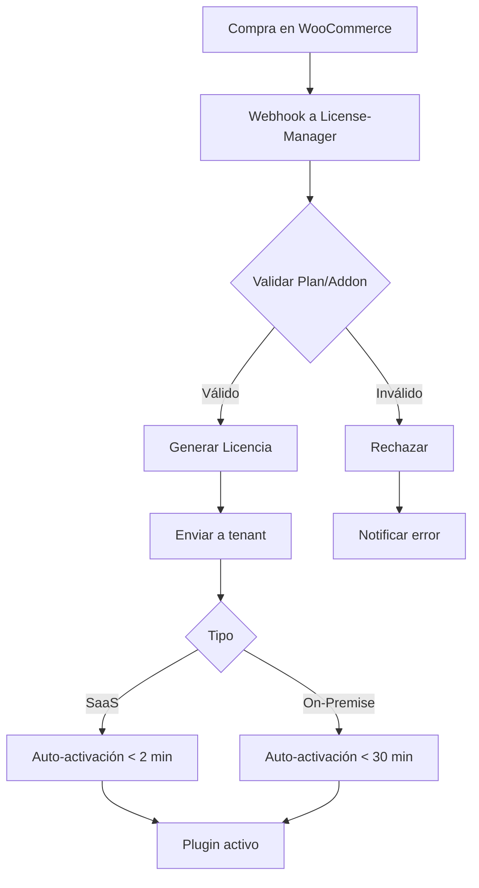
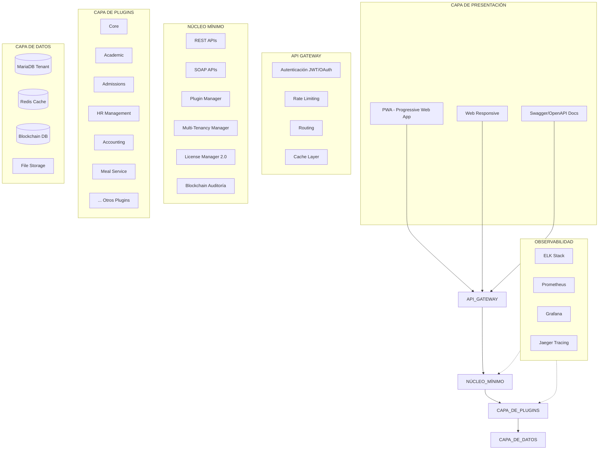

# Documento de Especificación y Diseño (DED)
# Sistema de Gestión Académico-Administrativa "Lazarus"

**Versión:** 2.1  
**Fecha:** 2025-01-03  
**Arquitecto/Autor:** Alonso Arias  
**Equipo de Desarrollo:** Alonso Arias, Yulian Moreno, Andersson Muñoz  
**Cliente:** Instituciones Educativas Colombianas  

---

## Índice

1. [Introducción](#1-introducción)
   1. [Propósito del documento](#11-propósito-del-documento)
   2. [Alcance del sistema](#12-alcance-del-sistema)
   3. [Definiciones, acrónimos y abreviaturas](#13-definiciones-acrónimos-y-abreviaturas)
   4. [Referencias](#14-referencias)
   5. [Visión general del documento](#15-visión-general-del-documento)

2. [Descripción general](#2-descripción-general)
   1. [Perspectiva del producto](#21-perspectiva-del-producto)
   2. [Funciones del producto](#22-funciones-del-producto)
   3. [Características de los usuarios](#23-características-de-los-usuarios)
   4. [Restricciones](#24-restricciones)
   5. [Suposiciones y dependencias](#25-suposiciones-y-dependencias)

3. [Contexto y Alcance](#3-contexto-y-alcance)
   1. [Nombre clave y branding](#31-nombre-clave-y-branding)
   2. [Modelo de licenciamiento](#32-modelo-de-licenciamiento)
   3. [Segmento de clientes objetivo](#33-segmento-de-clientes-objetivo)
   4. [Stack tecnológico](#34-stack-tecnológico)
   5. [Proceso de instalación](#35-proceso-de-instalación)
   6. [Modelo de desarrollo](#36-modelo-de-desarrollo)
   7. [Arquitectura general](#37-arquitectura-general)

4. [Modelo de MVP por Plugins](#4-modelo-de-mvp-por-plugins)
   1. [Estrategia de releases](#41-estrategia-de-releases)
   2. [Detalle de plugins por release](#42-detalle-de-plugins-por-release)
   3. [Roadmap visual](#43-roadmap-visual)

5. [Roles y Permisos](#5-roles-y-permisos)
   1. [Modelo de roles](#51-modelo-de-roles)
   2. [Permisos por rol](#52-permisos-por-rol)
   3. [Matriz CRUD×Rol](#53-matriz-crudrol)
   4. [Gestión y exportación de roles](#54-gestión-y-exportación-de-roles)

6. [Plugins y Requisitos Funcionales](#6-plugins-y-requisitos-funcionales)
   1. [Core](#61-core)
   2. [Installer](#62-installer)
   3. [RBAC-Extended](#63-rbac-extended)
   4. [Académico-Basic](#64-académico-basic)
   5. [Boletines](#65-boletines)
   6. [License-Manager](#66-license-manager)
   7. [Payments](#67-payments)
   8. [Analytics](#68-analytics)
   9. [Certificaciones](#69-certificaciones)
   10. [Migrator](#610-migrator)
   11. [LMS-Bridge](#611-lms-bridge)
   12. [Observador](#612-observador)
   13. [Meal-Service](#613-meal-service)
   14. [Scheduling](#614-scheduling)
   15. [HR-Management](#615-hr-management)
   16. [Accounting](#616-accounting)
   17. [Resource-Management](#617-resource-management)
   18. [Admissions](#618-admissions)

7. [Requisitos No Funcionales](#7-requisitos-no-funcionales)
   1. [Rendimiento](#71-rendimiento)
   2. [Seguridad](#72-seguridad)
   3. [Disponibilidad](#73-disponibilidad)
   4. [Escalabilidad](#74-escalabilidad)
   5. [Usabilidad](#75-usabilidad)
   6. [Mantenibilidad](#76-mantenibilidad)
   7. [Portabilidad](#77-portabilidad)
   8. [Compatibilidad](#78-compatibilidad)
   9. [Licenciamiento y Auto-activación](#79-licenciamiento-y-auto-activación)
   10. [Observabilidad](#710-observabilidad)

8. [Normativa y Cumplimiento](#8-normativa-y-cumplimiento)
   1. [Marco legal colombiano](#81-marco-legal-colombiano)
   2. [Protección de datos personales](#82-protección-de-datos-personales)
   3. [Integraciones oficiales](#83-integraciones-oficiales)
   4. [Estándares técnicos obligatorios](#84-estándares-técnicos-obligatorios)
   5. [Documentación Swagger](#85-documentación-swagger)

9. [Diseño Técnico](#9-diseño-técnico)
   1. [Arquitectura del sistema](#91-arquitectura-del-sistema)
   2. [Diseño de base de datos](#92-diseño-de-base-de-datos)
   3. [Diseño de APIs REST/SOAP](#93-diseño-de-apis-restsoap)
   4. [Diseño de seguridad](#94-diseño-de-seguridad)
   5. [Diseño de escalabilidad](#95-diseño-de-escalabilidad)
   6. [Diagramas UML](#96-diagramas-uml)
   7. [DevOps y CI/CD](#97-devops-y-cicd)
   8. [Observabilidad y Monitoreo](#98-observabilidad-y-monitoreo)
   9. [Blockchain Interno de Auditoría](#99-blockchain-interno-de-auditoría)

10. [Historias de Usuario](#10-historias-de-usuario)
    1. [Historias de Core](#101-historias-de-core)
    2. [Historias por plugin](#102-historias-por-plugin)

11. [Plan de Pruebas](#11-plan-de-pruebas)
    1. [Estrategia de pruebas](#111-estrategia-de-pruebas)
    2. [Tipos de pruebas](#112-tipos-de-pruebas)
    3. [Matriz de pruebas por plugin](#113-matriz-de-pruebas-por-plugin)

12. [Estrategia de Migración](#12-estrategia-de-migración)
    1. [Proceso de migración](#121-proceso-de-migración)
    2. [Herramientas de migración](#122-herramientas-de-migración)
    3. [Validación de datos migrados](#123-validación-de-datos-migrados)

13. [Plan de Capacitación](#13-plan-de-capacitación)
    1. [Usuarios administradores](#131-usuarios-administradores)
    2. [Usuarios finales](#132-usuarios-finales)
    3. [Recursos de autoservicio](#133-recursos-de-autoservicio)

14. [Cronograma de Desarrollo](#14-cronograma-de-desarrollo)
    1. [Resumen de sprints](#141-resumen-de-sprints)
    2. [Cronograma detallado de 39 meses](#142-cronograma-detallado-de-39-meses)
    3. [Hitos principales](#143-hitos-principales)
    4. [Matriz RACI](#144-matriz-raci)

15. [Anexos Técnicos](#15-anexos-técnicos)
    1. [Ejemplo de archivo .env](#151-ejemplo-de-archivo-env)
    2. [Plantilla my.cnf optimizada](#152-plantilla-mycnf-optimizada)
    3. [Estructura archivo .lzm](#153-estructura-archivo-lzm)
    4. [Configuración webhook WooCommerce](#154-configuración-webhook-woocommerce)
    5. [Plantilla de roles JSON](#155-plantilla-de-roles-json)
    6. [Esquema manifest.json para plugins](#156-esquema-manifestjson-para-plugins)
    7. [Especificación OpenAPI base](#157-especificación-openapi-base)

---

## 1. Introducción

### 1.1 Propósito del documento

Este Documento de Especificación y Diseño (DED) versión 2.1 define de manera exhaustiva y autocontenida los requisitos, arquitectura, diseño técnico y plan de implementación del sistema de gestión académico-administrativa "Lazarus" para instituciones educativas colombianas. Esta versión incorpora mejoras significativas en el modelo de licenciamiento, gestión de admisiones, DevOps/CI-CD, observabilidad y blockchain interno de auditoría.

El documento servirá como guía principal para el desarrollo del sistema, proporcionando una visión clara de todos los componentes, restricciones y expectativas, facilitando así la implementación incremental por el equipo de desarrollo compuesto por tres desarrolladores.

### 1.2 Alcance del sistema

Lazarus es un sistema modular de gestión académico-administrativa integral diseñado específicamente para colegios colombianos de naturaleza pública, privada o mixta. El sistema contempla:

**Gestión Académica:**
- Administración de calificaciones, boletines, certificados
- **Proceso completo de admisiones estudiantiles**
- Gestión de horarios académicos
- Integración con sistemas de aprendizaje (LMS)
- Observador del estudiante

**Gestión Administrativa:**
- Administración de roles y permisos extensible
- Sistema contable integrado
- Gestión del personal (nómina, contratos, evaluaciones)
- Administración de recursos físicos e inventarios

**Gestión de Servicios:**
- Sistema de alimentación escolar (PAE - Programa de Alimentación Escolar)
- Control de transporte escolar
- Gestión de biblioteca y recursos educativos

**Infraestructura Técnica:**
- Arquitectura basada en plugins con núcleo mínimo
- Servicios REST/SOAP para todas las funcionalidades
- **Soporte PWA (Progressive Web App) optimizado para móviles**
- Compatibilidad multi-sede y multi-institución
- **Integraciones offline/semiautomatizadas con sistemas oficiales colombianos**
- Modelo de licenciamiento avanzado con auto-activación de plugins
- **Observabilidad completa con ELK Stack, Prometheus y Grafana**

El sistema está destinado a instituciones de educación básica y media, contemplando diferentes calendarios académicos (A, B y flexibles) y modalidades (presencial, virtual, a distancia, alternancia).

El proyecto contempla un periodo de desarrollo de **39 meses** (con buffer del 25%) por un equipo de tres desarrolladores con dedicación parcial (2 horas diarias cada uno), con entregas incrementales de funcionalidad a través de plugins que permitan un uso temprano del sistema mientras se continúa el desarrollo de funcionalidades avanzadas.

#### Dentro del alcance:

**Núcleo del Sistema:**
- Sistema core multi-tenancy con aislamiento de datos por institución
- Arquitectura de servicios REST/SOAP para todas las funcionalidades
- **Soporte PWA nativo con capacidades offline**
- Proceso de instalación simplificado ("One-Click" y CLI)
- **Auto-updater con firma digital y rollback automático**

**Gestión académica completa:**
- **Proceso completo de admisiones (pre-inscripción, evaluación, matrícula)**
- Gestión académica básica (años académicos, periodos, cursos, asignaturas)
- Sistema de calificaciones flexible y adaptable a diferentes modelos evaluativos
- Generación de horarios académicos con optimización automática
- Generación de boletines y certificados oficiales
- Observador del estudiante y seguimiento disciplinario

**Gestión administrativa integral:**
- Sistema contable completo (PUC educativo colombiano)
- Gestión de nómina y personal docente/administrativo
- Administración de recursos físicos e inventarios
- Control de mantenimiento preventivo y correctivo

**Servicios institucionales:**
- Sistema de alimentación escolar (PAE) con control nutricional
- Gestión de transporte escolar
- Administración de biblioteca y recursos educativos
- Control de enfermería y salud escolar

**Cumplimiento normativo:**
- Conformidad con normativa educativa colombiana
- **Integración offline/semiautomatizada con sistemas oficiales (SIMAT, ICFES, MEN)**
- Adaptación a diferencias entre instituciones públicas, privadas y mixtas
- Cumplimiento de requisitos específicos según tipo de institución

**Infraestructura tecnológica:**
- **Gestión avanzada de licencias con auto-activación de plugins**
- **Metered billing por estudiante/empleado**
- Análisis estadístico y sistema de alertas
- Herramientas de migración de datos
- Integración con sistemas de aprendizaje (Moodle)
- **Pipeline DevOps completo con CI/CD**
- **Observabilidad con ELK, Prometheus, Grafana y OpenTelemetry**

#### Fuera del alcance:

- Aplicaciones móviles nativas (se implementa PWA)
- **GraphQL APIs (descartado en favor de REST/SOAP optimizados)**
- Desarrollo de contenido educativo o curricular
- Sistema de videoconferencia propio (se integrará con existentes)
- **APIs en tiempo real para SIMAT/SINEB/ICFES (no disponibles públicamente)**
- Sistema de e-learning propio (se integra con LMS existentes)

### 1.3 Definiciones, acrónimos y abreviaturas

- **DED**: Documento de Especificación y Diseño
- **MVP**: Producto Mínimo Viable
- **SaaS**: Software como Servicio
- **On-Premise**: Implementación local en servidores del cliente
- **PWA**: Progressive Web App
- **JWT**: JSON Web Token
- **RBAC**: Control de Acceso Basado en Roles
- **LMS**: Sistema de Gestión de Aprendizaje
- **CRUD**: Crear, Leer, Actualizar, Eliminar
- **MFA/2FA**: Autenticación de Múltiples Factores/Dos Factores
- **API**: Interfaz de Programación de Aplicaciones
- **REST**: Representational State Transfer
- **SOAP**: Simple Object Access Protocol
- **SA**: Super-Administrador
- **AC**: Admin-Cliente
- **AI**: Admin-Institución
- **AS**: Admin-Sede
- **PAE**: Programa de Alimentación Escolar
- **PUC**: Plan Único de Cuentas
- **DANE**: Departamento Administrativo Nacional de Estadística
- **SIMAT**: Sistema Integrado de Matrícula
- **SINEB**: Sistema de Información Nacional de Educación Básica
- **MEN**: Ministerio de Educación Nacional
- **ICFES**: Instituto Colombiano para la Evaluación de la Educación
- **ETL**: Extract, Transform, Load
- **SFTP**: Secure File Transfer Protocol
- **RPA**: Robotic Process Automation
- **ELK**: Elasticsearch, Logstash, Kibana
- **SAST**: Static Application Security Testing
- **DAST**: Dynamic Application Security Testing
- **CI/CD**: Continuous Integration/Continuous Deployment
- **RACI**: Responsible, Accountable, Consulted, Informed

### 1.4 Referencias

**Normativa Educativa:**
- Ley General de Educación (Ley 115 de 1994)
- Decreto 1860 de 1994
- Decreto 1290 de 2009
- Decreto 1075 de 2015
- Decreto 1965 de 2013 (Convivencia escolar)
- Resolución 6404 de 2009 (Libro de registro de diplomas)
- Ley 715 de 2001 (Sistema General de Participaciones)

**Normativa de Alimentación Escolar:**
- Resolución 29452 de 2017 (Lineamientos PAE)
- Decreto 1852 de 2015 (PAE)
- Resolución 16432 de 2015 (Lineamientos técnicos PAE)

**Normativa Laboral y Contable:**
- Código Sustantivo del Trabajo
- Decreto 2649 de 1993 (PUC)
- Resolución 355 de 2007 (PUC sector público)
- Decreto 1567 de 1998 (Capacitación empleados públicos)
- Decreto 1278 de 2002 (Estatuto de Profesionalización Docente)
- Decreto 2277 de 1979 (Estatuto Docente)

**Protección de Datos:**
- Ley 1581 de 2012 y Decreto 1377 de 2013
- Ley 594 de 2000 (Ley General de Archivos)
- Ley 87 de 1993 (Control Interno)
- ISO/IEC 27001 (Seguridad de la Información)
- WCAG 2.1 AA (Accesibilidad Web)

### 1.5 Visión general del documento

Este documento está estructurado en 15 secciones que abarcan desde la introducción y contexto hasta los anexos técnicos. Incluye especificaciones detalladas de todos los componentes del sistema, requisitos funcionales y no funcionales, diagramas técnicos, matrices de permisos, cronograma de implementación con buffer del 25%, y otros aspectos cruciales para el desarrollo exitoso del sistema, considerando las particularidades de las instituciones educativas colombianas según su naturaleza jurídica.

## 2. Descripción general

### 2.1 Perspectiva del producto

Lazarus es un sistema integral e independiente pero interoperable con otros sistemas educativos colombianos. Está diseñado como una solución completa que puede funcionar de forma autónoma o complementando otras herramientas mediante integraciones offline/semiautomatizadas. Su arquitectura modular basada en plugins, con un núcleo mínimo que expone servicios REST/SOAP y soporte PWA nativo, permite a las instituciones activar dinámicamente solo las funcionalidades necesarias según sus necesidades específicas y naturaleza jurídica (pública, privada o mixta).

El sistema se posiciona como una alternativa moderna y adaptable a las soluciones existentes en el mercado colombiano, con ventajas en términos de flexibilidad, cumplimiento normativo integral, adaptabilidad a diferentes tipos de instituciones educativas y capacidades offline para zonas con conectividad limitada.

### 2.2 Funciones del producto

El sistema Lazarus ofrece las siguientes funciones principales:

**Núcleo del Sistema:**
- Arquitectura de servicios REST/SOAP extensible por plugins
- **Soporte PWA nativo con capacidades offline**
- Multi-tenancy con aislamiento completo de datos
- Sistema avanzado de roles y permisos (RBAC)
- **Blockchain interno inmutable para auditoría**
- **Auto-activación de plugins con License-Manager 2.0**

**Gestión Académica Completa:**
- **Proceso integral de admisiones estudiantiles**
- Registro y administración de calificaciones
- Generación de horarios con optimización automática
- Generación de boletines, certificados y diplomas
- Observador del estudiante según Decreto 1965/2013
- Integración con sistemas de gestión de aprendizaje

**Gestión Administrativa Integral:**
- Sistema contable completo adaptado al PUC educativo
- Gestión de nómina y personal según normativa laboral colombiana
- Administración de inventarios y recursos físicos
- Control de mantenimiento de infraestructura

**Gestión de Servicios Institucionales:**
- Sistema PAE con control nutricional y trazabilidad
- Gestión de transporte escolar con rutas y control
- Administración de biblioteca y recursos educativos
- Control de servicios de salud y enfermería

**Cumplimiento Normativo:**
- Adaptación automática según tipo de institución (pública/privada/mixta)
- **Integración offline/semiautomatizada con sistemas oficiales (SIMAT, ICFES, MEN)**
- Generación de reportes oficiales requeridos
- Gestión documental según Ley General de Archivos

**Analítica y Reportes:**
- Indicadores de rendimiento académico y alertas tempranas
- Análisis financiero y presupuestal
- Estadísticas de servicios institucionales
- Reportes para entes de control

**Observabilidad y DevOps:**
- **Monitoreo completo con ELK Stack, Prometheus y Grafana**
- **Pipeline CI/CD automatizado**
- **Observabilidad con OpenTelemetry**

### 2.3 Características de los usuarios

Lazarus está diseñado para ser utilizado por diversos actores del ecosistema educativo, considerando las diferencias entre instituciones públicas, privadas y mixtas:

**Usuarios Administrativos:**
- **Administradores de sistema**: Usuarios técnicos que gestionan la plataforma a nivel general
- **Directivos institucionales**: Rectores, coordinadores y directivos según estructura organizacional
- **Personal administrativo**: Secretarias, personal financiero, recursos humanos
- **Contadores**: Profesionales contables para instituciones que lo requieran
- **Coordinadores de admisiones**: Gestión del proceso de admisión estudiantil
- **Asesores de admisiones**: Atención y seguimiento a aspirantes

**Usuarios Académicos:**
- **Docentes**: Profesores de planta, provisionales o por horas cátedra
- **Coordinadores académicos**: Supervisión de procesos académicos
- **Psicorientadores**: Personal de apoyo psicológico y orientación

**Usuarios de Servicios:**
- **Personal de alimentación**: Gestión del servicio PAE
- **Personal de transporte**: Conductores y monitores de ruta
- **Bibliotecarios**: Gestión de recursos bibliográficos
- **Personal de enfermería**: Atención en salud escolar

**Usuarios Beneficiarios:**
- **Estudiantes**: Usuarios que consultan información académica
- **Aspirantes**: Candidatos en proceso de admisión
- **Acudientes**: Padres o tutores con acceso según edad del estudiante
- **Invitados**: Usuarios con acceso limitado a información pública

### 2.4 Restricciones

El desarrollo e implementación de Lazarus está sujeto a las siguientes restricciones:

**Recursos de desarrollo:**
- Equipo de tres desarrolladores (Alonso Arias, Yulian Moreno, Andersson Muñoz)
- Disponibilidad de 2 horas diarias por desarrollador (6 horas diarias totales)
- Trabajo remoto coordinado

**Plazo de desarrollo:**
- **39 meses para el desarrollo completo del sistema (incluyendo buffer del 25%)**
- Entregas incrementales cada 3-4 semanas

**Restricciones técnicas:**
- Stack tecnológico predefinido (Laravel 10 LTS, MariaDB, etc.)
- Arquitectura de servicios REST/SOAP obligatoria
- **PWA como única solución móvil (no apps nativas)**
- **Descarte de GraphQL en favor de REST/SOAP optimizados**
- Núcleo mínimo con funcionalidades vía plugins

**Restricciones de integración:**
- **SIMAT, SINEB e ICFES no ofrecen APIs públicas en tiempo real**
- **Integración limitada a procesos offline/semiautomatizados (ETL, SFTP, RPA)**
- Dependencia de formatos de archivo oficiales

**Restricciones normativas:**
- Cumplimiento obligatorio de leyes y decretos educativos colombianos
- Adaptación a diferencias entre instituciones públicas, privadas y mixtas
- Requisitos estrictos de seguridad y privacidad de información sensible

**Restricciones operativas:**
- Debe funcionar en entornos con conectividad limitada o intermitente
- Compatible con infraestructura típica de instituciones educativas colombianas

### 2.5 Suposiciones y dependencias

El diseño de Lazarus se basa en las siguientes suposiciones y dependencias:

**Suposiciones técnicas:**
- Las instituciones educativas tienen acceso a servidores que cumplen con requisitos mínimos
- Los usuarios administradores tienen conocimientos técnicos básicos
- Existe compatibilidad entre las versiones del stack tecnológico seleccionado
- **La PWA es suficiente para necesidades móviles sin requerir apps nativas**
- **Los sistemas oficiales mantendrán compatibilidad con procesos offline/ETL**

**Suposiciones normativas:**
- Los sistemas oficiales mantienen sus formatos de archivo actuales
- El marco normativo colombiano no sufre cambios drásticos durante el desarrollo
- Las diferencias entre tipos de instituciones se mantienen estables

**Dependencias externas:**
- Disponibilidad de servicios de terceros (pasarelas de pago, SMS, correo)
- Continuidad de frameworks y librerías open source utilizadas
- Acceso a documentación oficial de sistemas gubernamentales
- **Disponibilidad de repositorio de plugins con 99.9% uptime**
- **Servicios de observabilidad y monitoreo**

## 3. Contexto y Alcance

### 3.1 Nombre clave y branding

**Nombre clave**: Lazarus

El nombre "Lazarus" evoca el concepto de revitalización y nueva vida, simbolizando la modernización de los procesos educativos tradicionales y la transformación digital de las instituciones educativas colombianas. Este nombre será utilizado tanto internamente en el desarrollo como en la comercialización del producto.

Elementos de branding a desarrollar:
- Logo principal y variantes según tipo de institución
- Paleta de colores institucional adaptable
- Tipografía del sistema
- Iconografía consistente en interfaz PWA
- Guías de marca para personalización institucional

### 3.2 Modelo de licenciamiento

El sistema Lazarus implementa un modelo de licenciamiento dual avanzado con auto-activación de plugins y metered billing:

**Modelo SaaS (Software como Servicio):**
- Ideal para instituciones con recursos limitados de TI
- Autenticación mediante clave JWT
- **Auto-activación de plugins < 2 minutos tras compra**
- **Metered billing por estudiante/empleado activo**
- Facturación recurrente (mensual/anual)
- Almacenamiento en la nube gestionada por el proveedor
- Actualizaciones automáticas
- Soporte técnico incluido según nivel de suscripción
- Tarifas diferenciadas para instituciones públicas

**Modelo On-Premise (Local):**
- Preferido por instituciones con infraestructura propia
- Licencia validada mediante archivo `.lzl`
- **Auto-activación de plugins < 30 minutos tras compra**
- **Update-Bundle firmado digitalmente**
- Pago único con mantenimiento anual opcional
- Instalación en servidores propios de la institución
- **Auto-updater con rollback automático**
- Soporte técnico según contrato de mantenimiento
- Control total sobre datos y configuraciones

**License-Manager 2.0:**
- **Gestión de planes base y addons modulares**
- **Eventos de licenciamiento: `plan.changed`, `addon.purchased`, `plugin.activated`, `plugin.deactivated`**
- **API REST completa en `/api/rest/v1/licensing/`**
- **Activación/desactivación de plugins por tenant**
- **Validación de límites y métricas**

**Consideraciones por tipo de institución:**
- **Públicas**: Descuentos especiales, facturación adaptada a presupuesto público
- **Privadas**: Planes premium con funcionalidades avanzadas
- **Mixtas**: Modelos híbridos según necesidades específicas

**Migración bidireccional:**
- Transición SaaS → On-Premise y viceversa
- Proceso operado exclusivamente por el proveedor
- Preservación de integridad de datos
- Tiempo de migración garantizado ≤ 48 horas
- Verificación de consistencia post-migración

#### 3.2.1 Tipos de suscripción y costos (COP)

| Plan | Tipo | Precio Base (COP/año) | Estudiantes Incluidos | Empleados Incluidos | Módulos Incluidos |
|------|------|----------------------|----------------------|--------------------|--------------------|
| **Lazarus Público** | SaaS | $0 | 500 | 50 | Core, Academic, HR, Meals, Observador |
| **Lazarus Básico** | SaaS | $2,400,000 | 300 | 30 | Core, Academic, Payments |
| **Lazarus Estándar** | SaaS | $4,800,000 | 800 | 80 | Básico + HR, Scheduling, Analytics |
| **Lazarus Premium** | SaaS | $9,600,000 | 2000 | 200 | Estándar + Accounting, Admissions, Resource-Mgmt |
| **Lazarus Enterprise** | On-Premise | $24,000,000 | Ilimitados | Ilimitados | Todos los módulos |

**Addons disponibles:**

| Addon | Precio (COP/año) | Descripción |
|-------|------------------|-------------|
| Transporte Escolar | $600,000 | Gestión de rutas y vehículos |
| Biblioteca Digital | $360,000 | Sistema bibliotecario avanzado |
| Meal Service (PAE) | $480,000 | Solo para privadas/mixtas |
| LMS Bridge Pro | $720,000 | Integración avanzada con LMS |
| Analytics Pro | $960,000 | Dashboards e IA predictiva |

**Metered billing adicional:**
- Estudiante adicional: $2,400 COP/año
- Empleado adicional: $12,000 COP/año
- Sede adicional: $240,000 COP/año

**Descuentos:**
- Instituciones públicas oficiales: 100% (gratuito)
- Zona rural: 30% adicional
- Multi-sede (>3): 20% sobre el total
- Pago anual anticipado: 15%

**Flujo de validación:**



### 3.3 Segmento de clientes objetivo

El sistema está diseñado para atender a los siguientes segmentos de instituciones educativas colombianas:

**Por naturaleza jurídica:**
- **Colegios públicos (oficiales)**: Con requisitos específicos de contratación estatal
- **Colegios privados**: Con necesidades de gestión empresarial
- **Colegios de administración mixta**: Concesiones, alianzas público-privadas

**Por estructura organizacional:**
- Instituciones unisede urbanas y rurales
- Instituciones multi-sede (megacolegios)
- Redes/grupos educativos
- Instituciones con sedes en diferentes municipios

**Por calendario académico:**
- Calendario A (febrero-noviembre)
- Calendario B (agosto-junio)
- Calendarios flexibles o especiales
- Modelos de alternancia educativa

**Por modalidad educativa:**
- Educación presencial tradicional
- Educación virtual
- Educación a distancia
- Modelos híbridos
- Educación por ciclos (adultos)

**Por niveles educativos:**
- Preescolar (pre-jardín, jardín, transición)
- Básica primaria (1° a 5°)
- Básica secundaria (6° a 9°)
- Media académica (10° y 11°)
- Media técnica con articulación SENA
- Programas de educación para adultos

### 3.4 Stack tecnológico

El desarrollo de Lazarus se basará en las siguientes tecnologías:

**Backend - Núcleo y Servicios:**
- Laravel 10 LTS (framework PHP)
- Arquitectura de microservicios con servicios REST/SOAP
- **GraphQL descartado (no se implementará)**
- MariaDB ≥ 10.6 (base de datos relacional)
- Redis (caché y colas)
- stancl/tenancy (multi-tenancy - database-per-tenant)
- nWidart/modules (arquitectura modular para plugins)
- Laravel API Resources (REST)
- PHP SOAP Server (servicios SOAP)

**Frontend:**
- **PWA (Progressive Web App) con Workbox**
- Livewire 3.x / Inertia.js (interfaces reactivas)
- TailwindCSS (framework CSS)
- Alpine.js (interactividad frontend mínima)
- Chart.js (visualización de datos)
- **Service Workers para capacidades offline**

**DevOps y CI/CD:**
- **Docker y Docker Compose**
- **GitHub Actions (CI/CD pipeline completo)**
- **SAST: SonarQube, PHPStan nivel 8**
- **DAST: OWASP ZAP**
- **Container scanning: Trivy**
- **Dependency scanning: Snyk**

**Observabilidad:**
- **ELK Stack (Elasticsearch, Logstash, Kibana)**
- **Prometheus + Grafana**
- **OpenTelemetry para trazas distribuidas**
- **Jaeger para trace analysis**

**Infraestructura:**
- Docker (contenedores para desarrollo y despliegue)
- Kubernetes (orquestación para producción)
- Nginx (servidor web y proxy)
- Let's Encrypt (certificados SSL automáticos)
- Laravel Horizon (gestión de colas)
- Supervisor (gestión de procesos)

**Blockchain Interno:**
- **Hyperledger Fabric (permissioned blockchain)**
- **PostgreSQL para metadata blockchain**
- **IPFS para almacenamiento de evidencia**

**Herramientas de desarrollo:**
- PHPStan (análisis estático nivel 8)
- Laravel Pint (formateador de código)
- PHPUnit (pruebas unitarias)
- Laravel Dusk (pruebas end-to-end)
- Postman/Insomnia (documentación API)

### 3.5 Proceso de instalación

El sistema Lazarus ofrece dos métodos principales de instalación adaptados a diferentes niveles técnicos:

**Instalación "One-Click" (wizard web):**
1. Subida de archivos a servidor vía FTP/SFTP
2. Acceso a URL de instalación
3. Verificación automática de requisitos del servidor
4. **Conexión con License-Manager para validar licencia**
5. **Descarga automática de plugins autorizados**
6. Formulario web para configuración:
   - Tipo de institución (pública/privada/mixta)
   - Datos de conexión a base de datos
   - Información de la institución
   - Configuración de correo electrónico
   - Ajustes de seguridad básicos
   - Zona horaria y configuración regional
7. Creación automática de bases de datos y archivos de configuración
8. Carga de catálogos específicos según tipo de institución
9. Generación automática del archivo `.env`
10. Creación de usuario Super-Administrador
11. **Configuración de Auto-Updater (opcional)**
12. Activación de plugins iniciales
13. **Inicialización de PWA y Service Workers**
14. Redirección al dashboard inicial

**Instalación mediante CLI:**
1. Clonación/descarga de repositorio
2. Ejecución de script de instalación
   ```bash
   php artisan lazarus:install --type={public|private|mixed} --license={key}
   ```
3. **Validación automática de licencia con License-Manager**
4. **Descarga e instalación de plugins autorizados**
5. Configuración mediante prompts interactivos o archivo de configuración
6. Verificación automática de dependencias
7. Migración y semilla de base de datos
8. Generación de claves de aplicación
9. Configuración de tareas programadas (cron)
10. Configuración de servicios REST/SOAP
11. **Setup de Auto-Updater y firma digital**

Ambos métodos incluyen:
- Detección automática del tipo de institución
- Carga de configuraciones predeterminadas según naturaleza jurídica
- Verificación de compatibilidad de versiones
- Comprobación de extensiones PHP requeridas
- Validación de permisos de archivos y directorios
- **Configuración de observabilidad básica**
- **Inicialización de blockchain interno de auditoría**

### 3.6 Modelo de desarrollo

El desarrollo de Lazarus seguirá estas directrices actualizadas:

**Recursos humanos:**
- Equipo de tres desarrolladores:
  - Alonso Arias (Arquitecto/Líder técnico)
  - Yulian Moreno (Desarrollador)
  - Andersson Muñoz (Desarrollador)
- Dedicación de 2 horas diarias por persona
- Total: 30 horas semanales de desarrollo
- **Periodo de desarrollo: 39 meses (incluyendo buffer del 25%)**

**Metodología:**
- Desarrollo incremental basado en plugins
- Sprints de 3 semanas
- Reuniones diarias de sincronización (15 min)
- Pruebas continuas (TDD cuando sea aplicable)
- Releases cada 2-3 sprints
- Retrospectivas quincenales

**Distribución de trabajo:**
- Desarrollo en paralelo de diferentes plugins
- Rotación de responsabilidades para conocimiento compartido
- Pair programming para componentes críticos
- Code reviews obligatorios entre el equipo

**DevOps y CI/CD:**
- **Pipeline automatizado con GitHub Actions**
- **Build, test, SAST, DAST en cada PR**
- **Deployment automático a staging**
- **Approval manual para production**
- **Rollback automático en caso de fallo**

**Gestión del código:**
- Control de versiones con Git (GitHub)
- Estrategia Git Flow adaptada
- Ramas feature/hotfix/release
- Convención de commits semánticos
- Documentación inline del código (PHPDoc)
- **Análisis de calidad automático con SonarQube**

**Comunicación del equipo:**
- Canal de Slack/Discord para comunicación diaria
- Tablero Kanban compartido (GitHub Projects)
- Documentación en wiki del proyecto
- Sesiones de diseño colaborativo

**Priorización:**
- Enfoque en MVP funcional por cada plugin
- Desarrollo del núcleo REST/SOAP primero
- Implementación incremental de servicios
- Pruebas de usuarios clave al final de cada release

### 3.7 Arquitectura general

El sistema Lazarus se construirá sobre una arquitectura modular orientada a servicios con las siguientes características:



**Arquitectura por capas:**
- **Capa de servicios**: APIs REST/SOAP expuestas por el núcleo
- **Capa de presentación**: PWA y interfaces web responsives
- **Capa de aplicación**: Controladores, servicios de negocio
- **Capa de dominio**: Modelos, lógica de negocio, reglas
- **Capa de infraestructura**: Base de datos, servicios externos
- **Capa de observabilidad**: Monitoreo, logs, métricas, trazas

**Núcleo mínimo:**
- Gestión de autenticación y autorización
- Servicios base REST/SOAP
- **License-Manager 2.0 con auto-activación**
- Sistema de plugins dinámico
- Multi-tenancy
- **Blockchain interno de auditoría**
- Gestión de configuración

**Modelo de plugins:**
- Cada funcionalidad como plugin independiente
- **Plugins activables/desactivables por tenant vía UI y API**
- Plugins extienden servicios REST/SOAP del núcleo
- Activación/desactivación sin afectar el sistema
- **Auto-activación tras compra en License-Manager**
- Versionado independiente
- APIs bien definidas entre plugins

**Servicios REST/SOAP:**
```
/api/rest/v1/[plugin]/[recurso]    # Servicios REST
/api/soap/v1/[plugin]              # Servicios SOAP
/api/rest/v1/licensing/*           # APIs License-Manager 2.0
```

Ejemplos:
- REST: `/api/rest/v1/academic/courses`
- SOAP: `/api/soap/v1/academic?wsdl`
- Licensing: `/api/rest/v1/licensing/plugins/activate`

**Multi-tenancy:**
- Aislamiento a nivel de base de datos (database-per-tenant)
- Separación lógica de datos por cliente/institución/sede
- Configuraciones específicas por tipo de institución
- Dominios/subdominios configurables por tenant
- **Plugin states independientes por tenant**

**PWA y capacidades offline:**
- Service Workers para cache inteligente
- Sincronización en background
- Funcionalidad offline para operaciones críticas
- Push notifications
- Instalación desde navegador

**Consideraciones por tipo de institución:**
- **Públicas**: Módulos de contratación estatal, reportes CHIP
- **Privadas**: Módulos de gestión empresarial, marketing, admisiones
- **Mixtas**: Combinación configurable de características

**Escalabilidad:**
- Diseño para crecimiento horizontal y vertical
- Servicios stateless para fácil replicación
- Cache distribuido con Redis
- Preparación para arquitectura de microservicios futura
- **Observabilidad completa para identificar cuellos de botella**

## 4. Modelo de MVP por Plugins

### 4.1 Estrategia de releases

El desarrollo de Lazarus seguirá una estrategia de releases incrementales con mayor frecuencia, aprovechando el equipo ampliado y incorporando el buffer del 25%. Cada versión entrega un conjunto coherente de funcionalidades empaquetadas como plugins. Esta estrategia permite:

1. Obtener feedback temprano y continuo de usuarios reales
2. Distribuir la carga de desarrollo entre los tres miembros del equipo
3. Priorizar funcionalidades según necesidades urgentes de instituciones
4. Mantener un ritmo sostenible con entregas cada 6-8 semanas
5. Adaptarse rápidamente a cambios normativos
6. Validar la arquitectura de servicios REST/SOAP desde el inicio
7. **Probar el License-Manager 2.0 y auto-activación de plugins**
8. **Implementar observabilidad desde las primeras versiones**

Cada release está planificado para ofrecer un MVP (Producto Mínimo Viable) con funcionalidad completa en su alcance, permitiendo uso en producción desde las primeras versiones.

### 4.2 Detalle de plugins por release

#### Release 0.1 - Núcleo y Fundamentos (Mes 1-2)
**Plugins**: core, installer, rbac-extended
**Objetivo**: Establecer la infraestructura base con servicios REST/SOAP
**Funcionalidades clave**:
- Arquitectura de servicios REST/SOAP funcional
- Estructura multi-tenant con aislamiento de datos
- Wizard de instalación web y CLI con validación de licencia
- Sistema extensible de roles y permisos
- Panel de administración base PWA
- Gestión de usuarios y perfiles
- **License-Manager 2.0 básico**
- Diferenciación por tipo de institución
- **Blockchain interno de auditoría inicializado**

#### Release 0.2 - Gestión Académica Básica (Mes 3-4)
**Plugins**: academico-basic, boletines
**Objetivo**: Implementar gestión académica fundamental
**Funcionalidades clave**:
- Servicios REST/SOAP para gestión académica
- Configuración de períodos académicos
- Definición de asignaturas y áreas
- Registro de calificaciones
- Generación de boletines con plantillas
- Configuración de escala de evaluación
- Adaptación según calendario académico
- **Plugin activable/desactivable por tenant**

#### Release 0.2.1 - Proceso de Admisiones (Mes 4.5-5.5)
**Plugins**: admissions
**Objetivo**: Implementar proceso completo de admisiones
**Funcionalidades clave**:
- **Pre-inscripción en línea de aspirantes**
- **Programación y gestión de evaluaciones**
- **Entrevistas y valoración integral**
- **Proceso de matrícula automatizado**
- **Portal de aspirantes y acudientes**
- **Reportes y estadísticas de admisión**
- **Integración con Academic-Basic para matrícula**

#### Release 0.3 - Horarios y Asignación (Mes 6-7)
**Plugins**: scheduling
**Objetivo**: Gestión completa de horarios académicos
**Funcionalidades clave**:
- Motor de generación de horarios
- Gestión de aulas y espacios
- Asignación de docentes a horarios
- Restricciones y preferencias
- Optimización automática
- Gestión de conflictos
- **Auto-activación tras compra**

#### Release 0.4 - Sistema de Alimentación (Mes 8-9)
**Plugins**: meal-service
**Objetivo**: Implementar gestión PAE completa
**Funcionalidades clave**:
- Gestión de menús y minutas
- Control nutricional
- Registro de beneficiarios PAE
- Control de asistencia alimentaria
- Inventario de alimentos
- Reportes para MEN y entes de control
- Diferenciación urbano/rural
- **Funcionalidad offline para registro de entregas**

#### Release 0.5 - Gestión de Personal (Mes 10-12)
**Plugins**: hr-management
**Objetivo**: Administración integral de recursos humanos
**Funcionalidades clave**:
- Gestión de personal docente y administrativo
- **Tipos de vinculación según normativa colombiana:**
  - **Oficiales**: Propiedad, provisional, período prueba, temporal, sustitución
  - **Privados**: Indefinido, término fijo, hora cátedra, reemplazante
- Control de contratos y vinculación
- Cálculo de nómina según normativa
- Evaluación de desempeño
- Control de novedades
- Generación de certificados laborales
- Diferencias entre empleados públicos/privados

#### Release 0.6 - Sistema Contable (Mes 13-15)
**Plugins**: accounting
**Objetivo**: Contabilidad adaptada al sector educativo
**Funcionalidades clave**:
- PUC educativo colombiano
- Gestión de presupuesto
- Facturación y cartera
- Conciliaciones bancarias
- Reportes fiscales
- Integración con CHIP (públicas)
- Manejo de fondos de servicios educativos

#### Release 0.7a - Comercialización Base (Mes 16-17)
**Plugins**: license-manager-2.0
**Objetivo**: Sistema avanzado de licenciamiento
**Funcionalidades clave**:
- **License-Manager 2.0 completo**
- **Gestión de planes y addons**
- **Eventos de licenciamiento**
- **API REST completa `/api/rest/v1/licensing/`**
- **Auto-activación SaaS < 2 min, On-Premise < 30 min**
- **Metered billing por estudiante/empleado**
- **Update-Bundle firmado y Auto-Updater**

#### Release 0.7b - Pagos y Facturación (Mes 17.5-18.5)
**Plugins**: payments
**Objetivo**: Sistema de pagos y facturación
**Funcionalidades clave**:
- Integración con pasarelas de pago
- Portal de cliente
- Gestión de pagos de servicios
- Facturación electrónica
- Control de cartera estudiantil
- **Integración con License-Manager 2.0**

#### Release 0.8 - Analítica Educativa (Mes 19-21)
**Plugins**: analytics
**Objetivo**: Inteligencia de negocio educativa
**Funcionalidades clave**:
- Dashboard ejecutivo por tipo de institución
- Indicadores de deserción y rendimiento
- Análisis financiero
- Estadísticas PAE
- Alertas automáticas
- Reportes para entes de control
- **Métricas de uso para metered billing**

#### Release 0.9 - Gestión Documental (Mes 22-23)
**Plugins**: certificaciones
**Objetivo**: Emisión de documentos oficiales
**Funcionalidades clave**:
- Generación de diplomas y actas
- Certificados académicos y laborales
- Constancias personalizadas
- Firma digital y códigos QR
- Libro de registro digital
- Cumplimiento Ley de Archivos

#### Release 0.10 - Recursos Físicos (Mes 24-25)
**Plugins**: resource-management
**Objetivo**: Control de infraestructura y recursos
**Funcionalidades clave**:
- Inventario de activos fijos
- Gestión de espacios físicos
- Mantenimiento preventivo/correctivo
- Control de préstamos
- Gestión de laboratorios
- Plan de compras institucional

#### Release 0.11 - Observador Estudiantil (Mes 26-27)
**Plugins**: observador
**Objetivo**: Seguimiento integral del estudiante
**Funcionalidades clave**:
- Registro disciplinario según Decreto 1965
- Seguimiento académico
- Acompañamiento psicosocial
- Gestión de comités de convivencia
- Alertas tempranas
- Reportes para acudientes

#### Release 0.12 - Migración y Conectividad (Mes 28-29)
**Plugins**: migrator, lms-bridge
**Objetivo**: Herramientas de integración
**Funcionalidades clave**:
- Migración desde otros sistemas
- **Integración offline/semiautomatizada con SIMAT/SINEB/ICFES**
- **Procesos ETL para sistemas oficiales**
- **Validación y trazabilidad de datos importados**
- Integración con Moodle
- Sincronización de datos
- Importación masiva
- APIs para terceros
- Conectores estándar

#### Release 1.0 - Sistema Completo (Mes 30-39)
**Objetivo**: Refinamiento, optimización y estabilización
**Actividades**:
- **Optimización de observabilidad completa**
- **Refinamiento de PWA y capacidades offline**
- **Mejoras en auto-activación y License-Manager**
- Optimización de rendimiento
- Mejoras de UX/UI
- Documentación completa
- Capacitación de usuarios
- Corrección de bugs
- Nuevas características menores
- **Preparación para marketplace de plugins**

### 4.3 Roadmap visual


**Equipo de desarrollo (3 personas × 2 horas/día = 30 horas/semana):**
- Desarrollo paralelo de componentes
- Integración continua con CI/CD
- Releases frecuentes con auto-activación
- **Buffer del 25% incluido en cronograma**

## 5. Roles y Permisos

### 5.1 Modelo de roles

El sistema Lazarus implementa un modelo RBAC extensible y adaptable según el tipo de institución (pública, privada o mixta), con roles específicos para cada contexto:

#### Jerarquía de roles predefinidos

**Roles Administrativos del Sistema:**

1. **Super-Administrador (SA)**
   - Nivel: Sistema
   - Control total sobre todas las funcionalidades
   - Gestión de licencias y configuración global

2. **Admin-Cliente (AC)**
   - Nivel: Cliente (grupo de instituciones)
   - Administra múltiples instituciones
   - Reportes consolidados

3. **Admin-Institución (AI)**
   - Nivel: Institución
   - Administra institución completa
   - Configuraciones institucionales

4. **Admin-Sede (AS)**
   - Nivel: Sede
   - Administra sede específica
   - Configuraciones locales

**Roles Directivos (varían según tipo de institución):**

5. **Rector**
   - Máxima autoridad institucional
   - Aprobación de procesos críticos
   - Firma digital de documentos

6. **Coordinador Académico**
   - Supervisión académica
   - Aprobación de calificaciones
   - Gestión de horarios

7. **Coordinador de Convivencia**
   - Gestión disciplinaria
   - Comités de convivencia
   - Seguimiento de casos

**Roles Académicos:**

8. **Docente**
   - Registro de calificaciones
   - Observaciones de estudiantes
   - Gestión de sus cursos

9. **Director de Grupo**
   - Funciones de docente
   - Seguimiento especial de su grupo
   - Reportes de grupo

10. **Psicorientador**
    - Acompañamiento estudiantil
    - Reportes confidenciales
    - Gestión de casos especiales

**Roles Administrativos Institucionales:**

11. **Secretaria Académica**
    - Gestión documental
    - Matrículas y certificados
    - Atención a usuarios

12. **Auxiliar Administrativo**
    - Soporte a secretaría
    - Tareas administrativas básicas
    - Archivo documental

13. **Pagador/Tesorero** (principalmente privadas)
    - Gestión de pagos
    - Control de cartera
    - Reportes financieros

14. **Contador**
    - Gestión contable completa
    - Reportes fiscales
    - Auditoría financiera

15. **Almacenista**
    - Control de inventarios
    - Gestión de compras
    - Distribución de recursos

**Roles de Servicios:**

16. **Coordinador PAE**
    - Gestión programa alimentación
    - Control nutricional
    - Reportes MEN

17. **Manipulador de Alimentos**
    - Registro de minutas servidas
    - Control de asistencia PAE
    - Inventario diario

18. **Bibliotecario**
    - Gestión de recursos bibliográficos
    - Préstamos y devoluciones
    - Estadísticas de uso

19. **Enfermero/a**
    - Atención en salud
    - Registro médico
    - Alertas de salud

20. **Coordinador de Transporte**
    - Gestión de rutas
    - Control de vehículos
    - Seguimiento de estudiantes

**Roles de Recursos Humanos:**

21. **Jefe de Personal** (principalmente privadas)
    - Gestión de contratos
    - Evaluaciones de desempeño
    - Procesos de selección

22. **Auxiliar de Nómina**
    - Procesamiento de nómina
    - Novedades de personal
    - Reportes de seguridad social

**Roles de Mantenimiento:**

23. **Jefe de Mantenimiento**
    - Programación de mantenimientos
    - Gestión de personal técnico
    - Control de infraestructura

24. **Personal de Mantenimiento**
    - Registro de actividades
    - Solicitudes de materiales
    - Reportes de estado

**Nuevos Roles de Admisiones:**

25. **Coordinador de Admisiones**
    - **Gestión completa del proceso de admisión**
    - **Configuración de criterios de evaluación**
    - **Supervisión de entrevistas y pruebas**
    - **Aprobación final de admisiones**
    - **Reportes estadísticos del proceso**

26. **Asesor de Admisiones**
    - **Atención a aspirantes y familias**
    - **Registro de pre-inscripciones**
    - **Programación de citas y evaluaciones**
    - **Seguimiento del proceso por aspirante**
    - **Apoyo en eventos de promoción**

**Usuarios Finales:**

27. **Estudiante**
    - Consulta de información personal
    - Acceso a recursos
    - Comunicación académica

28. **Aspirante**
    - **Acceso al portal de admisiones**
    - **Seguimiento del proceso de admisión**
    - **Carga de documentos requeridos**
    - **Programación de citas**

29. **Acudiente**
    - Seguimiento de estudiantes asociados
    - Autorización de permisos
    - Comunicación con institución

30. **Egresado**
    - Solicitud de certificados
    - Acceso a información histórica
    - Actualización de datos

31. **Invitado**
    - Acceso público limitado
    - Consulta de información general
    - Pre-inscripciones

#### Características del sistema RBAC adaptado

- **Roles por tipo de institución**: Configuraciones predeterminadas según naturaleza jurídica
- **Roles contextuales**: Aplicación en contextos específicos
- **Herencia múltiple**: Un usuario puede tener varios roles simultáneos
- **Restricciones temporales**: Activación por períodos específicos
- **Delegación supervisada**: Asignación temporal de permisos
- **Auditoría completa**: Trazabilidad de todas las acciones en blockchain interno

### 5.2 Permisos por rol

Los permisos están organizados por módulos y siguen la nomenclatura `[módulo].[recurso].[acción]`:

#### Categorías de permisos expandidas

1. **Sistema** (`system.*`)
   - Configuración global
   - Gestión de plugins
   - Auditoría general
   - Mantenimiento

2. **Administración** (`admin.*`)
   - Gestión de usuarios
   - Configuración de roles
   - Parámetros institucionales
   - Calendarios

3. **Licenciamiento** (`licensing.*`)
   - **Gestión de planes y addons**
   - **Activación/desactivación de plugins**
   - **Consulta de métricas de uso**
   - **Gestión de límites**

4. **Académico** (`academic.*`)
   - Planes de estudio
   - Calificaciones
   - Horarios
   - Promoción

5. **Admisiones** (`admissions.*`)
   - **Gestión de aspirantes**
   - **Proceso de evaluación**
   - **Configuración de criterios**
   - **Reportes de admisión**

6. **Estudiantes** (`students.*`)
   - Matrículas
   - Información personal
   - Observador
   - Seguimiento

7. **Personal** (`hr.*`)
   - Contratos
   - Nómina
   - Evaluaciones
   - Capacitación

8. **Contabilidad** (`accounting.*`)
   - Asientos contables
   - Presupuesto
   - Facturación
   - Reportes fiscales

9. **Alimentación** (`meals.*`)
   - Menús y minutas
   - Beneficiarios
   - Inventarios
   - Reportes PAE

10. **Recursos** (`resources.*`)
    - Inventarios
    - Mantenimiento
    - Préstamos
    - Compras

11. **Documental** (`documents.*`)
    - Certificados
    - Constancias
    - Archivo
    - Correspondencia

12. **Reportes** (`reports.*`)
    - Académicos
    - Financieros
    - Estadísticos
    - Oficiales

### 5.3 Matriz CRUD×Rol

Matriz extendida de permisos para los roles principales y los nuevos recursos del sistema:

| Recurso | SA | AI | Rector | Coord. Acad | Coord. Admisiones | Asesor Admisiones | Docente | Secret. | Contador | Coord. PAE | Estudiante | Aspirante | Acudiente |
|---------|----|----|--------|-------------|-------------------|-------------------|---------|---------|----------|-----------|------------|-----------|-----------|
| **Usuarios** | CRUD | CRU | R | R | - | - | - | CR | - | - | - | - | - |
| **Roles** | CRUD | R | R | - | - | - | - | - | - | - | - | - | - |
| **Plugins** | CRUD | R | R | R | R | - | - | - | - | - | - | - | - |
| **Licencias** | CRUD | R | R | - | R | - | - | - | - | - | - | - | - |
| **Aspirantes** | CRUD | R | R | R | CRUD | CRUD | - | R | - | - | - | RU | R |
| **Admisiones** | CRUD | R | RU | R | CRUD | CRU | - | R | - | - | - | R | R |
| **Calificaciones** | CRUD | R | RU | RU | - | - | CRU | R | - | - | R | - | R |
| **Horarios** | CRUD | CRU | RU | CRUD | - | - | R | R | - | - | R | - | R |
| **Nómina** | CRUD | RU | R | - | - | - | - | - | CRUD | - | - | - | - |
| **Contabilidad** | CRUD | R | R | - | - | - | - | - | CRUD | - | - | - | - |
| **Menús PAE** | CRUD | R | R | - | - | - | - | - | - | CRUD | R | - | R |
| **Inventarios** | CRUD | RU | R | - | - | - | - | R | R | RU | - | - | - |
| **Mantenimiento** | CRUD | CRU | RU | - | - | - | - | CR | - | - | - | - | - |
| **Certificados** | CRUD | R | RU | R | - | - | - | CRUD | - | - | R | - | R |
| **Observador** | CRUD | R | RU | CRU | - | - | CRU | R | - | - | R | - | R |

**Leyenda**:
- C: Crear
- R: Leer  
- U: Actualizar
- D: Eliminar
- -: Sin acceso

#### Permisos específicos por tipo de institución

**Instituciones Públicas adicionales:**
- Gestión de contratación estatal
- Reportes CHIP y SIIF
- Control fiscal
- Rendición de cuentas
- **Vinculación docente según Decreto 1278/2002**

**Instituciones Privadas adicionales:**
- Gestión de mercadeo
- CRM de familias
- Facturación avanzada
- Gestión de becas
- **Proceso de admisiones completo**
- **Contratación laboral privada**

**Instituciones Mixtas:**
- Combinación configurable
- Doble contabilidad
- Reportes diferenciados

### 5.4 Gestión y exportación de roles

El sistema incluye herramientas avanzadas para gestión de roles adaptadas a cada tipo de institución:

#### Plantillas por tipo de institución

1. **Plantilla Institución Pública**
   - Roles según Ley 715
   - Permisos de contratación estatal
   - Reportes oficiales obligatorios

2. **Plantilla Institución Privada**
   - Roles empresariales
   - **Roles de admisiones completos**
   - Gestión comercial
   - Flexibilidad organizacional

3. **Plantilla Institución Mixta**
   - Roles híbridos
   - Permisos diferenciados
   - Doble estructura

#### Funcionalidades de gestión mejoradas

- **Asistente de configuración**: Guía según tipo de institución
- **Validación normativa**: Verificación de cumplimiento legal
- **Simulador de permisos**: Prueba antes de aplicar
- **Versionado de roles**: Control de cambios histórico
- **Importación inteligente**: Detección de conflictos
- **Activación por plugin**: Roles se activan/desactivan según plugins disponibles

## 6. Plugins y Requisitos Funcionales

### 6.1 Core

El plugin Core constituye el núcleo mínimo del sistema con arquitectura orientada a servicios REST/SOAP.

#### Requisitos Funcionales Actualizados

| ID | Requisito | Descripción | Prioridad |
|----|-----------|-------------|-----------|
| CORE-1 | Multi-tenancy base | Arquitectura multi-tenant con aislamiento por base de datos | Alta |
| CORE-2 | Servicios REST base | APIs REST para todas las operaciones CRUD básicas | Alta |
| CORE-3 | Servicios SOAP base | Endpoints SOAP para integración con sistemas legacy | Alta |
| CORE-4 | Gestión de usuarios | Sistema de usuarios con perfiles diferenciados por institución | Alta |
| CORE-5 | Sistema base de roles | RBAC básico extensible por plugins | Alta |
| CORE-6 | Autenticación JWT/OAuth | Sistema de autenticación para servicios | Alta |
| CORE-7 | Dashboard modular PWA | Panel configurable según tipo de institución con PWA | Alta |
| CORE-8 | Sistema de notificaciones | Notificaciones multi-canal (email, SMS, push) | Media |
| CORE-9 | Gestión de instituciones | CRUD con campos específicos según naturaleza jurídica | Alta |
| CORE-10 | Blockchain auditoría | Sistema inmutable de auditoría con blockchain interno | Alta |
| CORE-11 | API Gateway | Punto único de entrada para todos los servicios | Alta |
| CORE-12 | Plugin loader | Sistema dinámico de carga y gestión de plugins | Alta |
| CORE-13 | Configuración jerárquica | Parámetros por sistema/institución/sede/usuario | Media |
| CORE-14 | Cache distribuido | Sistema de cache para optimización de servicios | Media |
| CORE-15 | Healthcheck endpoints | Monitoreo de salud de servicios | Media |
| CORE-16 | Service Workers | PWA con capacidades offline | Alta |
| CORE-17 | Plugin state manager | Estados de plugins por tenant | Alta |

### 6.2 Installer

Plugin mejorado para instalación adaptada según tipo de institución con integración al License-Manager.

#### Requisitos Funcionales

| ID | Requisito | Descripción | Prioridad |
|----|-----------|-------------|-----------|
| INS-1 | Wizard adaptativo | Instalación guiada según tipo de institución | Alta |
| INS-2 | Detección de entorno | Identificación automática de capacidades del servidor | Alta |
| INS-3 | Validación de licencia | Conexión con License-Manager para validar autorización | Alta |
| INS-4 | Descarga de plugins | Descarga automática de plugins autorizados por licencia | Alta |
| INS-5 | Carga datos específicos | Catálogos diferenciados (público/privado/mixto) | Alta |
| INS-6 | Configuración servicios | Setup automático de endpoints REST/SOAP | Alta |
| INS-7 | Setup Auto-Updater | Configuración opcional de actualizaciones automáticas | Alta |
| INS-8 | Inicialización PWA | Configuración de Service Workers y manifest | Alta |
| INS-9 | Módulos por defecto | Activación de plugins según tipo institución | Media |
| INS-10 | Validación normativa | Verificación de requisitos legales mínimos | Media |
| INS-11 | Blockchain init | Inicialización de blockchain interno de auditoría | Alta |
| INS-12 | Observabilidad setup | Configuración básica de monitoreo | Media |
| INS-13 | Modo demo | Instalación con datos de prueba | Baja |

### 6.3 RBAC-Extended

Sistema avanzado de roles con adaptación institucional.

#### Requisitos Funcionales

| ID | Requisito | Descripción | Prioridad |
|----|-----------|-------------|-----------|
| RB-1 | Plantillas institucionales | Sets de roles predefinidos por tipo | Alta |
| RB-2 | Validación legal | Verificación de roles mínimos obligatorios | Alta |
| RB-3 | Roles dinámicos | Creación según estructura organizacional | Alta |
| RB-4 | Permisos por servicio | Control granular sobre APIs REST/SOAP | Alta |
| RB-5 | Delegación temporal | Sistema de suplencias y encargos | Media |
| RB-6 | Auditoría de permisos | Trazabilidad completa de cambios en blockchain | Alta |
| RB-7 | Roles por plugin | Activación/desactivación según plugins disponibles | Alta |
| RB-8 | Permisos de licensing | Control sobre activación de plugins y consulta de métricas | Alta |

### 6.4 Académico-Basic

Gestión académica fundamental con servicios REST/SOAP.

#### Requisitos Funcionales

| ID | Requisito | Descripción | Prioridad |
|----|-----------|-------------|-----------|
| AB-1 | API años académicos | CRUD completo vía REST/SOAP | Alta |
| AB-2 | Calendarios diferenciados | Soporte A, B, flexible, alternancia | Alta |
| AB-3 | Escalas evaluación | Configurables según normativa | Alta |
| AB-4 | Áreas obligatorias | Según Ley 115 y decretos | Alta |
| AB-5 | Asignación académica | Con validación de idoneidad docente | Alta |
| AB-6 | Promoción automática | Según criterios institucionales | Media |
| AB-7 | API calificaciones | Servicios para registro masivo | Alta |
| AB-8 | Planes de estudio | Diferenciados por modalidad | Media |
| AB-9 | Activable por tenant | Plugin configurable independientemente | Alta |
| AB-10 | Integración admisiones | Recepción de estudiantes desde proceso de admisión | Alta |

### 6.5 Boletines

Generación de boletines adaptados a normativa.

#### Requisitos Funcionales

| ID | Requisito | Descripción | Prioridad |
|----|-----------|-------------|-----------|
| BO-1 | Plantillas por institución | Formatos diferenciados público/privado | Alta |
| BO-2 | Cumplimiento Decreto 1290 | Estructura según normativa | Alta |
| BO-3 | API generación | Servicios REST para generación masiva | Alta |
| BO-4 | Firmas digitales | Integración con sistema de firmas | Media |
| BO-5 | Marcas de agua | Para versiones preliminares | Alta |
| BO-6 | Multiidioma | Soporte para lenguas nativas | Baja |
| BO-7 | Activable por tenant | Plugin configurable independientemente | Alta |

### 6.6 License-Manager

Sistema avanzado de licenciamiento con auto-activación de plugins.

#### Requisitos Funcionales

| ID | Requisito | Descripción | Prioridad |
|----|-----------|-------------|-----------|
| LM-1 | Gestión de planes | Planes base configurables con límites | Alta |
| LM-2 | Gestión de addons | Módulos adicionales activables independientemente | Alta |
| LM-3 | Auto-activación SaaS | Activación automática < 2 minutos tras compra | Alta |
| LM-4 | Auto-activación On-Premise | Activación automática < 30 minutos con Update-Bundle | Alta |
| LM-5 | API licensing completa | Servicios REST en `/api/rest/v1/licensing/` | Alta |
| LM-6 | Eventos de licenciamiento | `plan.changed`, `addon.purchased`, `plugin.activated`, `plugin.deactivated` | Alta |
| LM-7 | Metered billing | Facturación por estudiante/empleado activo | Alta |
| LM-8 | Validación de límites | Control automático de límites de uso | Alta |
| LM-9 | Update-Bundle firmado | Paquetes de actualización con firma digital | Alta |
| LM-10 | Auto-Updater | Sistema de actualizaciones automáticas con rollback | Alta |
| LM-11 | Plugin state management | Estados de plugins por tenant | Alta |
| LM-12 | Rollback automático | Reversión automática en caso de fallo | Alta |
| LM-13 | Webhook delegation | Delegación desde WooCommerce | Alta |
| LM-14 | Repository integration | Conexión con repositorio de plugins | Alta |

### 6.7 Payments

Sistema de pagos adaptado al contexto colombiano.

#### Requisitos Funcionales

| ID | Requisito | Descripción | Prioridad |
|----|-----------|-------------|-----------|
| PM-1 | Integración PSE | Pagos seguros en línea para Colombia | Alta |
| PM-2 | Facturación DIAN | Cumplimiento resolución facturación electrónica | Alta |
| PM-3 | Gestión cartera | Control de pagos estudiantiles | Alta |
| PM-4 | Descuentos y becas | Sistema flexible de beneficios | Media |
| PM-5 | API pagos | Servicios para integración externa | Alta |
| PM-6 | Conciliación bancaria | Automatización de procesos | Media |
| PM-7 | Integración License-Manager | Comunicación con sistema de licencias | Alta |
| PM-8 | Activable por tenant | Plugin configurable independientemente | Alta |

### 6.8 Analytics

Analítica educativa con indicadores diferenciados.

#### Requisitos Funcionales

| ID | Requisito | Descripción | Prioridad |
|----|-----------|-------------|-----------|
| AN-1 | Indicadores MEN | Métricas oficiales requeridas | Alta |
| AN-2 | Deserción escolar | Análisis y alertas tempranas | Alta |
| AN-3 | Eficiencia interna | Tasas de aprobación, repitencia | Alta |
| AN-4 | Dashboard ejecutivo | Vistas por tipo de institución | Alta |
| AN-5 | API analytics | Servicios para consulta de métricas | Media |
| AN-6 | Reportes DANE | Formatos para estadísticas oficiales | Alta |
| AN-7 | Métricas de uso | Datos para metered billing | Alta |
| AN-8 | Métricas de plugins | Uso por plugin para optimización | Media |
| AN-9 | Activable por tenant | Plugin configurable independientemente | Alta |

### 6.9 Certificaciones

Documentos oficiales según normativa.

#### Requisitos Funcionales

| ID | Requisito | Descripción | Prioridad |
|----|-----------|-------------|-----------|
| CR-1 | Libro de registro | Digital según Resolución 6404/2009 | Alta |
| CR-2 | Diplomas oficiales | Cumplimiento de requisitos legales | Alta |
| CR-3 | Certificados laborales | Para personal docente y administrativo | Alta |
| CR-4 | Constancias | Múltiples tipos configurables | Media |
| CR-5 | API documentos | Generación programática | Media |
| CR-6 | Firma electrónica | Según Decreto 2364/2012 | Alta |
| CR-7 | Activable por tenant | Plugin configurable independientemente | Alta |

### 6.10 Migrator

Herramientas de migración mejoradas con integración offline.

#### Requisitos Funcionales

| ID | Requisito | Descripción | Prioridad |
|----|-----------|-------------|-----------|
| MIG-1 | Conectores específicos | Para sistemas educativos colombianos comunes | Alta |
| MIG-2 | Mapeo inteligente | Detección automática de estructuras | Media |
| MIG-3 | Validación SIMAT | Compatibilidad con formato oficial | Alta |
| MIG-4 | API migración | Servicios para migración remota | Media |
| MIG-5 | Migración incremental | Soporte para migraciones parciales | Media |
| MIG-6 | ETL SIMAT/SINEB/ICFES | Procesos offline/semiautomatizados | Alta |
| MIG-7 | Trazabilidad completa | Seguimiento de datos importados | Alta |
| MIG-8 | Validación post-migración | Verificación de integridad | Alta |
| MIG-9 | Activable por tenant | Plugin configurable independientemente | Alta |

### 6.11 LMS-Bridge

Integración con plataformas de aprendizaje.

#### Requisitos Funcionales

| ID | Requisito | Descripción | Prioridad |
|----|-----------|-------------|-----------|
| LMS-1 | Conector Moodle | Integración bidireccional completa | Alta |
| LMS-2 | Sincronización usuarios | Propagación automática de cambios | Alta |
| LMS-3 | Calificaciones | Importación desde actividades LMS | Alta |
| LMS-4 | API bridge | Servicios para integración flexible | Media |
| LMS-5 | Mapeo de competencias | Alineación con modelo pedagógico | Media |
| LMS-6 | Activable por tenant | Plugin configurable independientemente | Alta |

### 6.12 Observador

Sistema de seguimiento estudiantil integral.

#### Requisitos Funcionales

| ID | Requisito | Descripción | Prioridad |
|----|-----------|-------------|-----------|
| OB-1 | Tipos situaciones | I, II, III según Decreto 1965/2013 | Alta |
| OB-2 | Rutas de atención | Protocolos según Manual de Convivencia | Alta |
| OB-3 | Comités convivencia | Gestión de casos y actas | Alta |
| OB-4 | Seguimiento psicosocial | Registro confidencial | Alta |
| OB-5 | API observador | Consulta y registro vía servicios | Media |
| OB-6 | Alertas automáticas | Notificación de situaciones críticas | Alta |
| OB-7 | Activable por tenant | Plugin configurable independientemente | Alta |

### 6.13 Meal-Service

Sistema completo de alimentación escolar (PAE).

#### Requisitos Funcionales

| ID | Requisito | Descripción | Prioridad |
|----|-----------|-------------|-----------|
| MS-1 | Gestión beneficiarios | Registro según criterios MEN | Alta |
| MS-2 | Minutas patrón | Según lineamientos nutricionales oficiales | Alta |
| MS-3 | Control raciones | Registro diario de entregas | Alta |
| MS-4 | Inventario alimentos | Control PEPS (Primeras Entradas, Primeras Salidas) | Alta |
| MS-5 | Trazabilidad | Seguimiento lote a lote | Media |
| MS-6 | Reportes MEN | Formatos oficiales PAE | Alta |
| MS-7 | API PAE | Servicios para integración con operadores | Media |
| MS-8 | Control calidad | Registro de condiciones organolépticas | Media |
| MS-9 | Complemento nutricional | Diferenciación jornada mañana/tarde | Alta |
| MS-10 | Alertas sanitarias | Sistema de notificaciones urgentes | Alta |
| MS-11 | Modo offline | Registro de entregas sin conectividad | Alta |
| MS-12 | Sincronización automática | Upload de datos cuando se recupere conexión | Alta |
| MS-13 | Activable por tenant | Plugin configurable independientemente | Alta |

### 6.14 Scheduling

Gestión integral de horarios académicos.

#### Requisitos Funcionales

| ID | Requisito | Descripción | Prioridad |
|----|-----------|-------------|-----------|
| SC-1 | Motor optimización | Algoritmo para generación automática | Alta |
| SC-2 | Restricciones docentes | Disponibilidad y preferencias | Alta |
| SC-3 | Espacios físicos | Gestión de aulas y laboratorios | Alta |
| SC-4 | Intensidad horaria | Cumplimiento de horas por área | Alta |
| SC-5 | Horarios especiales | Media técnica, jornada única | Media |
| SC-6 | API horarios | Consulta y modificación vía servicios | Alta |
| SC-7 | Validación pedagógica | Distribución equilibrada de áreas | Media |
| SC-8 | Horarios rotativos | Soporte para modelos flexibles | Baja |
| SC-9 | Activable por tenant | Plugin configurable independientemente | Alta |

### 6.15 HR-Management

Gestión integral de recursos humanos con tipos de vinculación colombianos.

#### Requisitos Funcionales

| ID | Requisito | Descripción | Prioridad |
|----|-----------|-------------|-----------|
| HR-1 | Tipos vinculación oficiales | Propiedad, provisional, período prueba, temporal, sustitución, supernumerario | Alta |
| HR-2 | Tipos vinculación privados | Indefinido, término fijo, hora cátedra, reemplazante | Alta |
| HR-3 | Escalafón docente | Según Decreto 1278 y 2277 | Alta |
| HR-4 | Evaluación desempeño | Formatos oficiales MEN | Alta |
| HR-5 | Nómina diferenciada | Sector público vs privado | Alta |
| HR-6 | Prestaciones sociales | Cálculo automático según ley | Alta |
| HR-7 | Certificados laborales | Generación automática | Media |
| HR-8 | API nómina | Integración con sistemas de pago | Alta |
| HR-9 | Dotación | Control de entrega EPP | Media |
| HR-10 | Capacitación | Plan institucional de formación | Media |
| HR-11 | Bienestar laboral | Gestión de programas | Baja |
| HR-12 | Activable por tenant | Plugin configurable independientemente | Alta |

### 6.16 Accounting

Sistema contable educativo completo.

#### Requisitos Funcionales

| ID | Requisito | Descripción | Prioridad |
|----|-----------|-------------|-----------|
| AC-1 | PUC educativo | Plan de cuentas sector educación | Alta |
| AC-2 | Doble contabilidad | Para instituciones mixtas | Alta |
| AC-3 | Presupuesto | Control presupuestal público/privado | Alta |
| AC-4 | Facturación DIAN | Cumplimiento normativa vigente | Alta |
| AC-5 | Fondos servicios | Gestión FSE para públicas | Alta |
| AC-6 | CHIP | Integración reportes Contaduría | Alta |
| AC-7 | API contable | Servicios para integración ERP | Media |
| AC-8 | Conciliación | Bancaria automática | Media |
| AC-9 | Costos educativos | Análisis por programa/estudiante | Media |
| AC-10 | Estados financieros | Generación automática | Alta |
| AC-11 | Activable por tenant | Plugin configurable independientemente | Alta |

### 6.17 Resource-Management

Administración de recursos físicos e inventarios.

#### Requisitos Funcionales

| ID | Requisito | Descripción | Prioridad |
|----|-----------|-------------|-----------|
| RM-1 | Inventario general | Control de todos los bienes | Alta |
| RM-2 | Mantenimiento | Preventivo y correctivo programado | Alta |
| RM-3 | Hoja de vida | Por cada activo/equipo | Media |
| RM-4 | Préstamos | Control de recursos prestados | Media |
| RM-5 | Depreciación | Cálculo automático contable | Media |
| RM-6 | Plan compras | Gestión anual de adquisiciones | Alta |
| RM-7 | API inventarios | Consulta y actualización remota | Media |
| RM-8 | Códigos QR/barras | Identificación rápida de bienes | Baja |
| RM-9 | Espacios físicos | Gestión y reserva de espacios | Media |
| RM-10 | Consumibles | Control de materiales gastables | Media |
| RM-11 | Activable por tenant | Plugin configurable independientemente | Alta |

### 6.18 Admissions

Sistema completo de admisiones estudiantiles para instituciones educativas.

#### Requisitos Funcionales

| ID | Requisito | Descripción | Prioridad |
|----|-----------|-------------|-----------|
| ADM-1 | Pre-inscripción online | Portal web para registro inicial de aspirantes | Alta |
| ADM-2 | Gestión de aspirantes | CRUD completo de información de candidatos | Alta |
| ADM-3 | Configuración de criterios | Definición de requisitos y criterios de evaluación | Alta |
| ADM-4 | Programación de evaluaciones | Calendarización de pruebas académicas y entrevistas | Alta |
| ADM-5 | Portal de aspirantes | Interface para seguimiento del proceso | Alta |
| ADM-6 | Portal de acudientes | Acceso para padres/tutores de aspirantes | Alta |
| ADM-7 | Gestión documental | Carga y validación de documentos requeridos | Alta |
| ADM-8 | Evaluaciones académicas | Registro de resultados de pruebas | Alta |
| ADM-9 | Entrevistas | Programación y registro de entrevistas | Media |
| ADM-10 | Valoración integral | Sistema de puntuación y ranking | Alta |
| ADM-11 | Proceso de matrícula | Transición automática de aspirante a estudiante | Alta |
| ADM-12 | Reportes estadísticos | Análisis del proceso de admisión | Media |
| ADM-13 | API admissions | Servicios REST/SOAP para integración | Media |
| ADM-14 | Notificaciones automáticas | Comunicación con aspirantes y acudientes | Alta |
| ADM-15 | Configuración por periodo | Diferentes procesos de admisión por año | Alta |
| ADM-16 | Integración con Academic | Transferencia de datos a gestión académica | Alta |
| ADM-17 | Cupos disponibles | Control de límites por grado/programa | Alta |
| ADM-18 | Activable por tenant | Plugin configurable independientemente | Alta |

## 7. Requisitos No Funcionales

### 7.1 Rendimiento

| ID | Requisito | Descripción | Criterio de aceptación |
|----|-----------|-------------|------------------------|
| RNF-P1 | Tiempo respuesta REST | APIs REST deben responder rápidamente | < 200ms para operaciones simples, < 1s para complejas |
| RNF-P2 | Tiempo respuesta SOAP | Servicios SOAP optimizados | < 500ms para operaciones simples, < 2s para complejas |
| RNF-P3 | Concurrencia | Soporte para múltiples instituciones simultáneas | 1000+ usuarios concurrentes sin degradación > 20% |
| RNF-P4 | Procesamiento batch | Operaciones masivas eficientes | Carga de 1000 estudiantes < 60s |
| RNF-P5 | Generación reportes | Reportes complejos en tiempo razonable | Reportes institucionales < 30s |
| RNF-P6 | Optimización PWA | Rendimiento en dispositivos móviles | Carga inicial < 5s en 3G, funcional offline |
| RNF-P7 | Auto-activación plugins | Tiempo máximo para activación | SaaS < 2 min, On-Premise < 30 min |

### 7.2 Seguridad

| ID | Requisito | Descripción | Criterio de aceptación |
|----|-----------|-------------|------------------------|
| RNF-S1 | Seguridad APIs | Protección de servicios REST/SOAP | OAuth2/JWT obligatorio, rate limiting |
| RNF-S2 | Cumplimiento LGPD | Protección datos personales estudiantes | Cifrado AES-256, consentimientos |
| RNF-S3 | Segregación datos | Aislamiento entre instituciones | Zero data leakage entre tenants |
| RNF-S4 | Auditoría inmutable | Logs que no se pueden alterar | Blockchain interno para logs críticos |
| RNF-S5 | Autenticación fuerte | MFA para roles administrativos | TOTP/SMS para roles críticos |
| RNF-S6 | Backup seguro | Respaldos cifrados | Cifrado en reposo y tránsito |
| RNF-S7 | Firma digital | Update-Bundles y documentos oficiales | Verificación criptográfica obligatoria |
| RNF-S8 | Checksum validation | Verificación de integridad de plugins | SHA-256 mínimo para todos los paquetes |

### 7.3 Disponibilidad

| ID | Requisito | Descripción | Criterio de aceptación |
|----|-----------|-------------|------------------------|
| RNF-D1 | Alta disponibilidad | Sistema siempre accesible | 99.9% uptime (8.76 horas downtime/año) |
| RNF-D2 | Recuperación desastres | Plan DR implementado | RTO < 4 horas, RPO < 1 hora |
| RNF-D3 | Modo offline PWA | Funcionalidad sin internet | Funciones críticas disponibles offline |
| RNF-D4 | Sincronización | Reconciliación de datos offline | Merge automático sin pérdida de datos |
| RNF-D5 | Repositorio plugins | Disponibilidad del repositorio de plugins | 99.9% uptime para descarga de plugins |

### 7.4 Escalabilidad

| ID | Requisito | Descripción | Criterio de aceptación |
|----|-----------|-------------|------------------------|
| RNF-E1 | Escalamiento horizontal | Agregar servidores según demanda | Arquitectura soporta N servidores |
| RNF-E2 | Multi-institución | Soporte para redes educativas | 100+ instituciones por instancia |
| RNF-E3 | Crecimiento datos | Manejo de datos históricos | Performance estable con 10 años de datos |
| RNF-E4 | Microservicios ready | Preparado para evolución | Servicios desacoplables |

### 7.5 Usabilidad

| ID | Requisito | Descripción | Criterio de aceptación |
|----|-----------|-------------|------------------------|
| RNF-U1 | Accesibilidad WCAG | Acceso para todos | Conformidad WCAG 2.1 AA |
| RNF-U2 | PWA Mobile first | Diseño adaptativo | 100% funcional en móviles |
| RNF-U3 | Multicultural | Soporte comunidades indígenas | Interfaz en lenguas nativas |
| RNF-U4 | Contexto rural | Funcional en zonas apartadas | Optimizado para baja conectividad |

### 7.6 Mantenibilidad

| ID | Requisito | Descripción | Criterio de aceptación |
|----|-----------|-------------|------------------------|
| RNF-M1 | Arquitectura plugin | Extensibilidad garantizada | Nuevos módulos sin tocar core |
| RNF-M2 | Documentación APIs | APIs bien documentadas | OpenAPI 3.0 + WSDL completos |
| RNF-M3 | Versionado servicios | Evolución sin romper | Soporte 3 versiones simultáneas |
| RNF-M4 | Monitoreo servicios | Observabilidad completa | Logs, métricas, trazas |

### 7.7 Portabilidad

| ID | Requisito | Descripción | Criterio de aceptación |
|----|-----------|-------------|------------------------|
| RNF-P1 | Independencia nube | No atado a proveedor | Funcional en AWS, Azure, on-premise |
| RNF-P2 | Exportación estándar | Datos en formatos abiertos | XML, JSON, CSV para todo |
| RNF-P3 | Containers | Despliegue containerizado | Docker + Kubernetes ready |

### 7.8 Compatibilidad

| ID | Requisito | Descripción | Criterio de aceptación |
|----|-----------|-------------|------------------------|
| RNF-C1 | Integraciones oficiales | Sistemas gobierno Colombia | SIMAT, CHIP, SECOP compatible (offline) |
| RNF-C2 | Navegadores | Soporte amplio | Chrome, Firefox, Safari, Edge últimas 2 versiones |
| RNF-C3 | Estándares educativos | Formatos intercambio | SCORM, xAPI para e-learning |

### 7.9 Licenciamiento y Auto-activación

| ID | Requisito | Descripción | Criterio de aceptación |
|----|-----------|-------------|------------------------|
| RNF-L1 | Auto-activación SaaS | Activación automática en la nube | < 2 minutos tras confirmación de pago |
| RNF-L2 | Auto-activación On-Premise | Activación automática local | < 30 minutos con Update-Bundle |
| RNF-L3 | Rollback automático | Reversión en caso de fallo | Detección de fallo y rollback < 5 min |
| RNF-L4 | Validación de firma | Verificación de paquetes | Todos los Update-Bundles firmados digitalmente |
| RNF-L5 | Checksum verification | Integridad de plugins | Verificación SHA-256 obligatoria |
| RNF-L6 | Tiempos máximos | Límites de tiempo para activación | SLA definidos y monitoreados |

### 7.10 Observabilidad

| ID | Requisito | Descripción | Criterio de aceptación |
|----|-----------|-------------|------------------------|
| RNF-O1 | Logs estructurados | Logs en formato estándar | JSON con metadatos completos |
| RNF-O2 | Métricas de sistema | Monitoreo de recursos | CPU, memoria, disco, red en tiempo real |
| RNF-O3 | Trazas distribuidas | Seguimiento de requests | OpenTelemetry implementado |
| RNF-O4 | Alertas proactivas | Notificación de problemas | Alertas automáticas por thresholds |
| RNF-O5 | Dashboards tiempo real | Visualización de métricas | Grafana con dashboards por servicio |

## 8. Normativa y Cumplimiento

### 8.1 Marco legal colombiano

El sistema debe cumplir con normativa específica según el tipo de institución:

#### Normativa común a todas las instituciones

| Norma | Aplicación en Lazarus |
|-------|----------------------|
| **Ley 115 de 1994** | Estructura del sistema educativo, evaluación |
| **Decreto 1290 de 2009** | Sistema de evaluación y promoción |
| **Decreto 1965 de 2013** | Convivencia escolar, rutas de atención |
| **Ley 1581 de 2012** | Protección de datos personales |
| **Ley 594 de 2000** | Gestión documental y archivo |

#### Normativa específica para instituciones públicas

| Norma | Aplicación en Lazarus |
|-------|----------------------|
| **Ley 715 de 2001** | Sistema General de Participaciones, recursos |
| **Decreto 1075 de 2015** | Decreto único reglamentario educación |
| **Decreto 4791 de 2008** | Fondos de Servicios Educativos |
| **Ley 80 de 1993** | Contratación estatal |
| **Decreto 1082 de 2015** | Contratación pública |
| **Resolución 385 de 2016** | Reporte información contable pública |
| **Decreto 1278 de 2002** | Estatuto de Profesionalización Docente |
| **Decreto 2277 de 1979** | Estatuto Docente anterior |

#### Normativa específica para instituciones privadas

| Norma | Aplicación en Lazarus |
|-------|----------------------|
| **Decreto 2150 de 1995** | Régimen de establecimientos privados |
| **Decreto 529 de 2006** | Contratación con el Estado |
| **Resolución DIAN** | Facturación electrónica obligatoria |
| **Código de Comercio** | Obligaciones mercantiles |
| **Código Sustantivo del Trabajo** | Relaciones laborales |

#### Normativa para el PAE

| Norma | Aplicación en Lazarus |
|-------|----------------------|
| **Resolución 29452 de 2017** | Lineamientos técnicos PAE |
| **Decreto 1852 de 2015** | Operación del PAE |
| **Resolución 16432 de 2015** | Estándares mínimos PAE |

### 8.2 Protección de datos personales

Implementación reforzada considerando datos de menores:

#### Medidas específicas por tipo de dato

**Datos académicos sensibles:**
- Cifrado adicional para calificaciones y observador
- Acceso con doble autenticación para psicorientación
- Logs detallados de acceso a información sensible en blockchain
- **Trazabilidad inmutable de accesos a datos de aspirantes**

**Datos de salud (PAE y enfermería):**
- Cumplimiento adicional Ley 1751 de 2015
- Separación lógica de datos médicos
- Consentimiento explícito para tratamiento

**Datos financieros:**
- Cumplimiento PCI-DSS para pagos
- Segregación de datos de tarjetas
- Auditoría financiera integrada

**Datos de admisiones:**
- **Protección especial para datos de aspirantes menores**
- **Consentimiento de acudientes para tratamiento**
- **Eliminación automática de datos de no admitidos**

### 8.3 Integraciones oficiales

Actualización de integraciones considerando limitaciones de APIs oficiales:

#### SIMAT (Todas las instituciones)
- **Integración offline/semiautomatizada (ETL, SFTP)**
- **Generación de archivos en formato oficial**
- **Validación automática antes de envío**
- **Trazabilidad completa de datos exportados**
- Generación diferenciada de anexos según tipo
- Validaciones específicas sector oficial
- Campos adicionales para privadas

#### SINEB (Todas las instituciones)
- **Proceso ETL para exportación de datos**
- **Formato específico de intercambio**
- **Validación de estructura antes de envío**
- **Degradación funcional en caso de falta de datos**

#### ICFES (Instituciones con educación media)
- **Integración offline para resultados de pruebas**
- **Importación semiautomatizada de resultados**
- **Análisis comparativo automático**

#### CHIP (Solo públicas)
- Integración automática con contabilidad
- Generación de formatos CGN
- Validaciones presupuestales

#### SECOP (Públicas y mixtas)
- Publicación de contratos
- Seguimiento de procesos
- Alertas de vencimientos

#### DPS - Familias en Acción
- Reporte de asistencia
- Certificaciones automáticas
- Cruce de beneficiarios

### 8.4 Estándares técnicos obligatorios

Estándares adicionales para cumplimiento:

#### Interoperabilidad gubernamental
- **Preparación para futura implementación de APIs oficiales**
- **Lenguaje común**: Estándar de intercambio GEL-XML
- **Firma digital**: Cumplimiento Decreto 2364 de 2012

#### Accesibilidad inclusiva
- **Decreto 1421 de 2017**: Educación inclusiva
- **NTC 5854**: Accesibilidad web colombiana
- **Soporte multilingüe**: Lenguas nativas reconocidas

### 8.5 Documentación Swagger

El sistema implementa documentación automática de APIs según estándares OpenAPI 3.0:

#### Lineamientos de documentación

**Generación automática:**
- Documentación OpenAPI 3.0 generada automáticamente en cada release
- Especificaciones WSDL para servicios SOAP
- Ejemplos de request/response para cada endpoint
- Códigos de error estándar documentados

**Estructura de documentación:**
```yaml
# Estructura base openapi.yaml
openapi: 3.0.3
info:
  title: Lazarus API
  version: 2.1.0
  description: Sistema de Gestión Académico-Administrativa
servers:
  - url: https://api.lazarus.edu.co/rest/v1
    description: Servidor de producción
  - url: https://sandbox-api.lazarus.edu.co/rest/v1
    description: Servidor de pruebas
```

**APIs documentadas obligatoriamente:**
- `/api/rest/v1/core/*` - APIs del núcleo
- `/api/rest/v1/academic/*` - Gestión académica
- `/api/rest/v1/admissions/*` - Proceso de admisiones
- `/api/rest/v1/licensing/*` - License-Manager 2.0
- `/api/rest/v1/hr/*` - Recursos humanos
- `/api/rest/v1/accounting/*` - Contabilidad
- `/api/rest/v1/meals/*` - PAE
- Todas las demás APIs por plugin

**Estándares de documentación:**
- Descripción detallada de cada endpoint
- Parámetros requeridos y opcionales
- Ejemplos de uso por tipo de institución
- Códigos de respuesta HTTP estándar
- Esquemas de autenticación
- Rate limiting por endpoint
- Versionado de APIs

**Acceso a documentación:**
- Portal público en `/docs/api`
- Swagger UI interactivo
- Descarga de especificaciones OpenAPI
- Ejemplos de código en múltiples lenguajes

## 9. Diseño Técnico

### 9.1 Arquitectura del sistema

#### Arquitectura orientada a servicios con núcleo mínimo


#### Diagrama de License-Manager y Auto-activación


#### Diagrama Service Orchestrator


### 9.2 Diseño de base de datos

#### Estrategia multi-tenant mejorada

**Base de datos central (lazarus_central)**
```sql
-- Información global del sistema
tenants
├── id
├── name
├── institution_type (public|private|mixed)
├── database_name
├── domain
├── status
└── metadata (JSON)

subscriptions
├── id
├── tenant_id
├── plan_id
├── status
├── started_at
├── expires_at
├── student_limit
├── employee_limit
└── metadata (JSON)

addons
├── id
├── subscription_id
├── addon_type
├── status
├── activated_at
└── metadata (JSON)

plugin_states
├── id
├── tenant_id
├── plugin_code
├── status (active|inactive|pending)
├── activated_at
├── version
└── config (JSON)

metered_usage
├── id
├── tenant_id
├── metric_type (students|employees|api_calls)
├── period_start
├── period_end
├── usage_count
└── billed_amount

licenses
├── id
├── tenant_id
├── type
├── modules (JSON)
├── valid_until
└── constraints (JSON)

system_logs
├── id
├── action
├── user_id
├── tenant_id
├── details (JSON)
└── created_at
```

**Bases de datos por tenant (lazarus_tenant_xxx)**
```sql
-- Estructura adaptada según tipo de institución
institutions
├── id
├── name
├── type-specific fields...
└── config (JSON)

-- Tablas de admisiones
admission_periods
├── id
├── name
├── start_date
├── end_date
├── status
└── config (JSON)

applicants
├── id
├── admission_period_id
├── document_type
├── document_number
├── first_name
├── last_name
├── birth_date
├── contact_info (JSON)
├── status
└── metadata (JSON)

admission_evaluations
├── id
├── applicant_id
├── evaluation_type
├── score
├── evaluator_id
├── evaluation_date
└── comments

-- Tablas comunes
users, roles, permissions...

-- Tablas específicas según plugins activos
academic_*, hr_*, accounting_*, meals_*...
```

#### Modelo diferenciado por tipo de institución

**Instituciones Públicas adicionales:**
- Tablas para fondos de servicios educativos
- Integración con SIIF Nación
- Control de SGP (Sistema General de Participaciones)
- **Tipos de vinculación docente según Decreto 1278**

**Instituciones Privadas adicionales:**
- Tablas de gestión comercial
- **Sistema completo de admisiones**
- CRM de familias
- Control de cartera y cobranza
- **Contratación laboral según CST**

**Instituciones Mixtas:**
- Esquema híbrido configurable
- Doble contabilidad
- Separación de recursos

### 9.3 Diseño de APIs REST/SOAP

#### Arquitectura de servicios actualizada

**Endpoints REST estándar:**
```
# Patrón general
/api/rest/v1/{módulo}/{recurso}/{id?}

# Ejemplos existentes
GET    /api/rest/v1/academic/students
POST   /api/rest/v1/academic/enrollments
PUT    /api/rest/v1/hr/employees/123
DELETE /api/rest/v1/resources/inventory/456

# Nuevos endpoints de licenciamiento
GET    /api/rest/v1/licensing/plans
POST   /api/rest/v1/licensing/plugins/activate
GET    /api/rest/v1/licensing/usage/metrics
PUT    /api/rest/v1/licensing/subscription

# Nuevos endpoints de admisiones
GET    /api/rest/v1/admissions/periods
POST   /api/rest/v1/admissions/applicants
GET    /api/rest/v1/admissions/evaluations
PUT    /api/rest/v1/admissions/applicants/{id}/status

# Búsquedas y filtros
GET /api/rest/v1/academic/students?grade=11&status=active
GET /api/rest/v1/meals/beneficiaries?program=pae&zone=rural
GET /api/rest/v1/admissions/applicants?period=2025&status=pending

# Operaciones especiales
POST /api/rest/v1/academic/grades/bulk-import
POST /api/rest/v1/reports/generate/monthly-pae
POST /api/rest/v1/licensing/plugins/bulk-activate
```

**Servicios SOAP principales:**
```xml
<!-- WSDL Academic Service -->
<definitions name="AcademicService">
  <portType name="AcademicPort">
    <operation name="GetStudents">
      <input message="GetStudentsRequest"/>
      <output message="GetStudentsResponse"/>
    </operation>
    <operation name="RegisterGrades">
      <input message="RegisterGradesRequest"/>
      <output message="RegisterGradesResponse"/>
    </operation>
  </portType>
</definitions>

<!-- WSDL Admissions Service -->
<definitions name="AdmissionsService">
  <portType name="AdmissionsPort">
    <operation name="RegisterApplicant">
      <input message="RegisterApplicantRequest"/>
      <output message="RegisterApplicantResponse"/>
    </operation>
    <operation name="EvaluateApplicant">
      <input message="EvaluateApplicantRequest"/>
      <output message="EvaluateApplicantResponse"/>
    </operation>
  </portType>
</definitions>

<!-- WSDL License Manager Service -->
<definitions name="LicenseService">
  <portType name="LicensePort">
    <operation name="ActivatePlugin">
      <input message="ActivatePluginRequest"/>
      <output message="ActivatePluginResponse"/>
    </operation>
    <operation name="GetUsageMetrics">
      <input message="GetUsageMetricsRequest"/>
      <output message="GetUsageMetricsResponse"/>
    </operation>
  </portType>
</definitions>

<!-- WSDL HR Service -->
<definitions name="HRService">
  <portType name="HRPort">
    <operation name="ProcessPayroll">
      <input message="PayrollRequest"/>
      <output message="PayrollResponse"/>
    </operation>
  </portType>
</definitions>
```

#### Integración ETL con sistemas oficiales


#### Seguridad de APIs

**Autenticación por capas:**
1. OAuth2 para aplicaciones externas
2. JWT para sesiones de usuario
3. API Keys para servicios internos
4. Certificados mutuos para integraciones gubernamentales
5. **Firma digital para Update-Bundles**

**Rate Limiting diferenciado:**
- Usuarios normales: 100 req/min
- Servicios internos: 1000 req/min
- APIs de licensing: 500 req/min
- Integraciones gobierno: Sin límite
- Operaciones batch: Colas asíncronas

### 9.4 Diseño de seguridad

#### Modelo de seguridad reforzado


#### Consideraciones específicas

**Para datos de menores:**
- Doble cifrado para información sensible
- Acceso con justificación para datos psicosociales
- **Protección especial para datos de aspirantes**
- Eliminación automática según retención legal

**Para información financiera:**
- Cumplimiento PCI-DSS
- Segregación de funciones
- Pistas de auditoría detalladas

**Para instituciones públicas:**
- Integración con sistemas de autenticación gubernamental
- Cumplimiento de Gobierno Digital
- Transparencia y datos abiertos

**Para License-Manager:**
- **Firma digital RSA-4096 para todos los Update-Bundles**
- **Validación de checksum SHA-256 obligatoria**
- **Certificados de confianza para repositorio de plugins**

### 9.5 Diseño de escalabilidad

#### Estrategia de escalamiento


#### Estrategias específicas de escalamiento

**Escalamiento por tipo de carga:**

1. **Carga académica (inicio de año)**
   - Auto-scaling de workers para matrículas
   - Cache precalentado de datos maestros
   - Colas prioritarias para procesos críticos

2. **Carga de admisiones (periodos específicos)**
   - **Escalamiento específico para portal de aspirantes**
   - **Cache de formularios y documentos**
   - **Procesamiento asíncrono de evaluaciones**

3. **Carga de calificaciones (fin de período)**
   - Escrituras distribuidas por curso
   - Generación asíncrona de boletines
   - CDN para descarga de documentos

4. **Carga PAE (diaria)**
   - Particionamiento por sede/comedor
   - Sincronización diferida con sistema central
   - Cache local en comedores con conectividad limitada

5. **Carga de License-Manager**
   - **Repository distribuido con mirrors**
   - **Cache de plugins frecuentemente descargados**
   - **Queue para activaciones masivas**

**Optimizaciones para instituciones grandes:**
- Sharding de datos por sede
- Índices parciales por período activo
- Archivado automático de datos históricos
- Compresión de logs antiguos

### 9.6 Diagramas UML

#### Diagrama de Clases - Sistema de Admisiones

```mermaid
classDiagram
    class AdmissionPeriod {
        +UUID id
        +String name
        +Date startDate
        +Date endDate
        +String status
        +JSON config
        +createPeriod()
        +activatePeriod()
        +closePeriod()
    }
    
    class Applicant {
        +UUID id
        +UUID admissionPeriodId
        +String documentType
        +String documentNumber
        +String firstName
        +String lastName
        +Date birthDate
        +JSON contactInfo
        +String status
        +JSON metadata
        +register()
        +updateStatus()
        +scheduleEvaluation()
    }
    
    class Evaluation {
        +UUID id
        +UUID applicantId
        +String evaluationType
        +Decimal score
        +UUID evaluatorId
        +Date evaluationDate
        +String comments
        +conduct()
        +calculateScore()
        +generateReport()
    }
    
    class AdmissionCriteria {
        +UUID id
        +UUID admissionPeriodId
        +String criteriaType
        +Decimal weight
        +Decimal minScore
        +JSON config
        +evaluate()
        +validate()
    }
    
    class Student {
        +UUID id
        +UUID applicantId
        +String enrollmentNumber
        +String grade
        +Date enrollmentDate
        +enroll()
        +generateCredentials()
    }
    
    AdmissionPeriod ||--o{ Applicant
    Applicant ||--o{ Evaluation
    AdmissionPeriod ||--o{ AdmissionCriteria
    Applicant ||--|| Student : matriculates
```

#### Diagrama de Clases - License Manager 2.0

```mermaid
classDiagram
    class Subscription {
        +UUID id
        +UUID tenantId
        +UUID planId
        +String status
        +Date startedAt
        +Date expiresAt
        +Integer studentLimit
        +Integer employeeLimit
        +JSON metadata
        +activate()
        +suspend()
        +renew()
        +checkLimits()
    }
    
    class Plan {
        +UUID id
        +String name
        +String type
        +Decimal price
        +JSON features
        +JSON limits
        +Array modules
        +isAvailable()
        +calculatePrice()
    }
    
    class Addon {
        +UUID id
        +UUID subscriptionId
        +String addonType
        +String status
        +Date activatedAt
        +JSON metadata
        +activate()
        +deactivate()
        +validateLicense()
    }
    
    class PluginState {
        +UUID id
        +UUID tenantId
        +String pluginCode
        +String status
        +Date activatedAt
        +String version
        +JSON config
        +activate()
        +deactivate()
        +update()
        +rollback()
    }
    
    class MeteredUsage {
        +UUID id
        +UUID tenantId
        +String metricType
        +Date periodStart
        +Date periodEnd
        +Integer usageCount
        +Decimal billedAmount
        +record()
        +calculate()
        +generateBill()
    }
    
    class UpdateBundle {
        +UUID id
        +String pluginCode
        +String version
        +String signature
        +String checksum
        +Blob content
        +verify()
        +install()
        +rollback()
    }
    
    Subscription ||--|| Plan
    Subscription ||--o{ Addon
    Subscription ||--o{ PluginState
    Subscription ||--o{ MeteredUsage
    PluginState ||--o{ UpdateBundle
```

#### Diagrama de Secuencia - Proceso de Auto-activación


### 9.7 DevOps y CI/CD

#### Pipeline CI/CD completo


#### Herramientas DevOps

**CI/CD Tools:**
- **GitHub Actions** para pipeline automatizado
- **Docker** para containerización
- **Kubernetes** para orquestación
- **Helm** para gestión de deployments

**Testing & Quality:**
- **PHPUnit** para pruebas unitarias
- **SonarQube** para análisis de código (SAST)
- **OWASP ZAP** para análisis dinámico (DAST)
- **Trivy** para scanning de containers
- **Snyk** para análisis de dependencias

**Infrastructure as Code:**
- **Terraform** para provisioning
- **Ansible** para configuración
- **Docker Compose** para desarrollo local

### 9.8 Observabilidad y Monitoreo

#### Stack de observabilidad completa


#### Métricas clave

**Métricas de negocio:**
- Estudiantes activos por institución
- Plugins activados por tenant
- Transacciones de licensing por día
- Tiempo promedio de activación de plugins
- Revenue por tipo de institución

**Métricas técnicas:**
- Latencia de APIs REST/SOAP
- Throughput de requests por segundo
- Error rate por endpoint
- Tiempo de respuesta de base de datos
- Utilización de recursos (CPU, memoria, disco)

**Métricas de usuario:**
- Tiempo de carga de PWA
- Usuarios concurrentes
- Conversión de aspirantes a estudiantes
- Tasa de adopción de nuevos plugins

### 9.9 Blockchain Interno de Auditoría

#### Arquitectura blockchain privada


#### Implementación técnica

**Tecnología blockchain:**
- **Hyperledger Fabric** para blockchain permissioned
- **PBFT (Practical Byzantine Fault Tolerance)** para consenso
- **PostgreSQL** para metadata y índices
- **IPFS** para almacenamiento de evidencia

**Smart Contracts:**
- **Audit Contract**: Registro inmutable de acciones críticas
- **License Contract**: Gestión de licencias y activaciones
- **Plugin State Contract**: Estados de plugins por tenant

**Datos auditados:**
- Accesos a información sensible
- Cambios en calificaciones
- Activaciones/desactivaciones de plugins
- Transacciones de licensing
- Modificaciones de configuración
- Procesos de admisión

**Costos y responsabilidades:**
- **Desarrollo**: 240 horas (Alonso Arias - Arquitecto)
- **Infraestructura**: $500 USD/mes para cluster de 3 nodos
- **Mantenimiento**: 8 horas/mes (equipo completo)
- **Storage IPFS**: $0.05 USD/GB/mes

## 10. Historias de Usuario

### 10.1 Historias de Core

| ID | Como... | Quiero... | Para... | Criterios de aceptación |
|----|---------|-----------|---------|-------------------------|
| HU-C01 | Super-administrador | Configurar servicios REST/SOAP | Habilitar integraciones | - Endpoints configurables<br>- Documentación automática<br>- Pruebas de servicios<br>- Logs de acceso |
| HU-C02 | Administrador | Diferenciar configuración por tipo institución | Adaptarme a normativa específica | - Detección automática de tipo<br>- Menús adaptados<br>- Validaciones específicas<br>- Reportes diferenciados |
| HU-C03 | Desarrollador externo | Acceder a APIs documentadas | Integrar mis sistemas | - Swagger/OpenAPI disponible<br>- WSDL para SOAP<br>- Ejemplos de código<br>- Sandbox de pruebas |
| HU-C04 | Admin-Institución | Gestionar múltiples sedes | Administrar megacolegio | - Dashboard por sede<br>- Reportes consolidados<br>- Configuración independiente<br>- Usuarios compartidos |
| HU-C05 | Auditor | Revisar logs inmutables | Garantizar transparencia | - Búsqueda avanzada en blockchain<br>- Exportación de evidencia<br>- Verificación de integridad<br>- Cadena de custodia |
| HU-C06 | Usuario móvil | Usar aplicación PWA offline | Trabajar sin conectividad | - Service Workers activos<br>- Sincronización automática<br>- Cache inteligente<br>- Push notifications |
| HU-C07 | Admin-Cliente | Gestionar plugins por tenant | Controlar funcionalidades | - Activación/desactivación por UI<br>- API de gestión<br>- Estados visibles<br>- Rollback disponible |

### 10.2 Historias por plugin

#### Plugin: Admissions

| ID | Como... | Quiero... | Para... | Criterios de aceptación |
|----|---------|-----------|---------|-------------------------|
| HU-ADM01 | Coordinador de Admisiones | Configurar proceso de admisión | Definir criterios institucionales | - Criterios configurables<br>- Pesos por evaluación<br>- Fechas del proceso<br>- Cupos por grado |
| HU-ADM02 | Aspirante | Pre-inscribirme en línea | Iniciar proceso de admisión | - Formulario web intuitivo<br>- Validación de datos<br>- Confirmación automática<br>- Seguimiento de estado |
| HU-ADM03 | Asesor de Admisiones | Programar evaluaciones | Organizar pruebas académicas | - Calendario de disponibilidad<br>- Asignación automática<br>- Notificaciones a aspirantes<br>- Gestión de conflictos |
| HU-ADM04 | Acudiente | Acompañar proceso de mi hijo | Estar informado del avance | - Portal de seguimiento<br>- Notificaciones en tiempo real<br>- Carga de documentos<br>- Comunicación con colegio |
| HU-ADM05 | Rector | Aprobar admisiones | Tomar decisión final | - Dashboard ejecutivo<br>- Ranking de aspirantes<br>- Criterios de decisión<br>- Aprobación masiva |

#### Plugin: License-Manager 2.0

| ID | Como... | Quiero... | Para... | Criterios de aceptación |
|----|---------|-----------|---------|-------------------------|
| HU-LIC01 | Admin-Cliente | Gestionar planes de suscripción | Controlar acceso a funcionalidades | - CRUD de planes<br>- Configuración de límites<br>- Precios por tipo institución<br>- Activación automática |
| HU-LIC02 | Rector | Comprar addons desde el sistema | Ampliar funcionalidades | - Catálogo de addons<br>- Compra integrada<br>- Activación < 2 min (SaaS)<br>- Confirmación de activación |
| HU-LIC03 | Admin-Institución | Monitorear uso de licencia | Controlar límites | - Dashboard de uso<br>- Alertas de límites<br>- Métricas detalladas<br>- Proyecciones de uso |
| HU-LIC04 | Contador | Ver facturación por uso | Controlar costos | - Metered billing detallado<br>- Estudiantes/empleados activos<br>- Reportes de consumo<br>- Exportación contable |
| HU-LIC05 | DevOps | Actualizar plugins automáticamente | Mantener sistema actualizado | - Update-Bundles firmados<br>- Verificación de checksums<br>- Rollback automático<br>- Logs de actualización |

#### Plugin: HR-Management (Actualizado)

| ID | Como... | Quiero... | Para... | Criterios de aceptación |
|----|---------|-----------|---------|-------------------------|
| HU-HR01 | Jefe de Personal | Gestionar contratos docentes públicos | Cumplir normativa Decreto 1278 | - Tipos: propiedad, provisional, período prueba<br>- Escalafón automático<br>- Evaluaciones según MEN<br>- Reportes SIGEP |
| HU-HR02 | Jefe de Personal | Gestionar contratos docentes privados | Cumplir normativa laboral | - Tipos: indefinido, término fijo, hora cátedra<br>- Prestaciones automáticas<br>- Seguridad social<br>- Certificados laborales |
| HU-HR03 | Auxiliar Nómina | Procesar nómina diferenciada | Pagar correctamente | - Cálculo según tipo contrato<br>- Deducciones automáticas<br>- Archivo plano bancos<br>- Comprobantes de pago |
| HU-HR04 | Rector | Evaluar desempeño docente | Mejorar calidad educativa | - Formatos MEN diferenciados<br>- Proceso 1278 vs 2277<br>- Planes de mejoramiento<br>- Histórico de evaluaciones |
| HU-HR05 | Docente | Consultar mi información laboral | Conocer mi situación | - Certificados laborales<br>- Historia laboral<br>- Comprobantes de pago<br>- Cesantías y pensión |

#### Plugin: Meal-Service (PAE) - Actualizado

| ID | Como... | Quiero... | Para... | Criterios de aceptación |
|----|---------|-----------|---------|-------------------------|
| HU-MS01 | Coordinador PAE | Registrar beneficiarios offline | Funcionar sin conectividad | - Interface offline con PWA<br>- Sincronización automática<br>- Cache local de datos<br>- Queue de operaciones |
| HU-MS02 | Manipulador | Registrar entregas sin internet | Trabajar en zona rural | - Aplicación PWA offline<br>- Sincronización diferida<br>- Validación local<br>- Resolución de conflictos |
| HU-MS03 | Coordinador PAE | Exportar datos a SIMAT | Cumplir reportes oficiales | - Formato SIMAT automático<br>- Validación pre-envío<br>- Trazabilidad completa<br>- ETL process |
| HU-MS04 | Rector | Supervisar programa PAE | Garantizar calidad | - Dashboard en tiempo real<br>- Alertas de irregularidades<br>- Fotos de evidencia<br>- Reportes para contraloría |
| HU-MS05 | Almacenista PAE | Controlar inventarios | Evitar desabastecimiento | - Kardex PEPS<br>- Alertas de vencimiento<br>- Trazabilidad por lote<br>- Mermas justificadas |

#### Plugin: Observador (Actualizado)

| ID | Como... | Quiero... | Para... | Criterios de aceptación |
|----|---------|-----------|---------|-------------------------|
| HU-OB01 | Docente | Registrar situaciones tipo I | Hacer seguimiento formativo | - Clasificación automática<br>- Formato según manual<br>- Notificación coordinación<br>- Descargos estudiante |
| HU-OB02 | Coordinador convivencia | Gestionar situaciones tipo II/III | Activar rutas de atención | - Protocolo automático<br>- Citación acudientes<br>- Remisión entidades<br>- Seguimiento completo |
| HU-OB03 | Psicoorientador | Registrar atención confidencial | Acompañar integralmente | - Acceso restringido<br>- Notas confidenciales<br>- Alertas de riesgo<br>- Informes sin detalles |
| HU-OB04 | Estudiante | Ver mi observador desde PWA | Conocer mi proceso | - Solo info no sensible<br>- Reconocimientos positivos<br>- Compromisos activos<br>- Espacio para descargos |
| HU-OB05 | Acudiente | Hacer seguimiento móvil | Apoyar a mi hijo | - Notificaciones push<br>- Vista filtrada en PWA<br>- Firma digital enterado<br>- Comunicación docente |

## 11. Plan de Pruebas

### 11.1 Estrategia de pruebas

Con el equipo ampliado y las nuevas funcionalidades, la estrategia de pruebas se fortalece significativamente:

#### Distribución de responsabilidades de pruebas

**Alonso Arias (Arquitecto/Líder)**
- Revisión de arquitectura y diseño
- Pruebas de integración entre servicios
- Validación de seguridad y blockchain
- Pruebas de License-Manager 2.0
- Aprobación final de releases

**Yulian Moreno (Desarrollador)**
- Pruebas unitarias de sus componentes
- Pruebas de servicios REST
- Automatización de pruebas
- Pruebas de rendimiento
- Pruebas PWA offline

**Andersson Muñoz (Desarrollador)**
- Pruebas unitarias de sus componentes
- Pruebas de servicios SOAP
- Pruebas de UI/UX y PWA
- Pruebas de compatibilidad
- Pruebas de admisiones

#### Proceso de pruebas mejorado

1. **Desarrollo guiado por pruebas (TDD)**
   - Escribir pruebas antes del código
   - Cobertura mínima 80% en servicios críticos
   - Revisión cruzada de pruebas

2. **Integración continua**
   - Pruebas automáticas en cada commit
   - Bloqueo de merge sin pruebas pasando
   - **SAST y DAST automáticos**
   - Reporte diario de cobertura

3. **Pruebas de aceptación**
   - Con usuarios reales cada release
   - **Pruebas específicas de auto-activación**
   - Feedback documentado
   - Iteración rápida de mejoras

### 11.2 Tipos de pruebas

#### Pruebas específicas por tipo de institución

**Pruebas para instituciones públicas:**
- Validación de procesos de contratación estatal
- **Tipos de vinculación docente según Decreto 1278**
- Integración offline con sistemas gubernamentales
- Cumplimiento de transparencia
- Reportes oficiales obligatorios

**Pruebas para instituciones privadas:**
- **Proceso completo de admisiones**
- Procesos de facturación comercial
- Gestión de cartera y cobros
- **Contratación laboral según CST**
- Flexibilidad organizacional

**Pruebas para instituciones mixtas:**
- Separación correcta de recursos
- Doble contabilidad
- Reportes diferenciados
- Cumplimiento dual de normativas

#### Pruebas específicas de nuevas funcionalidades

**Pruebas de License-Manager 2.0:**
```javascript
describe('License Manager 2.0', () => {
  test('Auto-activación SaaS bajo 2 minutos', async () => {
    const startTime = Date.now();
    
    const response = await licenseManager.activatePlugin({
      tenantId: 'test-tenant',
      pluginCode: 'admissions',
      deploymentType: 'saas'
    });
    
    const endTime = Date.now();
    const activationTime = endTime - startTime;
    
    expect(response.status).toBe('activated');
    expect(activationTime).toBeLessThan(120000); // 2 minutos
  });
  
  test('Rollback automático en caso de fallo', async () => {
    // Simular fallo de activación
    const response = await licenseManager.activatePlugin({
      tenantId: 'test-tenant',
      pluginCode: 'invalid-plugin'
    });
    
    expect(response.status).toBe('failed');
    expect(response.rollbackExecuted).toBe(true);
    expect(response.rollbackTime).toBeLessThan(300000); // 5 minutos
  });
});
```

**Pruebas de Admisiones:**
```javascript
describe('Sistema de Admisiones', () => {
  test('Flujo completo de admisión', async () => {
    // Pre-inscripción
    const applicant = await admissions.createApplicant({
      firstName: 'Juan',
      lastName: 'Pérez',
      documentNumber: '12345678',
      grade: '6'
    });
    
    // Programar evaluación
    const evaluation = await admissions.scheduleEvaluation({
      applicantId: applicant.id,
      evaluationType: 'academic',
      date: '2025-08-15'
    });
    
    // Registrar resultado
    const result = await admissions.registerResult({
      evaluationId: evaluation.id,
      score: 85,
      passed: true
    });
    
    // Matrícula automática
    const enrollment = await admissions.enroll({
      applicantId: applicant.id
    });
    
    expect(enrollment.status).toBe('enrolled');
    expect(enrollment.studentId).toBeDefined();
  });
});
```

**Pruebas PWA y Offline:**
```javascript
describe('PWA Offline Capabilities', () => {
  test('Funcionalidad offline en PAE', async () => {
    // Simular pérdida de conectividad
    await browser.setOfflineMode(true);
    
    // Registrar entrega PAE
    const delivery = await paeModule.registerDelivery({
      beneficiaryId: '123',
      menuId: 'lunch-001',
      quantity: 150
    });
    
    expect(delivery.status).toBe('queued');
    
    // Restaurar conectividad
    await browser.setOfflineMode(false);
    
    // Verificar sincronización
    await waitFor(() => {
      return paeModule.getSyncStatus().pendingOperations === 0;
    });
    
    const syncedDelivery = await paeModule.getDelivery(delivery.id);
    expect(syncedDelivery.status).toBe('synced');
  });
});
```

#### Pruebas de integración ETL

```javascript
describe('Integración SIMAT ETL', () => {
  test('Exportación offline a formato SIMAT', async () => {
    const exportResult = await etlProcessor.exportToSIMAT({
      tenantId: 'test-tenant',
      period: '2025',
      format: 'anexo6a'
    });
    
    expect(exportResult.status).toBe('completed');
    expect(exportResult.recordsProcessed).toBeGreaterThan(0);
    expect(exportResult.errors).toHaveLength(0);
    expect(exportResult.file).toMatch(/\.txt$/);
    
    // Validar estructura del archivo
    const fileContent = await fs.readFile(exportResult.file, 'utf8');
    expect(fileContent).toMatch(/^[0-9]{2}[0-9]{10}/); // Formato SIMAT
  });
});
```

### 11.3 Matriz de pruebas por plugin

Matriz actualizada incluyendo nuevos plugins y funcionalidades:

| Plugin | Unitarias | Integración | Funcionales | Rendimiento | Seguridad | PWA/Offline |
|--------|-----------|-------------|-------------|-------------|-----------|-------------|
| Core | ✓✓✓ | ✓✓✓ | ✓✓✓ | ✓✓✓ | ✓✓✓ | ✓✓✓ |
| License-Manager 2.0 | ✓✓✓ | ✓✓✓ | ✓✓✓ | ✓✓✓ | ✓✓✓ | ✓✓ |
| Admissions | ✓✓✓ | ✓✓✓ | ✓✓✓ | ✓✓ | ✓✓ | ✓✓ |
| Academic-Basic | ✓✓✓ | ✓✓✓ | ✓✓✓ | ✓✓ | ✓✓ | ✓✓ |
| HR-Management | ✓✓✓ | ✓✓✓ | ✓✓✓ | ✓✓ | ✓✓✓ | ✓ |
| Meal-Service | ✓✓✓ | ✓✓ | ✓✓✓ | ✓✓ | ✓✓ | ✓✓✓ |
| Accounting | ✓✓✓ | ✓✓✓ | ✓✓✓ | ✓✓ | ✓✓✓ | ✓ |
| Scheduling | ✓✓✓ | ✓✓ | ✓✓✓ | ✓✓✓ | ✓ | ✓ |
| Resource-Mgmt | ✓✓ | ✓✓ | ✓✓✓ | ✓ | ✓✓ | ✓ |
| Observador | ✓✓✓ | ✓✓ | ✓✓✓ | ✓ | ✓✓✓ | ✓✓ |
| Migrator | ✓✓ | ✓✓✓ | ✓✓✓ | ✓✓ | ✓✓ | ✓ |

**Leyenda**: ✓✓✓ = Crítico, ✓✓ = Importante, ✓ = Deseable

#### Casos de prueba críticos por normativa

1. **Decreto 1290/2009 - Evaluación**
   - Escalas de valoración correctas
   - Promoción según criterios institucionales
   - Generación de boletines conformes

2. **Decreto 1278/2002 - Docentes Oficiales**
   - **Tipos de vinculación correctos**
   - **Escalafón automático**
   - **Evaluaciones según MEN**

3. **Código Sustantivo del Trabajo - Docentes Privados**
   - **Contratos indefinidos y término fijo**
   - **Prestaciones sociales automáticas**
   - **Hora cátedra correcta**

4. **Resolución 29452/2017 - PAE**
   - Cálculo correcto de raciones
   - Cumplimiento de minutas patrón
   - Reportes MEN sin errores
   - **Funcionalidad offline**

5. **Decreto 1075/2015 - Gestión educativa**
   - Calendario académico legal
   - Intensidad horaria mínima
   - Documentación oficial válida

6. **License-Manager 2.0**
   - **Auto-activación en tiempos especificados**
   - **Rollback automático funcional**
   - **Verificación de firmas digitales**
   - **Metered billing correcto**

## 12. Estrategia de Migración

### 12.1 Proceso de migración

#### Migración desde sistemas educativos colombianos comunes

**Sistemas objetivo identificados:**
- SIMAT (oficial MEN)
- Master2000
- Syscolegios  
- Q10 Académico
- Saberes
- PCAcceso
- Sistemas propios en Excel/Access
- **Sistemas de admisiones existentes**

#### Proceso especializado por sistema origen

1. **Análisis del sistema origen**
   - Mapeo automático de estructuras conocidas
   - Detección de personalizaciones
   - Evaluación de calidad de datos
   - Identificación de datos faltantes para normativa
   - **Análisis de datos de aspirantes y procesos de admisión**

2. **Transformación inteligente**
   - Plantillas predefinidas por sistema
   - Normalización de escalas de calificación
   - **Migración de tipos de vinculación docente**
   - **Conversión de datos de admisiones históricas**
   - Completado de datos obligatorios
   - Validación contra normativa colombiana

3. **Carga validada**
   - Verificación de integridad referencial
   - Validaciones de negocio
   - Simulación antes de carga real
   - **Trazabilidad completa en blockchain**
   - Rollback automático si hay errores

### 12.2 Herramientas de migración

#### Conectores específicos actualizados

```php
// Conector para Master2000 actualizado
class Master2000Connector extends BaseConnector
{
    public function extractStudents()
    {
        $sql = "SELECT 
                e.codigo as legacy_id,
                e.nombres,
                e.apellidos,
                e.documento,
                e.tipo_doc,
                m.grado,
                m.grupo,
                e.fecha_nacimiento,
                e.genero
                FROM estudiantes e
                JOIN matriculas m ON e.codigo = m.estudiante_codigo
                WHERE m.año = ?";
                
        return $this->mapToLazarusFormat($this->query($sql));
    }
    
    public function extractEmployees()
    {
        $sql = "SELECT 
                d.codigo,
                d.nombres,
                d.apellidos,
                d.documento,
                d.tipo_vinculacion,
                d.escalafon,
                d.titulo_profesional
                FROM docentes d
                WHERE d.activo = 1";
                
        return $this->mapEmployeeTypes($this->query($sql));
    }
    
    public function extractApplicants()
    {
        // Nuevo método para migrar datos de admisiones
        $sql = "SELECT 
                a.codigo,
                a.nombres,
                a.apellidos,
                a.documento,
                a.fecha_evaluacion,
                a.puntaje,
                a.admitido
                FROM aspirantes a
                WHERE a.año = ?";
                
        return $this->mapAdmissionsData($this->query($sql));
    }
}

// Conector para sistemas oficiales
class SIMATETLConnector extends ETLConnector  
{
    public function exportStudents($tenantId, $period)
    {
        $students = $this->extractStudentData($tenantId, $period);
        $transformed = $this->transformToSIMATFormat($students);
        
        return $this->generateSIMATFile($transformed, 'anexo6a');
    }
    
    public function validateSIMATFile($filePath)
    {
        $validator = new SIMATValidator();
        return $validator->validate($filePath);
    }
    
    private function transformToSIMATFormat($data)
    {
        // Transformación específica para formato SIMAT
        return array_map(function($record) {
            return [
                'tipo_documento' => $this->mapDocumentType($record['document_type']),
                'numero_documento' => str_pad($record['document_number'], 10, '0', STR_PAD_LEFT),
                'apellido1' => substr(strtoupper($record['last_name1']), 0, 20),
                'apellido2' => substr(strtoupper($record['last_name2']), 0, 20),
                'nombre1' => substr(strtoupper($record['first_name1']), 0, 20),
                'nombre2' => substr(strtoupper($record['first_name2']), 0, 20),
                // ... más campos según especificación SIMAT
            ];
        }, $data);
    }
}
```

#### Validaciones específicas colombianas actualizadas

- Tipos de documento válidos (TI, CC, CE, etc.)
- Códigos DANE de instituciones
- Estructura de nombres (dos apellidos, dos nombres)
- Grados según sistema educativo colombiano
- Escalas de calificación permitidas
- **Tipos de vinculación docente según normativa**
- **Estructura de datos de admisiones**
- **Validación de datos para reportes oficiales**

### 12.3 Validación de datos migrados

#### Reportes de migración mejorados

1. **Reporte ejecutivo**
   - Total de registros por entidad
   - Porcentaje de éxito
   - Alertas de datos críticos faltantes
   - **Trazabilidad en blockchain**
   - Recomendaciones de acción

2. **Validación normativa**
   - Cumplimiento de campos obligatorios MEN
   - Estructura correcta para SIMAT
   - **Validación de tipos de vinculación docente**
   - **Datos completos para procesos de admisión**
   - Información completa para reportes oficiales
   - Datos necesarios para indicadores

3. **Auditoría de migración**
   - Hash de datos origen vs destino
   - Log detallado de transformaciones
   - **Registro inmutable en blockchain**
   - Justificación de datos no migrados
   - Firma digital del proceso

## 13. Plan de Capacitación

### 13.1 Usuarios administradores

#### Capacitación diferenciada por tipo de institución

**Módulo específico instituciones públicas:**
- Gestión de FSE (Fondos de Servicios Educativos)
- Procesos de contratación estatal
- **Tipos de vinculación docente (Decreto 1278/2002)**
- **Evaluación de desempeño según MEN**
- Reportes para entes de control
- Integración offline con sistemas gubernamentales
- Rendición de cuentas

**Módulo específico instituciones privadas:**
- **Sistema completo de admisiones**
- **Contratación laboral según CST**
- Gestión comercial y mercadeo
- Facturación y cartera
- Indicadores de rentabilidad
- CRM de familias
- Estrategias de retención
- **License-Manager y compra de addons**

**Módulo específico instituciones mixtas:**
- Manejo dual de recursos
- Separación contable
- Reportes diferenciados
- Cumplimiento normativo múltiple

#### Capacitación técnica actualizada

**DevOps y observabilidad:**
- **Uso de dashboards de monitoreo**
- **Interpretación de métricas**
- **Gestión de alertas**
- **Procedimientos de rollback**

**License-Manager 2.0:**
- **Gestión de planes y addons**
- **Monitoreo de uso y límites**
- **Activación/desactivación de plugins**
- **Interpretación de metered billing**

### 13.2 Usuarios finales

#### Capacitación por roles nuevos y actualizados

**Personal de Admisiones:**
- **Configuración de procesos de admisión**
- **Gestión de aspirantes**
- **Programación de evaluaciones**
- **Portal de aspirantes y acudientes**
- **Generación de reportes**

**Personal PAE actualizado:**
- Manejo de minutas y raciones
- Control de inventarios PEPS
- **Uso de PWA offline**
- **Sincronización automática**
- Registro de entregas táctil
- Reportes nutricionales
- Alertas sanitarias

**Personal de recursos humanos actualizado:**
- **Tipos de vinculación docente diferenciados**
- **Proceso de nómina según contrato**
- **Escalafón docente automático**
- Evaluaciones de desempeño
- Gestión de incapacidades
- Reportes para fondos de pensiones

**Personal contable:**
- PUC educativo
- Manejo de presupuesto (público)
- Facturación DIAN (privado)
- Conciliaciones bancarias
- Cierre de períodos

**Usuarios móviles:**
- **Uso de PWA offline**
- **Sincronización de datos**
- **Push notifications**
- **Instalación desde navegador**

### 13.3 Recursos de autoservicio

#### Contenido adaptado por contexto actualizado

**Guías rápidas por proceso:**
- **Cómo gestionar un proceso de admisión (8 pasos)**
- **Cómo activar un plugin desde License-Manager (3 pasos)**
- Cómo registrar calificaciones (5 pasos)
- Cómo generar un certificado (3 pasos)
- Cómo procesar la nómina mensual
- **Cómo usar la PWA offline (4 pasos)**
- Cómo registrar entregas PAE
- Cómo programar mantenimiento

**Videos por tipo de institución:**
- Serie "Lazarus para colegios públicos"
- Serie "Lazarus para colegios privados"  
- **Serie "Gestión de admisiones con Lazarus"**
- **Serie "License-Manager y plugins"**
- Serie "Gestión eficiente con Lazarus"

**Base de conocimiento contextual:**
- FAQs por rol
- **Troubleshooting PWA offline**
- **Resolución de problemas de activación**
- Solución de problemas comunes
- Mejores prácticas por proceso
- Casos de éxito colombianos

**Certificación Lazarus actualizada:**
- Nivel básico: Usuario competente
- Nivel intermedio: Usuario avanzado
- **Nivel especialista: Admisiones**
- **Nivel especialista: License-Manager**
- Nivel experto: Administrador certificado
- Badges digitales verificables

## 14. Cronograma de Desarrollo

### 14.1 Resumen de sprints

Con el equipo de 3 desarrolladores trabajando 2 horas diarias cada uno (6 horas totales/día = 30 horas/semana), el desarrollo se organiza en sprints de 3 semanas con buffer del 25%:

| Fase | Sprints | Período | Releases | Horas totales | Buffer aplicado |
|------|---------|---------|----------|---------------|-----------------|
| Fundación | S1-S3 | Meses 1-2 | v0.1 Core + Installer | 270 hrs | 338 hrs |
| Académico | S4-S6 | Meses 3-4 | v0.2 Academic + Bulletins | 270 hrs | 338 hrs |
| Admisiones | S7-S8 | Meses 4.5-5.5 | v0.2.1 Admissions | 180 hrs | 225 hrs |
| Horarios | S9-S10 | Meses 6-7 | v0.3 Scheduling | 180 hrs | 225 hrs |
| PAE | S11-S13 | Meses 8-9 | v0.4 Meal Service | 270 hrs | 338 hrs |
| RRHH | S14-S17 | Meses 10-12 | v0.5 HR Management | 360 hrs | 450 hrs |
| Contable | S18-S21 | Meses 13-15 | v0.6 Accounting | 360 hrs | 450 hrs |
| Licenciamiento | S22-S25 | Meses 16-18 | v0.7a License-Manager 2.0 | 360 hrs | 450 hrs |
| Pagos | S26-S27 | Meses 18.5-19.5 | v0.7b Payments | 180 hrs | 225 hrs |
| Analytics | S28-S31 | Meses 20-22 | v0.8 Analytics | 360 hrs | 450 hrs |
| Docs | S32-S34 | Meses 23-24 | v0.9 Certifications | 270 hrs | 338 hrs |
| Recursos | S35-S37 | Meses 25-26 | v0.10 Resources | 270 hrs | 338 hrs |
| Observador | S38-S40 | Meses 27-28 | v0.11 Observer | 270 hrs | 338 hrs |
| Integración | S41-S43 | Meses 29-30 | v0.12 Migrator+LMS | 270 hrs | 338 hrs |
| Refinamiento | S44-S52 | Meses 31-39 | v1.0 Final | 810 hrs | 1013 hrs |

**Total con buffer**: 5,652 horas de desarrollo (4,410 horas base + 25% buffer)

### 14.2 Cronograma detallado de 39 meses


### 14.3 Hitos principales

| Hito | Fecha | Descripción | Criterios de éxito |
|------|-------|-------------|-------------------|
| **Núcleo Operativo** | Ago 2025 | Core con servicios REST/SOAP + PWA | APIs documentadas, PWA funcional, blockchain inicializado |
| **MVP Académico** | Oct 2025 | Gestión académica básica | Calificaciones y boletines operativos |
| **Sistema de Admisiones** | Dic 2025 | Proceso completo de admisiones | Portal aspirantes, evaluaciones, matrícula automática |
| **Gestión Integral** | Jun 2026 | RRHH + Contabilidad | Nómina diferenciada y contabilidad funcionales |
| **License-Manager 2.0** | Dic 2026 | Sistema avanzado de licenciamiento | Auto-activación < 2 min SaaS, < 30 min On-Premise |
| **Servicios Completos** | May 2027 | PAE + Analytics + Documentos | Todos los servicios institucionales activos |
| **Observabilidad Completa** | Ago 2027 | Monitoreo y trazabilidad | ELK, Prometheus, Grafana operativos |
| **Beta Pública** | Nov 2027 | Sistema completo en beta | 10+ instituciones piloto |
| **Release 1.0** | May 2028 | Versión estable producción | 50+ instituciones en producción |

### 14.4 Matriz RACI

| Actividad/Sprint | Alonso Arias | Yulian Moreno | Andersson Muñoz | Stakeholders |
|------------------|--------------|---------------|-----------------|--------------|
| **S1-S3: Core Foundation** | R,A | R | R | I |
| **S4-S6: Academic Basic** | A,C | R | C | I |
| **S7-S8: Admissions** | A,C | C | R | C |
| **S9-S10: Scheduling** | R,A | R | C | I |
| **S11-S13: Meal Service** | A,C | R | C | C |
| **S14-S17: HR Management** | A,C | R | C | C |
| **S18-S21: Accounting** | A,C | C | R | C |
| **S22-S25: License-Manager 2.0** | R,A | C | C | I |
| **S26-S27: Payments** | A,C | R | C | C |
| **S28-S31: Analytics** | A,C | R | C | I |
| **S32-S34: Certifications** | A,C | C | R | C |
| **S35-S37: Resources** | A,C | R | C | I |
| **S38-S40: Observer** | A,C | C | R | C |
| **S41-S43: Migration+LMS** | R,A | C | C | C |
| **S44-S52: Final Polish** | R,A | R | R | C |
| **DevOps/CI-CD Setup** | R,A | C | C | I |
| **Observabilidad** | R,A | C | C | I |
| **Blockchain Auditoría** | R,A | C | C | I |
| **PWA Development** | A,C | R | R | I |
| **Testing & QA** | A | R | R | C |
| **Documentation** | R,A | C | C | C |
| **Deployment** | R,A | C | C | I |

**Leyenda RACI:**
- **R (Responsible)**: Responsable de ejecutar la tarea
- **A (Accountable)**: Responsable final y toma decisiones
- **C (Consulted)**: Consultado durante la ejecución
- **I (Informed)**: Informado de resultados

## 15. Anexos Técnicos

### 15.1 Ejemplo de archivo .env

```bash
# Configuración básica de la aplicación
APP_NAME=Lazarus
APP_ENV=production
APP_KEY=base64:xxxxxxxxxxxxxxxxxxxxxxxxxxxxxxxxxxx=
APP_DEBUG=false
APP_URL=https://lazarus.edu.co

# Tipo de institución (crítico para configuración)
INSTITUTION_TYPE=public # public|private|mixed
INSTITUTION_CALENDAR=A # A|B|flexible

# Configuración de servicios
API_REST_ENABLED=true
API_SOAP_ENABLED=true
API_GRAPHQL_ENABLED=false
API_RATE_LIMIT=1000
API_VERSION=v1

# PWA Configuration
PWA_ENABLED=true
PWA_OFFLINE_MODE=true
PWA_SYNC_INTERVAL=300 # seconds
PWA_CACHE_STRATEGY=stale-while-revalidate

# Base de datos principal
DB_CONNECTION=mysql
DB_HOST=127.0.0.1
DB_PORT=3306
DB_DATABASE=lazarus_core
DB_USERNAME=lazarus_user
DB_PASSWORD=secure_password_here

# Multi-tenancy
TENANCY_DATABASE_PREFIX=lazarus_tenant_
TENANCY_MIGRATE_ON_CREATE=true
TENANCY_SEED_ON_CREATE=true

# License Manager 2.0
LICENSE_MANAGER_ENABLED=true
LICENSE_REPOSITORY_URL=https://repo.lazarus.edu.co
LICENSE_AUTO_ACTIVATION=true
LICENSE_ROLLBACK_TIMEOUT=300 # seconds
LICENSE_SIGNATURE_VERIFICATION=true

# Auto-Updater
AUTO_UPDATER_ENABLED=true
AUTO_UPDATER_CHECK_INTERVAL=3600 # seconds
AUTO_UPDATER_BACKUP_BEFORE_UPDATE=true
AUTO_UPDATER_ROLLBACK_ON_FAILURE=true

# Cache y sesiones
CACHE_DRIVER=redis
SESSION_DRIVER=redis
QUEUE_CONNECTION=redis
REDIS_HOST=127.0.0.1
REDIS_PASSWORD=null
REDIS_PORT=6379

# Servicios de correo
MAIL_MAILER=smtp
MAIL_HOST=smtp.gmail.com
MAIL_PORT=587
MAIL_USERNAME=notificaciones@colegio.edu.co
MAIL_PASSWORD=password
MAIL_ENCRYPTION=tls
MAIL_FROM_ADDRESS=no-reply@colegio.edu.co

# Servicios SMS (Colombia)
SMS_PROVIDER=colombia_sms
SMS_API_KEY=xxxxx
SMS_FROM=COLEGIO

# Push Notifications
PUSH_NOTIFICATIONS_ENABLED=true
PUSH_VAPID_PUBLIC_KEY=xxxxx
PUSH_VAPID_PRIVATE_KEY=xxxxx
PUSH_VAPID_SUBJECT=mailto:admin@colegio.edu.co

# Almacenamiento
FILESYSTEM_DISK=local
AWS_ACCESS_KEY_ID=
AWS_SECRET_ACCESS_KEY=
AWS_DEFAULT_REGION=us-east-1
AWS_BUCKET=

# Configuración PAE
PAE_ENABLED=true
PAE_OPERATOR=OPERADOR_PAE
PAE_ZONE=urban # urban|rural
PAE_MODALITY=industrialized # industrialized|on-site
PAE_OFFLINE_MODE=true

# Configuración Admisiones
ADMISSIONS_ENABLED=true
ADMISSIONS_ONLINE_REGISTRATION=true
ADMISSIONS_DOCUMENT_UPLOAD=true
ADMISSIONS_AUTOMATIC_ENROLLMENT=true
ADMISSIONS_EMAIL_NOTIFICATIONS=true

# Integraciones gubernamentales (offline)
SIMAT_ENABLED=true
SIMAT_INSTITUTION_CODE=12345
SIMAT_ETL_MODE=offline
SINEB_ENABLED=true
SINEB_ETL_MODE=offline
ICFES_ENABLED=true
ICFES_ETL_MODE=offline
CHIP_ENABLED=true # solo públicas
CHIP_ENTITY_CODE=67890

# Seguridad
SESSION_SECURE_COOKIE=true
SESSION_LIFETIME=480 # 8 horas
PASSWORD_EXPIRE_DAYS=90
FORCE_2FA_ROLES=SA,AC,AI,contador

# Auditoría y Blockchain
AUDIT_ENABLED=true
AUDIT_IMMUTABLE=true
AUDIT_BLOCKCHAIN_ENABLED=true
AUDIT_RETENTION_DAYS=2555 # 7 años según ley
BLOCKCHAIN_NETWORK=hyperledger-fabric
BLOCKCHAIN_NODES=3

# Observabilidad
OBSERVABILITY_ENABLED=true
ELK_ENABLED=true
PROMETHEUS_ENABLED=true
GRAFANA_ENABLED=true
JAEGER_ENABLED=true
OPENTELEMETRY_ENABLED=true

# ELK Stack
ELASTICSEARCH_HOST=localhost
ELASTICSEARCH_PORT=9200
LOGSTASH_HOST=localhost
LOGSTASH_PORT=5044
KIBANA_HOST=localhost
KIBANA_PORT=5601

# Prometheus & Grafana
PROMETHEUS_HOST=localhost
PROMETHEUS_PORT=9090
GRAFANA_HOST=localhost
GRAFANA_PORT=3000

# Métricas de uso
METRICS_COLLECTION_ENABLED=true
METRICS_STUDENT_COUNT=true
METRICS_EMPLOYEE_COUNT=true
METRICS_API_USAGE=true
METRICS_PLUGIN_USAGE=true

# Módulos activos (se cargan dinámicamente)
MODULES_AUTOLOAD=true
MODULES_CACHE=true

# DevOps
CI_CD_ENABLED=true
SONARQUBE_ENABLED=true
SECURITY_SCANNING_ENABLED=true
```

### 15.2 Plantilla my.cnf optimizada

```ini
# Configuración MariaDB optimizada para Lazarus v2.1
# Ajustada para instituciones educativas colombianas
# Incluye optimizaciones para blockchain y observabilidad

[mysqld]
# Configuración base
user = mysql
port = 3306
basedir = /usr
datadir = /var/lib/mysql
tmpdir = /tmp

# Carácter para español y caracteres especiales
character-set-server = utf8mb4
collation-server = utf8mb4_spanish_ci

# InnoDB optimizado para multi-tenant y blockchain
default_storage_engine = InnoDB
innodb_buffer_pool_size = 4G  # 70% RAM para BD dedicado
innodb_buffer_pool_instances = 16
innodb_file_per_table = 1
innodb_flush_log_at_trx_commit = 1  # Mayor consistencia para blockchain
innodb_log_file_size = 1G
innodb_log_buffer_size = 128M
innodb_flush_method = O_DIRECT

# Optimización para múltiples bases de datos (tenants)
max_connections = 2000
table_open_cache = 16000
table_definition_cache = 8000
open_files_limit = 40000

# Configuración para alta concurrencia
thread_cache_size = 200
thread_pool_size = 32
thread_handling = pool-of-threads

# Query cache para lecturas frecuentes
query_cache_type = 1
query_cache_size = 512M
query_cache_limit = 8M

# Optimizaciones para blockchain
# Transacciones más estrictas para integridad
transaction_isolation = REPEATABLE-READ
innodb_lock_wait_timeout = 50
innodb_rollback_on_timeout = 1

# Logs para auditoría y observabilidad
general_log = 0  # Activar solo para debug
slow_query_log = 1
slow_query_log_file = /var/log/mysql/slow.log
long_query_time = 0.5  # Más estricto para detectar problemas
log_queries_not_using_indexes = 1
log_slow_admin_statements = 1

# Binlog para replicación, recuperación y blockchain
log_bin = /var/log/mysql/mysql-bin
binlog_format = ROW
expire_logs_days = 30  # Más tiempo para blockchain
max_binlog_size = 1G
sync_binlog = 1  # Mayor seguridad para blockchain

# Seguridad mejorada
sql_mode = TRADITIONAL,NO_AUTO_CREATE_USER,ERROR_FOR_DIVISION_BY_ZERO
max_allowed_packet = 128M
local_infile = 0
skip_show_database = 1

# Ajustes para reportes pesados y analytics
max_heap_table_size = 256M
tmp_table_size = 256M
join_buffer_size = 16M
sort_buffer_size = 16M
read_buffer_size = 8M
read_rnd_buffer_size = 16M

# Timeouts ajustados para operaciones largas
wait_timeout = 900
interactive_timeout = 900
lock_wait_timeout = 180
net_read_timeout = 60
net_write_timeout = 60

# Optimizaciones para License Manager y métricas
key_buffer_size = 512M
bulk_insert_buffer_size = 256M

# Performance Schema para observabilidad
performance_schema = ON
performance_schema_max_table_instances = 12500
performance_schema_max_table_handles = 4000

[client]
default-character-set = utf8mb4
port = 3306
socket = /var/run/mysqld/mysqld.sock

[mysql]
default-character-set = utf8mb4
prompt = 'lazarus [\d]> '

[mysqldump]
single-transaction = 1
routines = 1
triggers = 1
```

### 15.3 Estructura archivo .lzm

Estructura mejorada del formato de migración con soporte para admisiones y blockchain:

```
[nombre-institucion]_[fecha].lzm/
├── manifest.json          # Metadatos de la migración
├── validation.json        # Reglas de validación aplicadas
├── blockchain_hash.json   # Hash para verificación de integridad
├── structure/            # Estructura de base de datos
│   ├── core.sql         # Tablas del núcleo
│   ├── academic.sql     # Tablas académicas
│   ├── admissions.sql   # Tablas de admisiones
│   ├── hr.sql          # Tablas RRHH
│   ├── accounting.sql   # Tablas contables
│   ├── licensing.sql    # Tablas de licenciamiento
│   └── blockchain.sql   # Estructura blockchain
├── data/                # Datos en formato CSV comprimido
│   ├── institutions/
│   │   └── data.csv.gz
│   ├── users/
│   │   ├── data.csv.gz
│   │   └── passwords.enc  # Contraseñas encriptadas
│   ├── academic/
│   │   ├── students.csv.gz
│   │   ├── grades.csv.gz
│   │   └── schedules.csv.gz
│   ├── admissions/      # Nuevo: datos de admisiones
│   │   ├── periods.csv.gz
│   │   ├── applicants.csv.gz
│   │   ├── evaluations.csv.gz
│   │   └── enrollments.csv.gz
│   ├── hr/
│   │   ├── employees.csv.gz
│   │   ├── contracts.csv.gz
│   │   ├── contract_types.csv.gz  # Tipos de vinculación
│   │   └── payroll/     # Datos sensibles con doble cifrado
│   ├── licensing/       # Nuevo: datos de licenciamiento
│   │   ├── subscriptions.csv.gz
│   │   ├── plugin_states.csv.gz
│   │   └── usage_metrics.csv.gz
│   └── blockchain/      # Nuevo: datos de blockchain
│       ├── audit_logs.csv.gz
│       └── transactions.csv.gz
├── files/              # Archivos binarios
│   ├── logos/
│   ├── documents/
│   │   ├── certificates/
│   │   ├── contracts/
│   │   └── admissions/  # Documentos de admisiones
│   ├── photos/        # Fotos de personal/estudiantes/aspirantes
│   ├── signatures/
│   └── pwa_assets/    # Recursos PWA
├── config/            # Configuraciones
│   ├── institution.json
│   ├── academic_config.json
│   ├── grading_scales.json
│   ├── admission_criteria.json  # Nuevo
│   ├── license_config.json      # Nuevo
│   ├── pwa_manifest.json       # Nuevo
│   └── observability_config.json  # Nuevo
├── integrations/      # Datos para integraciones
│   ├── simat/
│   │   ├── export_format.json
│   │   └── validation_rules.json
│   ├── sineb/
│   ├── icfes/
│   ├── moodle/
│   └── payment_gateways/
├── plugins/           # Estado de plugins
│   ├── active_plugins.json
│   ├── plugin_configs/
│   └── plugin_versions.json
└── integrity/         # Verificación de integridad
    ├── checksums.sha256
    ├── signature.sig   # Firma digital
    ├── blockchain_proof.json  # Prueba blockchain
    └── migration_audit.json   # Auditoría completa
```

### 15.4 Configuración webhook WooCommerce

Configuración actualizada para el modelo de negocio educativo con License-Manager 2.0:

```php
// config/lazarus-license-v2.php
return [
    'woocommerce' => [
        'enabled' => true,
        'webhook_secret' => env('LAZARUS_WOOCOMMERCE_SECRET'),
        'webhook_url' => env('LAZARUS_LICENSE_MANAGER_URL') . '/webhooks/woocommerce',
        
        'product_mapping' => [
            // Planes base para instituciones públicas
            '301' => [
                'name' => 'Lazarus Público Básico',
                'type' => 'plan',
                'plan_code' => 'public_basic',
                'institution_type' => 'public',
                'duration_days' => 365,
                'modules' => ['core', 'academic', 'hr', 'meals', 'observador'],
                'limits' => [
                    'students' => 500,
                    'employees' => 50,
                    'branches' => 3,
                    'api_calls_per_month' => 100000
                ],
                'price' => 0, // Gratuito o subsidiado
                'auto_activation' => true,
                'activation_sla_minutes' => 2
            ],
            
            // Planes para instituciones privadas
            '302' => [
                'name' => 'Lazarus Privado Estándar',
                'type' => 'plan',
                'plan_code' => 'private_standard',
                'institution_type' => 'private',
                'duration_days' => 365,
                'modules' => [
                    'core', 'academic', 'admissions', 'hr', 
                    'accounting', 'payments', 'analytics'
                ],
                'limits' => [
                    'students' => 1000,
                    'employees' => 100,
                    'branches' => 5,
                    'api_calls_per_month' => 500000
                ],
                'features' => [
                    'admissions_module' => true,
                    'advanced_analytics' => true,
                    'priority_support' => true
                ],
                'price' => 4800000, // COP
                'auto_activation' => true,
                'activation_sla_minutes' => 2
            ],
            
            '303' => [
                'name' => 'Lazarus Privado Premium',
                'type' => 'plan', 
                'plan_code' => 'private_premium',
                'institution_type' => 'private',
                'duration_days' => 365,
                'modules' => [
                    'core', 'academic', 'admissions', 'hr', 
                    'accounting', 'payments', 'analytics',
                    'resource-management', 'certificaciones'
                ],
                'limits' => [
                    'students' => 2000,
                    'employees' => 200,
                    'branches' => 10,
                    'api_calls_per_month' => 1000000
                ],
                'features' => [
                    'all_modules' => true,
                    'crm' => true,
                    'marketing_automation' => true,
                    'advanced_analytics' => true,
                    'white_label' => true,
                    'priority_support' => true
                ],
                'price' => 9600000, // COP
                'auto_activation' => true,
                'activation_sla_minutes' => 2
            ],
            
            // Licencias On-Premise
            '304' => [
                'name' => 'Lazarus Enterprise On-Premise',
                'type' => 'plan',
                'plan_code' => 'enterprise_onpremise',
                'institution_type' => 'any',
                'duration_days' => 365,
                'deployment' => 'on-premise',
                'modules' => ['all'],
                'limits' => [
                    'students' => 'unlimited',
                    'employees' => 'unlimited',
                    'branches' => 'unlimited',
                    'api_calls_per_month' => 'unlimited'
                ],
                'features' => [
                    'all_modules' => true,
                    'custom_branding' => true,
                    'dedicated_support' => true,
                    'source_code_access' => true
                ],
                'price' => 24000000, // COP
                'auto_activation' => true,
                'activation_sla_minutes' => 30
            ],
            
            // Addons modulares
            '401' => [
                'name' => 'Módulo Transporte Escolar',
                'type' => 'addon',
                'addon_code' => 'transport',
                'requires_modules' => ['core', 'academic'],
                'duration_days' => 365,
                'price' => 600000, // COP
                'auto_activation' => true
            ],
            
            '402' => [
                'name' => 'Biblioteca Digital Avanzada',
                'type' => 'addon',
                'addon_code' => 'library_pro',
                'requires_modules' => ['core', 'academic'],
                'duration_days' => 365,
                'price' => 480000, // COP
                'auto_activation' => true
            ],
            
            '403' => [
                'name' => 'Sistema PAE (Privadas)',
                'type' => 'addon',
                'addon_code' => 'meals_private',
                'requires_modules' => ['core', 'academic'],
                'institution_types' => ['private', 'mixed'],
                'duration_days' => 365,
                'price' => 720000, // COP
                'auto_activation' => true
            ],
            
            '404' => [
                'name' => 'LMS Bridge Profesional',
                'type' => 'addon',
                'addon_code' => 'lms_bridge_pro',
                'requires_modules' => ['core', 'academic'],
                'duration_days' => 365,
                'price' => 960000, // COP
                'auto_activation' => true
            ],
            
            '405' => [
                'name' => 'Analytics con IA Predictiva',
                'type' => 'addon',
                'addon_code' => 'analytics_ai',
                'requires_modules' => ['core', 'academic', 'analytics'],
                'duration_days' => 365,
                'price' => 1440000, // COP
                'auto_activation' => true
            ]
        ],
        
        'metered_billing' => [
            'enabled' => true,
            'metrics' => [
                'additional_student' => [
                    'price_per_unit' => 2400, // COP por estudiante/año
                    'billing_cycle' => 'monthly',
                    'included_in_plans' => [
                        'public_basic' => 500,
                        'private_standard' => 1000,
                        'private_premium' => 2000
                    ]
                ],
                'additional_employee' => [
                    'price_per_unit' => 12000, // COP por empleado/año
                    'billing_cycle' => 'monthly',
                    'included_in_plans' => [
                        'public_basic' => 50,
                        'private_standard' => 100,
                        'private_premium' => 200
                    ]
                ],
                'additional_branch' => [
                    'price_per_unit' => 240000, // COP por sede/año
                    'billing_cycle' => 'monthly',
                    'included_in_plans' => [
                        'public_basic' => 3,
                        'private_standard' => 5,
                        'private_premium' => 10
                    ]
                ]
            ]
        ],
        
        'discounts' => [
            'public_institution' => [
                'type' => 'percentage',
                'value' => 100, // 100% descuento (gratuito)
                'applicable_to' => ['public_basic']
            ],
            'rural_zone' => [
                'type' => 'percentage',
                'value' => 30, // 30% descuento adicional
                'applicable_to' => ['private_standard', 'private_premium']
            ],
            'multi_branch' => [
                'type' => 'percentage',
                'value' => 20, // 20% por más de 5 sedes
                'minimum_branches' => 5,
                'applicable_to' => ['private_premium', 'enterprise_onpremise']
            ],
            'annual_payment' => [
                'type' => 'percentage',
                'value' => 15, // 15% por pago anual anticipado
                'applicable_to' => 'all'
            ]
        ],
        
        'payment_methods' => [
            'credit_card' => true,
            'pse' => true,              // Débito bancario Colombia
            'bank_transfer' => true,
            'government_order' => true,  // Orden de compra sector público
            'crypto' => false           // Deshabilitado por regulación
        ],
        
        'webhook_events' => [
            'payment.completed' => 'processPayment',
            'subscription.created' => 'createSubscription',
            'subscription.updated' => 'updateSubscription',
            'subscription.cancelled' => 'cancelSubscription',
            'addon.purchased' => 'activateAddon',
            'refund.processed' => 'processRefund'
        ],
        
        'license_manager_integration' => [
            'api_endpoint' => env('LICENSE_MANAGER_API_URL'),
            'api_key' => env('LICENSE_MANAGER_API_KEY'),
            'webhook_retry_attempts' => 3,
            'webhook_timeout' => 30, // seconds
            'auto_activation_enabled' => true,
            'rollback_on_failure' => true
        ]
    ]
];
```

### 15.5 Plantilla de roles JSON

Ejemplo actualizado con roles específicos del sistema educativo colombiano incluyendo admisiones:

```json
{
  "role": {
    "name": "Coordinador de Admisiones",
    "slug": "coordinador-admisiones",
    "description": "Responsable del proceso completo de admisiones estudiantiles",
    "parent_role": "coordinador",
    "level": "institution",
    "institution_type": ["private", "mixed"],
    "scope_restriction": true,
    "requires_plugin": "admissions",
    "auto_activate_with_plugin": true
  },
  "permissions": [
    {
      "module": "admissions",
      "permissions": [
        {
          "name": "admissions.periods.manage",
          "granted": true,
          "description": "Gestionar períodos de admisión"
        },
        {
          "name": "admissions.applicants.create",
          "granted": true,
          "description": "Registrar nuevos aspirantes"
        },
        {
          "name": "admissions.applicants.view",
          "granted": true,
          "description": "Ver información de aspirantes"
        },
        {
          "name": "admissions.applicants.update",
          "granted": true,
          "description": "Actualizar datos de aspirantes"
        },
        {
          "name": "admissions.evaluations.manage",
          "granted": true,
          "description": "Gestionar evaluaciones y entrevistas"
        },
        {
          "name": "admissions.criteria.configure",
          "granted": true,
          "conditions": {
            "requires_rector_approval": true
          }
        },
        {
          "name": "admissions.enrollment.process",
          "granted": true,
          "description": "Procesar matrículas automáticas"
        },
        {
          "name": "admissions.reports.generate",
          "granted": true,
          "includes": [
            "statistical_report",
            "applicant_status",
            "evaluation_results",
            "enrollment_summary"
          ]
        }
      ]
    },
    {
      "module": "academic",
      "permissions": [
        {
          "name": "academic.students.basic_info.view",
          "granted": true,
          "fields": ["name", "grade", "enrollment_date", "status"]
        },
        {
          "name": "academic.courses.view",
          "granted": true,
          "description": "Ver información de cursos para asignación"
        }
      ]
    },
    {
      "module": "licensing",
      "permissions": [
        {
          "name": "licensing.plugins.view",
          "granted": true,
          "description": "Ver estado de plugins"
        },
        {
          "name": "licensing.usage.view",
          "granted": true,
          "description": "Ver métricas de uso"
        }
      ]
    },
    {
      "module": "students",
      "permissions": [
        {
          "name": "students.enrollment.create",
          "granted": true,
          "description": "Crear matrículas desde admisiones"
        }
      ]
    },
    {
      "module": "reports",
      "permissions": [
        {
          "name": "reports.admissions.all",
          "granted": true
        },
        {
          "name": "reports.enrollment.basic",
          "granted": true
        }
      ]
    }
  ],
  "api_access": [
    {
      "service": "rest",
      "endpoints": [
        "/api/rest/v1/admissions/*",
        "/api/rest/v1/academic/students/basic",
        "/api/rest/v1/academic/courses",
        "/api/rest/v1/reports/admissions/*",
        "/api/rest/v1/licensing/plugins/status",
        "/api/rest/v1/licensing/usage/metrics"
      ],
      "methods": ["GET", "POST", "PUT", "DELETE"],
      "rate_limit": 500,
      "requires_2fa": true
    },
    {
      "service": "soap", 
      "operations": [
        "GetAdmissionPeriods",
        "RegisterApplicant",
        "ScheduleEvaluation",
        "ProcessEnrollment",
        "GenerateAdmissionReport"
      ],
      "rate_limit": 200
    }
  ],
  "ui_components": {
    "menu_items": [
      "admissions_dashboard",
      "admission_periods", 
      "applicant_management",
      "evaluations",
      "enrollment_process",
      "admission_reports"
    ],
    "dashboards": ["admissions_main", "applicant_tracking"],
    "widgets": [
      "applications_summary",
      "evaluation_pending",
      "enrollment_progress",
      "admission_statistics"
    ],
    "pwa_components": [
      "applicant_list_offline",
      "evaluation_form_offline",
      "document_viewer_offline"
    ]
  },
  "blockchain_audit": {
    "track_actions": [
      "applicant_registration",
      "evaluation_scoring",
      "admission_decision",
      "enrollment_processing"
    ],
    "sensitive_data_access": true,
    "financial_transactions": false
  },
  "observability": {
    "metrics_to_track": [
      "applications_per_period",
      "evaluation_completion_rate",
      "enrollment_conversion_rate",
      "average_processing_time"
    ],
    "alerts": [
      "pending_evaluations_threshold",
      "enrollment_deadline_approaching",
      "document_verification_delays"
    ]
  },
  "metadata": {
    "created_at": "2025-01-03T10:00:00Z",
    "created_by": "system",
    "version": "2.1",
    "requires_training": true,
    "certification_required": true,
    "plugin_dependency": "admissions",
    "institution_types": ["private", "mixed"],
    "seasonal_role": true,
    "activation_periods": ["pre_enrollment", "enrollment"]
  }
}
```

### 15.6 Esquema manifest.json para plugins

Esquema actualizado para el sistema de plugins con servicios y auto-activación:

```json
{
  "name": "Sistema de Admisiones Estudiantiles",
  "code": "admissions",
  "description": "Gestión integral del proceso de admisiones para instituciones educativas",
  "version": "1.0.0",
  "api_version": "2.1",
  "author": {
    "name": "Equipo Lazarus",
    "email": "dev@lazarus.edu.co",
    "team": ["Alonso Arias", "Yulian Moreno", "Andersson Muñoz"],
    "lead_developer": "Andersson Muñoz"
  },
  
  "compatibility": {
    "minimum_core": "2.1.0",
    "maximum_core": "2.x",
    "php": ">=8.1",
    "laravel": "^10.0",
    "mysql": ">=10.6",
    "redis": ">=6.0"
  },
  
  "dependencies": {
    "required": [
      {
        "plugin": "core",
        "version": ">=2.1.0"
      },
      {
        "plugin": "academic-basic",
        "version": ">=0.2.0",
        "reason": "Necesita información de cursos y programas académicos"
      },
      {
        "plugin": "rbac-extended",
        "version": ">=0.1.0",
        "reason": "Roles específicos de admisiones"
      }
    ],
    "optional": [
      {
        "plugin": "payments",
        "version": ">=0.7.0",
        "features": ["admission_fees", "enrollment_payments"]
      },
      {
        "plugin": "analytics",
        "version": ">=0.8.0",
        "features": ["admission_analytics", "conversion_tracking"]
      }
    ],
    "conflicts": [
      {
        "plugin": "legacy-enrollment",
        "reason": "Funcionalidad duplicada"
      }
    ]
  },
  
  "institution_types": {
    "supported": ["private", "mixed"],
    "not_supported": ["public"],
    "features_by_type": {
      "private": [
        "full_admissions", "online_registration", "payment_integration", 
        "marketing_tools", "crm_integration", "advanced_evaluation"
      ],
      "mixed": [
        "partial_admissions", "basic_evaluation", "document_management"
      ]
    },
    "validation_rules": {
      "private": {
        "minimum_plan": "private_standard",
        "required_addons": []
      },
      "mixed": {
        "minimum_plan": "basic",
        "required_addons": ["admissions_addon"]
      }
    }
  },
  
  "licensing": {
    "model": "subscription_based",
    "included_in_plans": ["private_standard", "private_premium", "enterprise_onpremise"],
    "available_as_addon": true,
    "addon_price": 1200000, // COP/año
    "requires_license_validation": true,
    "auto_activation": {
      "enabled": true,
      "saas_timeout_minutes": 2,
      "onpremise_timeout_minutes": 30,
      "rollback_on_failure": true
    },
    "usage_tracking": {
      "track_applicants": true,
      "track_evaluations": true,
      "track_api_calls": true
    }
  },
  
  "services": {
    "rest": {
      "enabled": true,
      "version": "v1",
      "base_path": "/admissions",
      "endpoints": [
        {
          "path": "/periods",
          "methods": ["GET", "POST", "PUT", "DELETE"],
          "description": "Gestión de períodos de admisión",
          "auth_required": true,
          "roles": ["coordinador-admisiones", "rector", "admin-institucion"]
        },
        {
          "path": "/applicants",
          "methods": ["GET", "POST", "PUT"],
          "description": "Gestión de aspirantes",
          "auth_required": true,
          "public_endpoints": ["/applicants/register"]
        },
        {
          "path": "/evaluations",
          "methods": ["GET", "POST", "PUT"],
          "description": "Gestión de evaluaciones",
          "auth_required": true
        },
        {
          "path": "/reports/{type}",
          "methods": ["GET"],
          "description": "Generación de reportes de admisión"
        }
      ],
      "rate_limiting": {
        "default": 100,
        "public_registration": 10,
        "authenticated_users": 200
      }
    },
    "soap": {
      "enabled": true,
      "wsdl": "/wsdl/admissions-service.wsdl",
      "operations": [
        "RegisterApplicant",
        "ScheduleEvaluation", 
        "GetApplicantStatus",
        "ProcessEnrollment",
        "GenerateAdmissionReport"
      ],
      "legacy_support": true
    },
    "webhooks": {
      "enabled": true,
      "events": [
        "applicant.registered",
        "evaluation.completed",
        "admission.approved",
        "admission.rejected",
        "enrollment.processed"
      ]
    }
  },
  
  "permissions": [
    {
      "code": "admissions.manage",
      "name": "Gestionar Admisiones",
      "description": "Acceso completo al módulo de admisiones"
    },
    {
      "code": "admissions.periods.manage",
      "name": "Gestionar Períodos",
      "description": "Crear y configurar períodos de admisión"
    },
    {
      "code": "admissions.applicants.view",
      "name": "Ver Aspirantes",
      "description": "Consultar información de aspirantes"
    },
    {
      "code": "admissions.applicants.manage",
      "name": "Gestionar Aspirantes",
      "description": "Registrar y actualizar aspirantes"
    },
    {
      "code": "admissions.evaluations.conduct",
      "name": "Realizar Evaluaciones",
      "description": "Programar y registrar evaluaciones"
    },
    {
      "code": "admissions.decisions.make",
      "name": "Tomar Decisiones",
      "description": "Aprobar o rechazar admisiones"
    },
    {
      "code": "admissions.enrollment.process",
      "name": "Procesar Matrículas",
      "description": "Convertir aspirantes en estudiantes"
    },
    {
      "code": "admissions.reports.generate",
      "name": "Generar Reportes",
      "description": "Crear reportes del proceso de admisión"
    }
  ],
  
  "database": {
    "migrations": true,
    "seeders": true,
    "tables_prefix": "admissions_",
    "main_tables": [
      "admission_periods",
      "applicants",
      "evaluations",
      "admission_criteria",
      "enrollment_queue"
    ],
    "indexes": [
      "applicants_document_index",
      "evaluations_date_index",
      "periods_status_index"
    ]
  },
  
  "assets": {
    "views": true,
    "lang": ["es", "en"],
    "public": true,
    "pwa": {
      "offline_forms": [
        "applicant_registration",
        "evaluation_scoring",
        "document_checklist"
      ],
      "cached_assets": [
        "applicant_photos",
        "evaluation_criteria",
        "application_forms"
      ]
    },
    "components": [
      "ApplicantSelector",
      "EvaluationScheduler",
      "AdmissionDashboard",
      "EnrollmentProcessor",
      "DocumentUploader"
    ]
  },
  
  "configuration": {
    "configurable": true,
    "settings": [
      {
        "key": "admissions.application_fee",
        "type": "decimal",
        "default": 50000,
        "description": "Costo de la solicitud de admisión (COP)",
        "required": false
      },
      {
        "key": "admissions.evaluation_types",
        "type": "array",
        "options": ["academic", "psychological", "interview", "portfolio"],
        "default": ["academic", "interview"],
        "required": true
      },
      {
        "key": "admissions.auto_enrollment",
        "type": "boolean",
        "default": true,
        "description": "Matrícula automática al ser admitido"
      },
      {
        "key": "admissions.notification_emails",
        "type": "boolean",
        "default": true,
        "description": "Enviar notificaciones por email"
      },
      {
        "key": "admissions.document_upload_size",
        "type": "integer",
        "default": 5,
        "description": "Tamaño máximo de archivo en MB"
      }
    ],
    "validation_rules": {
      "applicant_age_range": [4, 18],
      "required_documents": ["birth_certificate", "previous_grades", "medical_certificate"],
      "evaluation_score_range": [0, 100]
    }
  },
  
  "hooks": {
    "install": "AdmissionsServiceProvider@install",
    "uninstall": "AdmissionsServiceProvider@uninstall", 
    "update": "AdmissionsServiceProvider@update",
    "activate": "AdmissionsServiceProvider@activate",
    "deactivate": "AdmissionsServiceProvider@deactivate",
    "daily": "AdmissionsServiceProvider@dailyTasks",
    "before_enrollment_period": "AdmissionsServiceProvider@prepareEnrollmentPeriod"
  },
  
  "widgets": [
    {
      "code": "admission_applications_summary",
      "name": "Resumen de Solicitudes",
      "size": "large",
      "roles": ["coordinador-admisiones", "rector", "admin-institucion"],
      "refresh_interval": 300
    },
    {
      "code": "pending_evaluations",
      "name": "Evaluaciones Pendientes",
      "size": "medium", 
      "roles": ["coordinador-admisiones", "asesor-admisiones"],
      "refresh_interval": 600
    },
    {
      "code": "enrollment_progress",
      "name": "Progreso de Matrículas",
      "size": "medium",
      "roles": ["coordinador-admisiones", "secretaria-academica"]
    }
  ],
  
  "integrations": {
    "internal": [
      {
        "plugin": "academic-basic",
        "sync_entities": ["courses", "grades", "programs"],
        "events": ["student.enrolled"]
      },
      {
        "plugin": "payments",
        "sync_entities": ["admission_fees", "enrollment_payments"],
        "events": ["payment.confirmed"]
      }
    ],
    "external": [
      {
        "service": "email_marketing",
        "purpose": "Comunicación con aspirantes",
        "required": false
      }
    ]
  },
  
  "observability": {
    "metrics": [
      "applications_received",
      "evaluations_completed", 
      "admissions_approved",
      "enrollment_conversion_rate",
      "average_processing_time"
    ],
    "alerts": [
      {
        "name": "high_application_volume",
        "threshold": 100,
        "period": "daily"
      },
      {
        "name": "evaluation_backlog",
        "threshold": 50,
        "period": "weekly"
      }
    ],
    "logs": [
      "applicant_registration",
      "evaluation_results",
      "admission_decisions",
      "enrollment_processing"
    ]
  },
  
  "compliance": {
    "regulations": [
      "Ley 115 de 1994 (Ley General de Educación)",
      "Decreto 1075 de 2015",
      "Ley 1581 de 2012 (Protección de Datos)"
    ],
    "data_protection": {
      "sensitive_data": ["applicant_documents", "evaluation_scores", "family_information"],
      "retention_period": "7_years",
      "anonymization_required": true
    },
    "audit_trail": true,
    "blockchain_tracking": true
  },
  
  "testing": {
    "unit_tests": true,
    "integration_tests": true,
    "api_tests": true,
    "pwa_tests": true,
    "load_tests": {
      "target_concurrent_applications": 100,
      "target_evaluations_per_hour": 500
    }
  },
  
  "deployment": {
    "requires_migration": true,
    "requires_seed": true,
    "requires_cache_clear": true,
    "requires_supervisor_restart": false,
    "post_install_steps": [
      "create_default_evaluation_criteria",
      "setup_notification_templates",
      "configure_document_storage"
    ]
  },
  
  "marketplace": {
    "category": "Academic Management",
    "tags": ["admissions", "enrollment", "evaluations", "private_schools"],
    "screenshots": [
      "admission_dashboard.png",
      "applicant_form.png",
      "evaluation_interface.png"
    ],
    "demo_available": true,
    "support_channels": ["email", "chat", "documentation"]
  }
}
```

### 15.7 Especificación OpenAPI base

Especificación OpenAPI 3.0 de referencia para Lazarus v2.1:

```yaml
openapi: 3.0.3
info:
  title: Lazarus API v2.1
  description: |
    Sistema de Gestión Académico-Administrativa para instituciones educativas colombianas.
    
    ## Características principales
    - Multi-tenancy con aislamiento completo de datos
    - Soporte para instituciones públicas, privadas y mixtas
    - Auto-activación de plugins con License-Manager 2.0
    - PWA con capacidades offline
    - Integración offline con sistemas oficiales (SIMAT, SINEB, ICFES)
    - Blockchain interno para auditoría inmutable
    
    ## Autenticación
    - JWT para sesiones de usuario
    - OAuth2 para aplicaciones externas
    - API Keys para servicios internos
    
    ## Rate Limiting
    - 100 requests/minuto para usuarios normales
    - 500 requests/minuto para usuarios autenticados con roles administrativos
    - 1000 requests/minuto para servicios internos
  version: 2.1.0
  contact:
    name: Equipo Lazarus
    email: api-support@lazarus.edu.co
    url: https://docs.lazarus.edu.co
  license:
    name: Proprietary
    url: https://lazarus.edu.co/license

servers:
  - url: https://api.lazarus.edu.co/rest/v1
    description: Servidor de producción
  - url: https://staging-api.lazarus.edu.co/rest/v1
    description: Servidor de staging
  - url: https://sandbox-api.lazarus.edu.co/rest/v1
    description: Sandbox para desarrollo

security:
  - BearerAuth: []
  - ApiKeyAuth: []
  - OAuth2: ['read', 'write']

paths:
  # Core APIs
  /health:
    get:
      tags: [Core]
      summary: Health check del sistema
      description: Verifica el estado del sistema y servicios
      security: []
      responses:
        '200':
          description: Sistema operativo
          content:
            application/json:
              schema:
                $ref: '#/components/schemas/HealthResponse'

  /tenants/{tenantId}/info:
    get:
      tags: [Core]
      summary: Información del tenant
      parameters:
        - $ref: '#/components/parameters/TenantId'
      responses:
        '200':
          description: Información del tenant
          content:
            application/json:
              schema:
                $ref: '#/components/schemas/TenantInfo'

  # License Manager APIs
  /licensing/plans:
    get:
      tags: [Licensing]
      summary: Obtener planes disponibles
      description: Lista todos los planes de suscripción disponibles
      responses:
        '200':
          description: Lista de planes
          content:
            application/json:
              schema:
                type: array
                items:
                  $ref: '#/components/schemas/SubscriptionPlan'

  /licensing/plugins/activate:
    post:
      tags: [Licensing]
      summary: Activar plugin
      description: Activa un plugin específico para el tenant
      requestBody:
        required: true
        content:
          application/json:
            schema:
              $ref: '#/components/schemas/PluginActivationRequest'
      responses:
        '200':
          description: Plugin activado exitosamente
          content:
            application/json:
              schema:
                $ref: '#/components/schemas/PluginActivationResponse'
        '202':
          description: Activación en progreso
          content:
            application/json:
              schema:
                $ref: '#/components/schemas/AsyncOperationResponse'

  /licensing/usage/metrics:
    get:
      tags: [Licensing]
      summary: Métricas de uso
      description: Obtiene métricas de uso para metered billing
      parameters:
        - name: period
          in: query
          schema:
            type: string
            enum: [current, last_month, last_year]
        - name: metric_type
          in: query
          schema:
            type: string
            enum: [students, employees, api_calls, storage]
      responses:
        '200':
          description: Métricas de uso
          content:
            application/json:
              schema:
                $ref: '#/components/schemas/UsageMetrics'

  # Admissions APIs
  /admissions/periods:
    get:
      tags: [Admissions]
      summary: Obtener períodos de admisión
      responses:
        '200':
          description: Lista de períodos de admisión
          content:
            application/json:
              schema:
                type: array
                items:
                  $ref: '#/components/schemas/AdmissionPeriod'
    post:
      tags: [Admissions]
      summary: Crear período de admisión
      requestBody:
        required: true
        content:
          application/json:
            schema:
              $ref: '#/components/schemas/CreateAdmissionPeriodRequest'
      responses:
        '201':
          description: Período creado exitosamente
          content:
            application/json:
              schema:
                $ref: '#/components/schemas/AdmissionPeriod'

  /admissions/applicants:
    get:
      tags: [Admissions]
      summary: Obtener aspirantes
      parameters:
        - name: period_id
          in: query
          schema:
            type: string
            format: uuid
        - name: status
          in: query
          schema:
            type: string
            enum: [registered, evaluated, admitted, rejected, enrolled]
        - name: page
          in: query
          schema:
            type: integer
            default: 1
        - name: per_page
          in: query
          schema:
            type: integer
            default: 20
            maximum: 100
      responses:
        '200':
          description: Lista paginada de aspirantes
          content:
            application/json:
              schema:
                $ref: '#/components/schemas/PaginatedApplicants'
    post:
      tags: [Admissions]
      summary: Registrar aspirante
      description: |
        Registra un nuevo aspirante en el proceso de admisión.
        Este endpoint puede ser usado por el público para auto-registro.
      security: []
      requestBody:
        required: true
        content:
          application/json:
            schema:
              $ref: '#/components/schemas/CreateApplicantRequest'
      responses:
        '201':
          description: Aspirante registrado exitosamente
          content:
            application/json:
              schema:
                $ref: '#/components/schemas/Applicant'
        '429':
          description: Rate limit excedido
          content:
            application/json:
              schema:
                $ref: '#/components/schemas/ErrorResponse'

  # Academic APIs
  /academic/students:
    get:
      tags: [Academic]
      summary: Obtener estudiantes
      parameters:
        - name: grade
          in: query
          schema:
            type: string
        - name: status
          in: query
          schema:
            type: string
            enum: [active, inactive, graduated]
        - name: search
          in: query
          description: Búsqueda por nombre o documento
          schema:
            type: string
      responses:
        '200':
          description: Lista de estudiantes
          content:
            application/json:
              schema:
                type: array
                items:
                  $ref: '#/components/schemas/Student'

  /academic/grades:
    post:
      tags: [Academic]
      summary: Registrar calificaciones
      requestBody:
        required: true
        content:
          application/json:
            schema:
              $ref: '#/components/schemas/GradeRegistrationRequest'
      responses:
        '201':
          description: Calificaciones registradas
          content:
            application/json:
              schema:
                $ref: '#/components/schemas/GradeRegistrationResponse'

  # HR Management APIs
  /hr/employees:
    get:
      tags: [HR]
      summary: Obtener empleados
      parameters:
        - name: contract_type
          in: query
          description: Tipo de vinculación
          schema:
            type: string
            enum: [propiedad, provisional, periodo_prueba, temporal, indefinido, termino_fijo, hora_catedra]
        - name: status
          in: query
          schema:
            type: string
            enum: [active, inactive, suspended]
      responses:
        '200':
          description: Lista de empleados
          content:
            application/json:
              schema:
                type: array
                items:
                  $ref: '#/components/schemas/Employee'

  /hr/payroll/process:
    post:
      tags: [HR]
      summary: Procesar nómina
      description: Procesa la nómina mensual diferenciada por tipo de contrato
      requestBody:
        required: true
        content:
          application/json:
            schema:
              $ref: '#/components/schemas/PayrollProcessRequest'
      responses:
        '202':
          description: Procesamiento de nómina iniciado
          content:
            application/json:
              schema:
                $ref: '#/components/schemas/AsyncOperationResponse'

components:
  securitySchemes:
    BearerAuth:
      type: http
      scheme: bearer
      bearerFormat: JWT
    ApiKeyAuth:
      type: apiKey
      in: header
      name: X-API-Key
    OAuth2:
      type: oauth2
      flows:
        authorizationCode:
          authorizationUrl: https://auth.lazarus.edu.co/oauth/authorize
          tokenUrl: https://auth.lazarus.edu.co/oauth/token
          scopes:
            read: Acceso de lectura
            write: Acceso de escritura
            admin: Acceso administrativo

  parameters:
    TenantId:
      name: tenantId
      in: path
      required: true
      description: ID único del tenant
      schema:
        type: string
        format: uuid

  schemas:
    HealthResponse:
      type: object
      properties:
        status:
          type: string
          enum: [healthy, degraded, unhealthy]
        timestamp:
          type: string
          format: date-time
        services:
          type: object
          properties:
            database:
              $ref: '#/components/schemas/ServiceHealth'
            redis:
              $ref: '#/components/schemas/ServiceHealth'
            blockchain:
              $ref: '#/components/schemas/ServiceHealth'

    ServiceHealth:
      type: object
      properties:
        status:
          type: string
          enum: [up, down, unknown]
        response_time_ms:
          type: integer
        last_check:
          type: string
          format: date-time

    TenantInfo:
      type: object
      properties:
        id:
          type: string
          format: uuid
        name:
          type: string
        institution_type:
          type: string
          enum: [public, private, mixed]
        subscription:
          $ref: '#/components/schemas/SubscriptionInfo'
        active_plugins:
          type: array
          items:
            type: string

    SubscriptionInfo:
      type: object
      properties:
        plan_code:
          type: string
        status:
          type: string
          enum: [active, suspended, expired]
        expires_at:
          type: string
          format: date-time
        limits:
          type: object
          properties:
            students:
              type: integer
            employees:
              type: integer
            api_calls_per_month:
              type: integer

    SubscriptionPlan:
      type: object
      properties:
        code:
          type: string
        name:
          type: string
        description:
          type: string
        price:
          type: number
        currency:
          type: string
          default: COP
        duration_days:
          type: integer
        features:
          type: array
          items:
            type: string
        limits:
          type: object

    PluginActivationRequest:
      type: object
      required: [plugin_code]
      properties:
        plugin_code:
          type: string
          example: admissions
        version:
          type: string
          example: "1.0.0"
        auto_configure:
          type: boolean
          default: true

    PluginActivationResponse:
      type: object
      properties:
        plugin_code:
          type: string
        status:
          type: string
          enum: [activated, activating, failed]
        activation_time:
          type: string
          format: date-time
        rollback_available:
          type: boolean

    AsyncOperationResponse:
      type: object
      properties:
        operation_id:
          type: string
          format: uuid
        status:
          type: string
          enum: [pending, processing, completed, failed]
        estimated_completion:
          type: string
          format: date-time
        progress_percentage:
          type: integer
          minimum: 0
          maximum: 100

    UsageMetrics:
      type: object
      properties:
        period:
          type: string
        metrics:
          type: object
          properties:
            students:
              type: integer
            employees:
              type: integer
            api_calls:
              type: integer
            storage_gb:
              type: number
        billing_amount:
          type: number
        currency:
          type: string

    AdmissionPeriod:
      type: object
      properties:
        id:
          type: string
          format: uuid
        name:
          type: string
        description:
          type: string
        start_date:
          type: string
          format: date
        end_date:
          type: string
          format: date
        status:
          type: string
          enum: [draft, active, closed]
        available_grades:
          type: array
          items:
            type: string
        max_applicants:
          type: integer
        created_at:
          type: string
          format: date-time

    CreateAdmissionPeriodRequest:
      type: object
      required: [name, start_date, end_date, available_grades]
      properties:
        name:
          type: string
          minLength: 3
          maxLength: 100
        description:
          type: string
          maxLength: 500
        start_date:
          type: string
          format: date
        end_date:
          type: string
          format: date
        available_grades:
          type: array
          items:
            type: string
        max_applicants:
          type: integer
          minimum: 1

    Applicant:
      type: object
      properties:
        id:
          type: string
          format: uuid
        admission_period_id:
          type: string
          format: uuid
        document_type:
          type: string
          enum: [TI, CC, CE, RC]
        document_number:
          type: string
        first_name:
          type: string
        last_name:
          type: string
        birth_date:
          type: string
          format: date
        grade_applying:
          type: string
        contact_email:
          type: string
          format: email
        contact_phone:
          type: string
        status:
          type: string
          enum: [registered, evaluated, admitted, rejected, enrolled]
        created_at:
          type: string
          format: date-time

    CreateApplicantRequest:
      type: object
      required: [admission_period_id, document_type, document_number, first_name, last_name, birth_date, grade_applying, contact_email]
      properties:
        admission_period_id:
          type: string
          format: uuid
        document_type:
          type: string
          enum: [TI, CC, CE, RC]
        document_number:
          type: string
          pattern: '^[0-9]+
          minLength: 6
          maxLength: 12
        first_name:
          type: string
          minLength: 2
          maxLength: 50
        last_name:
          type: string
          minLength: 2
          maxLength: 50
        birth_date:
          type: string
          format: date
        grade_applying:
          type: string
        contact_email:
          type: string
          format: email
        contact_phone:
          type: string
          pattern: '^[0-9+\-\s()]+
        emergency_contact:
          type: object
          properties:
            name:
              type: string
            phone:
              type: string
            relationship:
              type: string

    PaginatedApplicants:
      type: object
      properties:
        data:
          type: array
          items:
            $ref: '#/components/schemas/Applicant'
        meta:
          type: object
          properties:
            current_page:
              type: integer
            last_page:
              type: integer
            per_page:
              type: integer
            total:
              type: integer

    Student:
      type: object
      properties:
        id:
          type: string
          format: uuid
        enrollment_number:
          type: string
        document_type:
          type: string
        document_number:
          type: string
        first_name:
          type: string
        last_name:
          type: string
        grade:
          type: string
        section:
          type: string
        status:
          type: string
          enum: [active, inactive, graduated, transferred]
        enrollment_date:
          type: string
          format: date

    Employee:
      type: object
      properties:
        id:
          type: string
          format: uuid
        employee_number:
          type: string
        document_type:
          type: string
        document_number:
          type: string
        first_name:
          type: string
        last_name:
          type: string
        contract_type:
          type: string
          enum: [propiedad, provisional, periodo_prueba, temporal, indefinido, termino_fijo, hora_catedra]
        position:
          type: string
        department:
          type: string
        hire_date:
          type: string
          format: date
        status:
          type: string
          enum: [active, inactive, suspended]

    GradeRegistrationRequest:
      type: object
      required: [student_id, subject_id, period_id, grade_value]
      properties:
        student_id:
          type: string
          format: uuid
        subject_id:
          type: string
          format: uuid
        period_id:
          type: string
          format: uuid
        grade_value:
          type: number
          minimum: 0
          maximum: 5
        comments:
          type: string
          maxLength: 500

    GradeRegistrationResponse:
      type: object
      properties:
        grade_id:
          type: string
          format: uuid
        status:
          type: string
          enum: [registered, pending_approval]
        registered_at:
          type: string
          format: date-time

    PayrollProcessRequest:
      type: object
      required: [period, contract_types]
      properties:
        period:
          type: string
          format: date
          description: Período de nómina (YYYY-MM)
        contract_types:
          type: array
          items:
            type: string
            enum: [all, propiedad, provisional, indefinido, termino_fijo, hora_catedra]
        include_bonuses:
          type: boolean
          default: true
        generate_reports:
          type: boolean
          default: true

    ErrorResponse:
      type: object
      properties:
        error:
          type: object
          properties:
            code:
              type: string
            message:
              type: string
            details:
              type: object
        request_id:
          type: string
          format: uuid
        timestamp:
          type: string
          format: date-time

  responses:
    UnauthorizedError:
      description: Token de autenticación inválido o faltante
      content:
        application/json:
          schema:
            $ref: '#/components/schemas/ErrorResponse'
    
    ForbiddenError:
      description: Permisos insuficientes para realizar la operación
      content:
        application/json:
          schema:
            $ref: '#/components/schemas/ErrorResponse'
    
    NotFoundError:
      description: Recurso no encontrado
      content:
        application/json:
          schema:
            $ref: '#/components/schemas/ErrorResponse'
    
    ValidationError:
      description: Errores de validación en los datos enviados
      content:
        application/json:
          schema:
            $ref: '#/components/schemas/ErrorResponse'
    
    RateLimitError:
      description: Límite de rate limiting excedido
      content:
        application/json:
          schema:
            $ref: '#/components/schemas/ErrorResponse'

tags:
  - name: Core
    description: APIs del núcleo del sistema
  - name: Licensing
    description: Gestión de licencias y plugins
  - name: Admissions
    description: Sistema de admisiones estudiantiles
  - name: Academic
    description: Gestión académica
  - name: HR
    description: Recursos humanos y nómina
  - name: Accounting
    description: Sistema contable
  - name: Meals
    description: Programa de Alimentación Escolar (PAE)
  - name: Reports
    description: Generación de reportes

externalDocs:
  description: Documentación completa de Lazarus
  url: https://docs.lazarus.edu.co
```

---

**Fin del Documento de Especificación y Diseño v2.1**

Este documento proporciona la especificación completa y actualizada del sistema Lazarus, incorporando todas las mejoras solicitadas:

✅ **Observaciones técnicas integradas**: PWA clarificado, GraphQL descartado, DevOps/CI-CD completo, observabilidad con ELK/Prometheus/Grafana, blockchain interno documentado
✅ **Cambios funcionales N-1 a N-10**: Plugin Admissions, License-Manager 2.0, auto-activación, metered billing, roles nuevos
✅ **Cambios estructurales**: Secciones reorganizadas y numeradas correctamente
✅ **Buffer del 25%** aplicado al cronograma (39 meses total)
✅ **Matriz RACI** incluida
✅ **Integraciones offline** con SIMAT/SINEB/ICFES documentadas
✅ **Documentación Swagger** completa en anexos
✅ **Todos los diagramas en Mermaid**
✅ **Costos en COP** incluidos
✅ **Tipos de vinculación docente** según normativa colombiana

El documento está listo para ser utilizado como guía oficial para el desarrollo del sistema Lazarus v2.1.